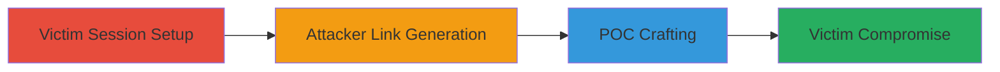

# Login CSRF for Forced Account Switching on Liberapay

Multi-stage attack chain demonstrating a complete CSRF-based account takeover workflow on Liberapay.com.

## Chain Metrics Dashboard

| Metric | Value |
|--------|-------|
| Chain Status | Unverified |
| Total Steps | 4 |
| Execution Time | ~10 minutes |
| Skill Level | Intermediate |
| Complexity | Medium |
| Impact Level | High |

## Attack Flow Visualization



## Prerequisites & Requirements

### Required Tools

- [[tools/Burp-Suite-Professional]]

### Target Environment

- Web platform (Liberapay.com)
- No specific ports or services beyond standard HTTPS (443)
- Attacker requires email access for Liberapay

### Initial Access Requirements

- Victim must be authenticated on Liberapay
- Attacker must have a Liberapay account
- Ability to send HTML/email to victim (e.g., phishing vector)

## Detailed Attack Procedures

### Step 1: Victim Authentication Setup
procedure: [[procedures/Victim-Authentication-Setup]]

**Objective**: Ensure the victim is logged into their own Liberapay account to establish a session that can be hijacked.

**Instructions**: Verify the victim's session by navigating to https://liberapay.com/ in their browser while authenticated. No tools or commands are needed; this is a passive setup step.

**Expected Output**: Victim sees their dashboard or profile page, confirming active session.

**Success Indicators**:
- Victim's browser shows logged-in state on Liberapay
- No logout or session expiration

### Step 2: Attacker Email Confirmation Link Generation
procedure: [[procedures/Attacker-Email-Confirmation-Link-Generation]]

**Objective**: Trigger an email from Liberapay containing the confirmation link with authentication parameters.

**Instructions**: As the attacker, navigate to the Liberapay login page at https://liberapay.com/ and enter your email address to request a login confirmation. Check your email inbox for the message containing the link.

**Expected Output**: Email received with a URL like https://liberapay.com/about/?log-in.id=...&log-in.key=...&log-in.token=....

**Success Indicators**:
- Confirmation email arrives
- Link parameters are present and valid

### Step 3: Extract Parameters and Craft CSRF HTML POC
procedure: [[procedures/Extract-Parameters-and-Craft-CSRF-HTML-POC]]

**Objective**: Parse the confirmation link to obtain id, key, and token, then create a malicious HTML form to submit these parameters cross-site.

**Instructions**: Use [[tools/Burp-Suite-Professional]] to intercept and parse the confirmation link if needed, or manually extract from the email URL. Create an HTML file with a form posting to https://liberapay.com/about/ using hidden inputs for log-in.id, log-in.key, and log-in.token. Include JavaScript to auto-submit on load and manipulate the URL with history.pushState to avoid warnings.

Example HTML structure:

```html
<!DOCTYPE html>
<html>
<body>
<form id="csrf-form" action="https://liberapay.com/about/" method="POST">
  <input type="hidden" name="log-in.id" value="[ID_VALUE]" />
  <input type="hidden" name="log-in.key" value="[KEY_VALUE]" />
  <input type="hidden" name="log-in.token" value="[TOKEN_VALUE]" />
</form>
<script>
  document.getElementById('csrf-form').submit();
  history.pushState(null, null, '/about/');
</script>
</body>
</html>
```

Replace placeholders with extracted values.

**Expected Output**: Valid HTML POC file ready for delivery.

**Success Indicators**:
- Parameters successfully extracted
- HTML form renders and auto-submits without errors in a test browser

### Step 4: Deliver Malicious HTML to Victim
procedure: [[procedures/Deliver-Malicious-HTML-to-Victim]]

**Objective**: Trick the victim into loading the malicious HTML, forcing their browser to submit the form and switch to the attacker's account.

**Instructions**: Host the HTML file on a server or send it via email/phishing as an attachment or link (e.g., 'Click here to view update'). When the victim opens it in their browser while logged into Liberapay, the form submits automatically.

**Expected Output**: Victim's session switches to attacker's account; original session logs out after a delay.

**Success Indicators**:
- Victim loads the page and is redirected to Liberapay under attacker's account
- Attacker monitors for new activity or added data in their profile

## Attack Chain Summary

### Key Achievements

1. Bypassed CSRF protections in login confirmation
2. Forced account switch without user interaction
3. Enabled potential exfiltration of victim data to attacker's profile

## Technique & Tactic Coverage

### MITRE ATT&CK Techniques

- [[Drive-by Compromise]] Drive-by Compromise
- [[Exploit Public-Facing Application]] Exploit Public-Facing Application

### MITRE ATT&CK Tactics

- [[Initial Access]] Initial Access

---
*Last updated: 2023-10-01T00:00:00Z*
