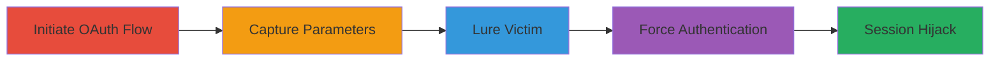

# Login CSRF via Google OAuth State Parameter Reuse Leading to Account Takeover

Multi-stage attack chain demonstrating a complete workflow for exploiting Login CSRF in the Google OAuth flow of ThisData, where the server fails to validate the state parameter, allowing reuse of OAuth tokens to force victim authentication as the attacker.

## Chain Metrics Dashboard

| Metric | Value |
|--------|-------|
| Chain Status | Unverified |
| Total Steps | 5 |
| Execution Time | ~5 minutes |
| Skill Level | Intermediate |
| Complexity | Medium |
| Impact Level | High |

## Attack Flow Visualization

## Prerequisites & Requirements

### Required Tools

- Browser developer tools for intercepting redirects
- Social engineering method (e.g., phishing link)

### Target Environment

- Web application using Google OAuth for authentication (e.g., ThisData)
- Access to attacker's Google account
- Victim's browser access to the target site

### Initial Access Requirements

- Attacker must have a valid Google account
- No prior access to victim account needed
- Network access to the target's OAuth endpoints

## Detailed Attack Procedures

### Step 1: Initiate Attacker's Google OAuth Flow
procedure: [[procedures/Initiate-Attacker-Google-OAuth-Flow]]

**Objective**: Start the OAuth authorization process to generate state and code parameters under the attacker's control.

**Instructions**: Navigate to the ThisData login page and select Google OAuth sign-in. This redirects to Google's authorization endpoint with the client's redirect URI.

**Expected Output**: Redirect to Google consent screen.

**Success Indicators**:
- OAuth flow initiated successfully
- Attacker sees Google's permission request for ThisData

### Step 2: Grant Permissions and Capture Parameters
procedure: [[procedures/Capture-OAuth-State-and-Code]]

**Objective**: Authorize the app and intercept the callback parameters without completing the login.

**Instructions**: Approve permissions on the Google consent screen. Use browser dev tools (e.g., Network tab) to capture the redirect URL containing `state` and `code` parameters, then block or abort the final redirect to ThisData to preserve the tokens.

**Expected Output**: Captured URL like `https://thisdata.com/oauth/redirect?state=abc123&code=def456`.

**Success Indicators**:
- State and code parameters extracted
- No automatic login occurs for attacker

### Step 3: Lure Victim to Malicious Redirect
procedure: [[procedures/Lure-Victim-to-OAuth-Redirect]]

**Objective**: Trick the victim into visiting the crafted URL, forcing them to process the attacker's OAuth tokens.

**Instructions**: Construct the malicious URL using the captured parameters: `https://thisdata.com/oauth/redirect?state={attacker_state}&code={attacker_code}`. Send this link to the victim via email, chat, or phishing.

**Expected Output**: Victim's browser processes the OAuth callback.

**Success Indicators**:
- Victim accesses the URL
- No errors in parameter processing

### Step 4: Force Victim Authentication as Attacker
procedure: [[procedures/Process-Victim-Authentication-as-Attacker]]

**Objective**: Exploit the lack of state validation to authenticate the victim with the attacker's identity.

**Instructions**: Upon victim visit, the server accepts the reused state and code, exchanges the code for an access token tied to the attacker's Google account, and logs in the victim as the attacker.

**Expected Output**: Victim's session is now authenticated as the attacker.

**Success Indicators**:
- Victim dashboard shows attacker's data
- Session cookies set for attacker's account

### Step 5: Achieve Account Takeover

**Objective**: Leverage the hijacked session for unauthorized actions.

**Instructions**: With the victim now logged in as the attacker, perform actions like accessing sensitive data or changing settings under the guise of the victim's session.

**Expected Output**: Full control over the victim's ThisData session using attacker's credentials.

**Success Indicators**:
- Unauthorized access confirmed
- Potential data exfiltration or privilege abuse

## Attack Chain Summary

### Key Achievements

1. Successful capture of reusable OAuth parameters
2. Victim tricked into processing attacker's tokens
3. Session hijacking without direct credential theft

## Technique & Tactic Coverage

### MITRE ATT&CK Techniques

- [[Valid Accounts]] Valid Accounts
- [[Drive-by Compromise]] Drive-by Compromise

### MITRE ATT&CK Tactics

- [[Initial Access]] Initial Access

---
*Last updated: 2023-10-01T00:00:00Z*
