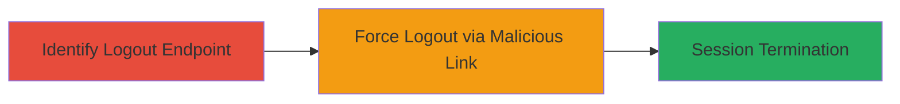

---
tags:
  - csrf
  - logout-csrf
  - web
  - django
type: attack_chain
tools: []
tactics:
  - '[[Initial Access]]'
verified: false
platforms:
  - Web
submitted: true
complexity: low
created_at: '2023-10-01T00:00:00Z'
procedures:
  - '[[procedures/Identify-Logout-Endpoint]]'
  - '[[procedures/Force-User-Logout-via-CSRF]]'
step_count: 2
techniques:
  - '[[Drive-by Compromise]]'
updated_at: '2025-12-14T17:27:23.671Z'
description: >-
  Attack chain exploiting a Logout CSRF vulnerability in Weblate's Django-based
  authentication system to involuntarily terminate user sessions via malicious
  links.
skill_level: beginner
impact_level: low
id: 56431d10-d9f1-444e-8b8d-bf3d86107834
validated: true
mitre_tactics:
  - '[[Initial Access]]'
mitre_techniques:
  - '[[Drive-by Compromise]]'
---
# Logout CSRF to Force User Session Termination in Weblate

Multi-stage attack chain demonstrating a complete attack workflow targeting the Weblate demo site's authentication system. The vulnerability arises from the logout endpoint (/accounts/logout/) using a GET method without CSRF token protection, allowing attackers to force logged-in users to log out by tricking them into visiting a malicious URL. This disrupts user sessions but does not lead to data theft or escalation.

## Chain Metrics Dashboard

| Metric | Value |
|--------|-------|
| Chain Status | Unverified |
| Total Steps | 2 |
| Execution Time | ~1 minutes |
| Skill Level | Beginner |
| Complexity | Low |
| Impact Level | Low |

## Attack Flow Visualization



## Prerequisites & Requirements

### Required Tools

- None (manual testing via browser or curl)

### Target Environment

- Web platform
- Django-based web application (e.g., Weblate)
- Accessible logout endpoint at /accounts/logout/

### Initial Access Requirements

- No credentials required for identification
- Attacker needs to trick victim into visiting a link (e.g., via phishing or embedded resource)
- Victim must be logged in to the target site

## Detailed Attack Procedures

### Step 1: Identify Logout Endpoint
procedure: [[procedures/Identify-Logout-Endpoint]]

**Objective**: Locate the vulnerable logout endpoint in the target web application to confirm it uses GET without CSRF protection.

**Instructions**: Manually inspect the authentication features of the site, such as by navigating to login/logout flows in a browser. Test the endpoint directly by accessing https://demo.weblate.org/accounts/logout/ via GET request. Use a browser or [[commands/curl-test-logout]] to verify accessibility without tokens.

```bash
curl -X GET https://demo.weblate.org/accounts/logout/ -v
```

**Expected Output**: The server responds with a redirect or logout confirmation, indicating no CSRF check is enforced.

**Success Indicators**:
- Endpoint accessible via simple GET request
- No CSRF token required or validated

### Step 2: Force User Logout via CSRF
procedure: [[procedures/Force-User-Logout-via-CSRF]]

**Objective**: Trick a logged-in user into visiting the malicious logout URL, causing their session to terminate involuntarily.

**Instructions**: Craft a malicious link to the logout endpoint (e.g., https://demo.weblate.org/accounts/logout/) and deliver it to the victim via email, social engineering, or an embedded iframe on a controlled site. When the victim clicks or loads the link in their browser while authenticated, the request triggers logout due to the lack of CSRF protection. Test in a controlled session using [[commands/curl-simulate-csrf]] with cookies from a logged-in session.

```bash
curl -X GET https://demo.weblate.org/accounts/logout/ -b "sessionid=your_session_cookie" -v
```

**Expected Output**: The response indicates session termination, such as a redirect to the login page.

**Success Indicators**:
- Victim's session ends upon link visit
- No additional authentication or tokens block the request

## Attack Chain Summary

### Key Achievements

1. Identified unprotected GET-based logout endpoint in Weblate.
2. Demonstrated session disruption via cross-site request forgery.
3. Highlighted low-severity impact on user availability without escalation.

## Technique & Tactic Coverage

### MITRE ATT&CK Techniques

- [[Drive-by Compromise]]

### MITRE ATT&CK Tactics

- [[Initial Access]]

---
*Last updated: 2023-10-01T00:00:00Z*
