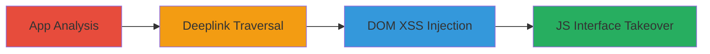

# Lynxview JS Interfaces Takeover via Deeplink Traversal in TikTok Android App

Multi-stage attack chain demonstrating a complete attack workflow exploiting chained vulnerabilities in older versions of the TikTok Android application. The chain involves deeplink traversal to access an exposed Webview, leading to DOM-based XSS and takeover of Javascript interfaces, allowing unauthorized control over the app's Webview interactions. Discovered through static and dynamic analysis of the app's JS interfaces and deeplink handling, this high-severity (8.1) vulnerability enables potential remote code execution within the app context.

## Chain Metrics Dashboard

| Metric | Value |
|--------|-------|
| Chain Status | Unverified |
| Total Steps | 3 |
| Execution Time | ~30 minutes |
| Skill Level | Intermediate |
| Complexity | Medium |
| Impact Level | High |

## Attack Flow Visualization



## Prerequisites & Requirements

### Required Tools

- [[tools/JADX]] (Android app decompiler)
- [[tools/ADB]] (Android Debug Bridge for dynamic testing)

### Target Environment

- Android platform with older TikTok app version (pre-2020 patches)
- Installed TikTok app on a test device or emulator
- No specific ports or services required; local app access

### Initial Access Requirements

- Physical or emulated access to Android device
- App installation privileges
- No network credentials needed; exploits app-internal handling

## Detailed Attack Procedures

### Step 1: Analyze App JS Interfaces
procedure: [[procedures/Analyze-TikTok-App-JS-Interfaces]]

**Objective**: Identify exposed Javascript interfaces and deeplink handlers in the TikTok app to find chaining opportunities.

**Instructions**: Decompile the TikTok APK using [[tools/JADX]] to inspect Webview configurations and JS bridges:

```bash
jadx -d tiktok_decompiled tiktok.apk
```

Search for Webview instances and addJavascriptInterface calls in the decompiled code, noting any exposed objects like Lynxview.

Then, use [[tools/ADB]] to monitor deeplink intents:

```bash
adb shell am start -W -a android.intent.action.VIEW -d "tiktok://deeplink/test" com.zhiliaoapp.musically
```

**Expected Output**: Decompiled source revealing JS interfaces and deeplink URI schemes.

**Success Indicators**:
- Exposed JS objects identified (e.g., Lynxview)
- Deeplink handlers mapped to Webview loads

### Step 2: Exploit Deeplink Traversal
procedure: [[procedures/Exploit-Deeplink-Traversal]]

**Objective**: Traverse deeplinks to reach the vulnerable Webview without authentication checks.

**Instructions**: Craft a malicious deeplink URI targeting the Lynxview Webview based on analysis. Use [[tools/ADB]] to simulate the intent:

```bash
adb shell am start -a android.intent.action.VIEW -d "tiktok://lynxview?url=javascript:alert(1)" com.zhiliaoapp.musically
```

Monitor logs with [[ADB logcat]] to confirm Webview loading:

```bash
adb logcat | grep WebView
```

**Expected Output**: App launches Webview with the injected URI, exposing DOM manipulation points.

**Success Indicators**:
- Webview loads without validation
- Logs show JS execution attempt

### Step 3: Takeover Webview JS Interfaces
procedure: [[procedures/Takeover-Webview-JS-Interfaces]]

**Objective**: Inject DOM-based XSS payload via the traversed Webview to takeover JS interfaces.

**Instructions**: Construct a payload exploiting the DOM-based XSS in the Webview's URL handling. Trigger via deeplink:

```bash
adb shell am start -a android.intent.action.VIEW -d "tiktok://lynxview?url=<script>document.location='javascript:'+lynxview.exposedMethod('malicious')</script>" com.zhiliaoapp.musically
```

Verify takeover by observing app behavior or using dynamic instrumentation tools to hook JS calls.

**Expected Output**: JS interface methods invoked with attacker-controlled input, leading to unauthorized actions.

**Success Indicators**:
- Arbitrary JS execution in Webview context
- Control over app features via hijacked interfaces

## Attack Chain Summary

### Key Achievements

1. Successful decompilation and identification of vulnerable JS interfaces
2. Bypassing app navigation via deeplink traversal to exposed Webview
3. DOM-based XSS exploitation resulting in full JS interface takeover

## Technique & Tactic Coverage

### MITRE ATT&CK Techniques

- [[JavaScript]]
- [[Drive-by Compromise]]

### MITRE ATT&CK Tactics

- [[Initial Access]]
- [[Execution]]

---
*Last updated: 2024-10-01T00:00:00Z*
