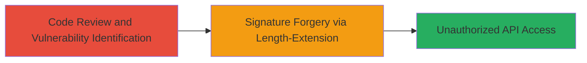

# MD5 Length-Extension Attack to Bypass WP API Key-Auth Signatures

Multi-stage attack chain demonstrating the exploitation of MD5 hashing in the WP API Key-Auth plugin to forge signatures and bypass authentication for unauthorized API access.

## Chain Metrics Dashboard

| Metric | Value |
|--------|-------|
| Chain Status | Unverified |
| Total Steps | 2 |
| Execution Time | ~30 minutes |
| Skill Level | Intermediate |
| Complexity | Medium |
| Impact Level | High |

## Attack Flow Visualization



## Prerequisites & Requirements

### Required Tools

- [[tools/Hashpump]]
- Git (for cloning repository)
- Browser or curl for API testing

### Target Environment

- WordPress site with WP API Key-Auth plugin enabled
- Access to public GitHub repository for code review
- Network access to the WordPress API endpoints

### Initial Access Requirements

- No prior credentials needed; public code review
- Valid API key and secret for initial signature observation (can be obtained from legitimate requests)
- Ability to intercept or observe API requests

## Detailed Attack Procedures

### Step 1: Code Review and Vulnerability Identification
procedure: [[procedures/Review-WP-API-Key-Auth-Source-Code]]

**Objective**: Examine the plugin source code to identify the use of insecure MD5 hashing for signature generation, confirming vulnerability to length-extension attacks.

**Instructions**: Clone the GitHub repository and inspect the key-auth.php file at line 65 to verify MD5 usage without HMAC.

Use git to clone:

```bash
git clone https://github.com/WP-API/Key-Auth.git
```

Then open key-auth.php and check line 65 for md5(json_encode($args)).

**Expected Output**: Confirmation of plain MD5 hash like `$signature = md5(json_encode($args) . $secret);`.

**Success Indicators**:
- MD5 identified without keyed hashing
- Recognition of length-extension vulnerability due to secret appended after message

### Step 2: Signature Forgery via Length-Extension
procedure: [[procedures/Forge-Signature-with-MD5-Length-Extension]]

**Objective**: Craft a forged signature using length-extension to append malicious payloads to the original message, bypassing authentication to access protected API endpoints.

**Instructions**: Observe a legitimate API request to capture the original message, signature, and length. Use [[tools/Hashpump]] to generate an extended message and new signature.

First, intercept a valid request (e.g., via browser dev tools or proxy) to get the JSON payload, signature, and known length.

Then execute [[commands/hashpump-extend]] to forge:

```bash
./hashpump -s ORIGINAL_SIGNATURE -k KNOWN_LENGTH -p '}{"malicious":"payload"}' --digest md5
```

Replace ORIGINAL_SIGNATURE with the hex MD5 sig, KNOWN_LENGTH with message byte length, and append payload to inject new JSON.

Submit the forged request to the API endpoint, e.g., using curl:

```bash
curl -X POST https://target.com/wp-json/wp/v2/posts -H "X-WP-Key-Auth-Signature: FORGED_SIGNATURE" -H "X-WP-Key-Auth-Key: API_KEY" -d '{"title":"Test"}'
```

**Expected Output**: Successful API response without auth error, indicating bypass.

**Success Indicators**:
- Forged signature accepted
- Unauthorized access to protected endpoint granted

## Attack Chain Summary

### Key Achievements

1. Identified MD5 vulnerability through code review
2. Forged authentication signature using length-extension
3. Gained unauthorized access to WordPress API

## Technique & Tactic Coverage

### MITRE ATT&CK Techniques

- [[Exploit Public-Facing Application]] Exploit Public-Facing Application
- [[Credentials In Files]] Meshed Editing (for forging credentials via crypto flaw)

### MITRE ATT&CK Tactics

- [[Initial Access]] Initial Access
- [[Lateral Movement]] Lateral Movement

---

*Last updated: 2023-10-01T00:00:00Z*
