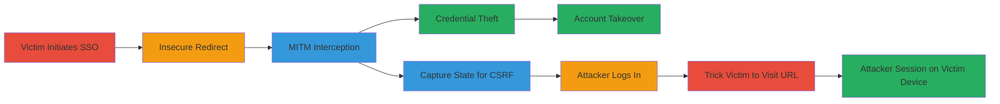

---
tags:
  - mitm
  - sso
  - csrf
  - http-redirect
  - account-takeover
type: attack_chain
tools:
  - '[[tools/mitmproxy]]'
tactics:
  - '[[Initial Access]]'
  - '[[Persistence]]'
commands: []
platforms:
  - Web
complexity: medium
procedures:
  - '[[procedures/Initiate-SSO-Redirect-to-Insecure-URL]]'
  - '[[procedures/Perform-MITM-Interception-for-Credential-Theft]]'
  - '[[procedures/Execute-CSRF-via-Intercepted-URL]]'
step_count: 8
techniques:
  - '[[Adversary-in-the-Middle]]'
  - '[[Man in the Browser]]'
description: >-
  Exploitation of HTTP redirect in Bumble's Odnoklassniki SSO allowing MITM
  attacks for credential theft or CSRF leading to account takeover
skill_level: intermediate
impact_level: high
id: c7c551fb-b6a0-46a0-9717-eddad8472d64
created_at: '2025-12-13T09:01:26.400Z'
updated_at: '2025-12-13T09:01:26.400Z'
verified: false
validated: true
submitted: true
mitre_tactics:
  - '[[Initial Access]]'
  - '[[Persistence]]'
mitre_techniques:
  - '[[Adversary-in-the-Middle]]'
  - '[[Man in the Browser]]'
---
# MITM Exploitation of Insecure SSO Redirect in Bumble for Account Takeover

Multi-stage attack chain demonstrating how an insecure HTTP redirect in Bumble's SSO integration with Odnoklassniki enables man-in-the-middle attacks, leading to credential theft or CSRF for account takeover under specific network conditions.

## Chain Metrics Dashboard

| Metric | Value |
|--------|-------|
| Chain Status | Unverified |
| Total Steps | 8 |
| Execution Time | ~10 minutes |
| Skill Level | Intermediate |
| Complexity | Medium |
| Impact Level | High |

## Attack Flow Visualization

## Prerequisites & Requirements

### Required Tools

- [[tools/mitmproxy]]

### Target Environment

- Web platform
- Services: Odnoklassniki OAuth, Badoo SSO
- Network access: Ability to perform MITM on victim's network (e.g., open WiFi)

### Initial Access Requirements

- Network position to intercept victim's HTTP traffic
- No prior credentials needed

## Detailed Attack Procedures

### Step 1: Victim Navigates to Badoo Signin and Selects Odnoklassniki SSO
procedure: [[procedures/Initiate-SSO-Redirect-to-Insecure-URL]]

**Objective**: Initiate the SSO flow to trigger the insecure redirect.

**Instructions**: The victim visits https://badoo.com/nl/signin/ and selects the Odnoklassniki SSO option, which leads to a redirect.

**Expected Output**: Redirect to the insecure Odnoklassniki OAuth URL.

**Success Indicators**:
- Victim is redirected to http://www.odnoklassniki.ru/oauth/authorize
- HTTP traffic is generated for interception

### Step 2: Victim is Forwarded to Insecure Odnoklassniki OAuth URL
procedure: [[procedures/Initiate-SSO-Redirect-to-Insecure-URL]]

**Objective**: Expose the login flow over HTTP.

**Instructions**: The redirect occurs to http://www.odnoklassniki.ru/oauth/authorize?response_type=code&display=popup&client_id=126351872&scope=VALUABLE_ACCESS%3BGET_EMAIL&state=<state>&redirect_uri=https%3A%2F%2Fbadoo.com%2Fexternal%2Fredirector.phtml.

**Expected Output**: Insecure HTTP request sent.

**Success Indicators**:
- HTTP URL is used instead of HTTPS
- Traffic is interceptable

### Step 3: Attacker Intercepts HTTP Traffic for Credential Theft
procedure: [[procedures/Perform-MITM-Interception-for-Credential-Theft]]

**Objective**: Capture victim's credentials via MITM.

**Instructions**: Use [[tools/mitmproxy]] to intercept the HTTP traffic and present a fake Odnoklassniki login page to the victim, capturing entered credentials.

**Expected Output**: Victim's Odnoklassniki credentials captured.

**Success Indicators**:
- Fake login page displayed to victim
- Credentials logged by the attacker

### Step 4: Attacker Uses Intercepted Credentials to Log into Victim's Badoo Account
procedure: [[procedures/Perform-MITM-Interception-for-Credential-Theft]]

**Objective**: Achieve account takeover using stolen credentials.

**Instructions**: Attacker uses the stolen Odnoklassniki credentials to log in via SSO on Badoo.

**Expected Output**: Successful login to victim's Badoo account.

**Success Indicators**:
- Attacker gains access to victim's profile and data
- Session established under victim's account

### Step 5: Attacker Intercepts URL for CSRF Attack
procedure: [[procedures/Execute-CSRF-via-Intercepted-URL]]

**Objective**: Capture the state variable for CSRF exploitation.

**Instructions**: Intercept the forwarded URL including the state variable linked to the victim's session.

**Expected Output**: URL with state parameter captured.

**Success Indicators**:
- State variable extracted from intercepted traffic

### Step 6: Attacker Browses to Intercepted URL and Enters Own Credentials
procedure: [[procedures/Execute-CSRF-via-Intercepted-URL]]

**Objective**: Authenticate with attacker's credentials using victim's state.

**Instructions**: Attacker navigates to the intercepted URL and enters their own Odnoklassniki credentials.

**Expected Output**: Authentication completes with attacker's credentials but victim's state.

**Success Indicators**:
- Redirect URL generated with code parameter

### Step 7: Attacker Intercepts Return URL and Tricks Victim to Visit It
procedure: [[procedures/Execute-CSRF-via-Intercepted-URL]]

**Objective**: Force the victim to load the manipulated redirect URL.

**Instructions**: Capture the return URL to https://badoo.com/external/redirector.phtml with parameters and provide it to the victim (e.g., via social engineering).

**Expected Output**: Victim visits the URL, triggering the CSRF.

**Success Indicators**:
- Victim loads the URL in their browser

### Step 8: Attacker is Logged into Badoo on Victim's Device
procedure: [[procedures/Execute-CSRF-via-Intercepted-URL]]

**Objective**: Establish attacker's session on victim's device.

**Instructions**: The CSRF results in the attacker being logged in on the victim's browser.

**Expected Output**: Attacker's account session active on victim's device.

**Success Indicators**:
- Attacker can interact with Badoo as if on victim's device
- Potential for further actions like data exfiltration

## Attack Chain Summary

### Key Achievements

1. Interception of credentials leading to direct account takeover
2. CSRF enabling attacker's session on victim's device
3. Demonstration of risks from insecure SSO redirects

## Technique & Tactic Coverage

### MITRE ATT&CK Techniques

- [[Adversary-in-the-Middle]]
- [[Man in the Browser]]

### MITRE ATT&CK Tactics

- [[Initial Access]]
- [[Persistence]]

*Last updated: 2023-10-01*
