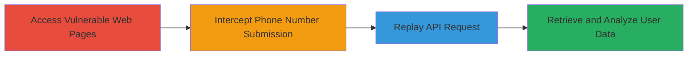

---
tags:
  - information-disclosure
  - api
  - web-application
  - user-enumeration
  - phone-number
type: attack_chain
tools:
  - '[[tools/Burp-Suite]]'
tactics:
  - '[[Discovery]]'
verified: false
platforms:
  - Web
submitted: true
complexity: medium
created_at: '2023-10-01T00:00:00Z'
procedures:
  - '[[procedures/Access-MTN-Vulnerable-Web-Pages]]'
  - '[[procedures/Intercept-Phone-Number-Submission-with-Burp-Suite]]'
  - '[[procedures/Replay-Intercepted-API-Request-for-User-Data]]'
  - '[[procedures/Analyze-API-Response-for-Sensitive-Information]]'
step_count: 4
techniques:
  - '[[Account Discovery]]'
updated_at: '2025-12-14T17:25:12.886Z'
description: >-
  Multi-stage attack exploiting an information disclosure vulnerability in MTN
  Group's web application, allowing unauthenticated retrieval of sensitive user
  profile data using only a phone number.
skill_level: intermediate
impact_level: high
id: f534d4bf-ea92-4767-b136-02304329ccad
validated: true
mitre_tactics:
  - '[[Discovery]]'
mitre_techniques:
  - '[[Account Discovery]]'
---
# MTN Group User Data Disclosure via Unauthenticated API Endpoint

Multi-stage attack chain demonstrating the exploitation of an information disclosure vulnerability in MTN Group's web application. An unauthenticated API endpoint exposes sensitive user data, including full names, customer types, and profile pictures, when queried with a phone number. This enables attackers to perform reconnaissance for social engineering, identity theft, or targeted attacks.

## Chain Metrics Dashboard

| Metric | Value |
|--------|-------|
| Chain Status | Unverified |
| Total Steps | 4 |
| Execution Time | ~5 minutes |
| Skill Level | Intermediate |
| Complexity | Medium |
| Impact Level | High |

## Attack Flow Visualization

## Prerequisites & Requirements

### Required Tools

- [[tools/Burp-Suite]]

### Target Environment

- Web application platform (MTN Group services)
- No specific ports required (standard HTTPS/443)
- Internet access to MTN's public-facing web interfaces

### Initial Access Requirements

- No credentials needed (unauthenticated)
- Direct network access to MTN web pages (e.g., VTU service interface)
- No prior access required

## Detailed Attack Procedures

### Step 1: Access Vulnerable Web Pages
procedure: [[procedures/Access-MTN-Vulnerable-Web-Pages]]

**Objective**: Navigate to the MTN web interface that triggers the vulnerable API call, such as VTU (Virtual Top-Up) pages.

**Instructions**: Open a web browser and visit redacted MTN URLs related to services like VTU top-up or similar features (e.g., 'https://example.mtn.com/vtu' or equivalent redacted endpoints). These pages provide input fields for phone numbers.

**Expected Output**: Web page loads with a form for entering a phone number.

**Success Indicators**:
- Page accessible without authentication
- Input field for phone number visible

### Step 2: Intercept Phone Number Submission with Burp Suite
procedure: [[procedures/Intercept-Phone-Number-Submission-with-Burp-Suite]]

**Objective**: Capture the HTTP request sent when submitting a phone number to identify the vulnerable API endpoint.

**Instructions**: Configure your browser to proxy traffic through Burp Suite. Enter a valid MTN phone number (e.g., starting with 070 or 081) into the form and submit it. In Burp Suite, intercept and inspect the outgoing request in the Proxy tab.

**Expected Output**: Intercepted HTTP GET request revealing the API endpoint structure.

**Success Indicators**:
- Request captured successfully
- Endpoint path like /vtu-service/api/pwa/pub/get-bio-data/{phone_number} identified

### Step 3: Replay Intercepted API Request for User Data
procedure: [[procedures/Replay-Intercepted-API-Request-for-User-Data]]

**Objective**: Directly query the unauthenticated API endpoint to retrieve user profile data.

**Instructions**: In Burp Suite's Repeater tab, forward the intercepted request and modify the {phone_number} parameter if needed (e.g., target a specific number like 07012345678). Send the GET request to /vtu-service/api/pwa/pub/get-bio-data/{phone_number} with standard headers (Host: mtn.example.com, User-Agent: Mozilla/5.0..., Accept: application/json).

**Expected Output**: HTTP 200 OK response with JSON containing user details.

**Success Indicators**:
- Response received without authentication errors
- JSON payload includes user fields

### Step 4: Analyze API Response for Sensitive Information
procedure: [[procedures/Analyze-API-Response-for-Sensitive-Information]]

**Objective**: Extract and review the disclosed sensitive data from the API response.

**Instructions**: Examine the JSON response in Burp Suite for fields like 'firstname', 'lastname', 'othername', 'customerType' (e.g., Prepaid), and 'profileImg' (URL to profile picture). Save or screenshot the data for further use.

**Expected Output**: Parsed JSON with full user name, customer type, and image URL.

**Success Indicators**:
- Sensitive data (name, type, image) retrieved
- Data usable for reconnaissance or social engineering

## Attack Chain Summary

### Key Achievements

1. Unauthenticated access to MTN user profiles via phone number
2. Disclosure of full names, customer types, and profile images
3. Enables broad information gathering for malicious activities like phishing or identity theft

## Technique & Tactic Coverage

### MITRE ATT&CK Techniques

- [[Account Discovery]]

### MITRE ATT&CK Tactics

- [[Discovery]]

---
*Last updated: 2023-10-01T00:00:00Z*
