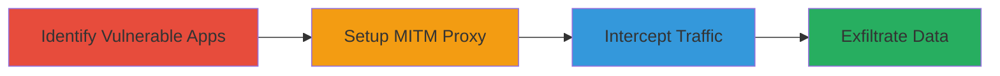

# Man-in-the-Middle Attack via Improper SSL Certificate Validation in Mobile Apps

Multi-stage attack chain demonstrating how to identify and exploit improper SSL certificate validation in popular mobile applications to perform man-in-the-middle attacks and intercept sensitive data such as credit card details and passwords.

## Chain Metrics Dashboard

| Metric | Value |
|--------|-------|
| Chain Status | Unverified |
| Total Steps | 2 |
| Execution Time | ~30 minutes |
| Skill Level | Intermediate |
| Complexity | Medium |
| Impact Level | High |

## Attack Flow Visualization



## Prerequisites & Requirements

### Required Tools

- [[tools/themeninthemiddle-com]]
- MITM proxy tool like mitmproxy (inferred for interception)

### Target Environment

- Android or iOS devices with vulnerable apps installed (e.g., Uber, Authy, Capital One Spark Pay)
- Rooted/jailbroken device or emulator for testing
- Network access to simulate MITM (e.g., Wi-Fi hotspot controlled by attacker)

### Initial Access Requirements

- Physical or network proximity to target device (e.g., shared Wi-Fi)
- No credentials needed; exploits client-side validation flaws
- Prior access: Ability to install test certificates or use proxy on device

## Detailed Attack Procedures

### Step 1: Identify Vulnerable Apps
procedure: [[procedures/Test-SSL-Certificate-Validation-in-Mobile-Apps]]

**Objective**: Systematically test mobile apps for failures in SSL certificate authority (CA) and hostname verification to identify those susceptible to MITM attacks.

**Instructions**: Use a testing site or tool to simulate invalid certificates. Install the app on an Android or iOS device/emulator, configure a proxy if needed, and attempt connections to endpoints with forged certificates. Observe if the app proceeds without warnings.

For example, direct the app's traffic through a proxy presenting an invalid CA or mismatched hostname:

```bash
# No specific command; use device proxy settings or ADB for Android
adb shell settings put global http_proxy 127.0.0.1:8080
```

Then interact with the app to trigger HTTPS requests and check for validation bypass.

**Expected Output**: App connects successfully despite invalid certificate, indicating vulnerability.

**Success Indicators**:
- No certificate warnings displayed in app
- Traffic flows through proxy without interruption
- Logs show unverified connections (e.g., via proxy output)

### Step 2: Perform MITM Interception
procedure: [[procedures/Perform-MITM-Interception-on-Vulnerable-Apps]]

**Objective**: Set up a man-in-the-middle proxy to intercept and potentially modify sensitive data transmitted by the vulnerable app.

**Instructions**: Once a vulnerable app is identified, configure a MITM proxy (e.g., mitmproxy) on a controlled network. Route the target's device traffic through the proxy by setting up a rogue Wi-Fi hotspot or using device proxy settings. Present forged certificates that the app fails to validate, allowing decryption and inspection of HTTPS traffic.

For Android testing:

```bash
# Forward traffic via ADB (assuming mitmproxy running on host)
adb reverse tcp:8080 tcp:8080
mitmproxy --mode transparent --set block_global=false
```

Monitor the proxy for intercepted requests containing sensitive data like login credentials or payment info.

**Expected Output**: Decrypted HTTPS traffic visible in proxy interface, including plaintext sensitive data.

**Success Indicators**:
- Successful decryption of app-server communications
- Capture of sensitive payloads (e.g., JSON with credit card tokens)
- No app-side rejection of forged certificates

## Attack Chain Summary

### Key Achievements

1. Identification of 75+ vulnerable Android apps and select iOS apps through systematic testing.
2. Successful simulation of MITM attacks leading to data interception.
3. Responsible disclosure to vendors, resulting in patches for apps like Authy and Uber.

## Technique & Tactic Coverage

### MITRE ATT&CK Techniques

- [[Adversary-in-the-Middle]] Adversary-in-the-Middle
- [[Steal Web Session Cookie]] Steal Web Session Cookie (extended to session hijacking via MITM)

### MITRE ATT&CK Tactics

- [[Collection]] Collection

---
*Last updated: 2023-10-01T00:00:00Z*
