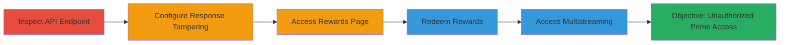

# Manipulating API Responses for Unauthorized Streamlabs Prime Access

Multi-stage attack chain demonstrating a complete attack workflow exploiting a business logic error in Streamlabs, where client-side checks for Prime subscription status can be bypassed by tampering with API responses using Burp Suite. This allows unauthorized access to premium features like unlimited reward redemptions (e.g., $30 Logitech gaming mice coupons) and multistreaming RTMP URLs/stream keys, potentially leading to financial losses through mass abuse.

## Chain Metrics Dashboard

| Metric | Value |
|--------|-------|
| Chain Status | Unverified |
| Total Steps | 5 |
| Execution Time | ~10 minutes |
| Skill Level | Intermediate |
| Complexity | Medium |
| Impact Level | High |

## Attack Flow Visualization

## Prerequisites & Requirements

### Required Tools

- [[tools/Burp-Suite]]

### Target Environment

- Web platform (Streamlabs dashboard)
- Required services/ports: HTTPS (443)
- Network access requirements: Valid Streamlabs account (non-Prime), ability to proxy traffic through Burp Suite

### Initial Access Requirements

- Logged-in Streamlabs account
- Network position: Local machine with browser proxied to Burp
- Prior access needed: None beyond account creation

## Detailed Attack Procedures

### Step 1: Inspect Prime Subscription API
procedure: [[procedures/Inspect-Prime-Subscription-API]]

**Objective**: Verify the API endpoint returns false values for non-Prime users, identifying the target for manipulation.

**Instructions**: Launch your browser with Burp Suite proxy enabled and log into Streamlabs. Navigate to the dashboard and trigger the API call to inspect the response.

**Expected Output**: JSON response from https://streamlabs.com/api/v5/user/prime/subscription showing subscription flags as false.

**Success Indicators**:
- API response intercepted in Burp showing "false" for Prime status
- Confirmation of non-Prime user flags

### Step 2: Configure Burp Match and Replace
procedure: [[procedures/Configure-Burp-Match-and-Replace]]

**Objective**: Set up rules to automatically modify API responses, simulating a Prime subscription by changing false to true.

**Instructions**: In Burp Suite, navigate to the Proxy > Options tab and add Match and Replace rules for response bodies.

**Expected Output**: Rules applied; subsequent API calls return modified JSON with true values for Prime flags.

**Success Indicators**:
- Burp logs show replacements occurring on API responses
- Dashboard features begin to unlock based on tampered responses

### Step 3: Access All Stars Rewards Page
procedure: [[procedures/Access-All-Stars-Rewards-Page]]

**Objective**: Use the modified API to unhide and enable the rewards redemption interface for non-Prime users.

**Instructions**: With Burp proxy active, navigate to the rewards page in the Streamlabs dashboard.

**Expected Output**: Redeem button visible and clickable, previously hidden for non-subscribers.

**Success Indicators**:
- Rewards page loads with Prime-only features accessible
- No errors from client-side checks due to tampered response

### Step 4: Redeem a Reward
procedure: [[procedures/Redeem-Unlimited-Rewards]]

**Objective**: Exploit the bypass to redeem high-value rewards like Logitech mouse coupons without a valid subscription.

**Instructions**: Enter an email address on the rewards page and click redeem; repeat for multiple rewards.

**Expected Output**: Confirmation email with coupon code for a free item (e.g., Logitech gaming mouse valued at ~$30).

**Success Indicators**:
- Successful redemption without subscription prompt
- Receipt of coupon via email, enabling unlimited abuse with multiple accounts

### Step 5: Access Multistreaming Settings
procedure: [[procedures/Access-Multistreaming-Settings]]

**Objective**: Unlock Prime-only multistreaming features to retrieve RTMP URLs and stream keys.

**Instructions**: Navigate to the multistreaming settings page with Burp active to view hidden configurations.

**Expected Output**: Display of RTMP URL and stream key, normally restricted to Prime users.

**Success Indicators**:
- Multistreaming interface fully accessible
- Sensitive stream keys exposed for potential abuse

## Attack Chain Summary

### Key Achievements

1. Bypassed client-side Prime checks via API response tampering
2. Redeemed unlimited high-value rewards causing financial impact
3. Accessed restricted multistreaming features for further exploitation

## Technique & Tactic Coverage

### MITRE ATT&CK Techniques

- [[Adversary-in-the-Middle]] Adversary-in-the-Middle
- [[Exploit Public-Facing Application]] Exploit Public-Facing Application

### MITRE ATT&CK Tactics

- [[Initial Access]] Initial Access

---
*Last updated: 2023-10-01T00:00:00Z*
