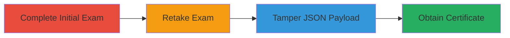

---
tags:
  - business-logic
  - json-tampering
  - exam-bypass
  - certificate-abuse
type: attack_chain
tools: []
tactics:
  - '[[Execution]]'
verified: false
platforms:
  - Web
submitted: true
complexity: medium
created_at: '2023-10-01T00:00:00Z'
procedures:
  - '[[procedures/Complete-Initial-Exam-Submission]]'
  - '[[procedures/Retake-Semrush-Academy-Exam]]'
  - '[[procedures/Tamper-and-Resubmit-Exam-JSON-Payload]]'
step_count: 3
techniques:
  - '[[Exploit Public-Facing Application]]'
updated_at: '2025-12-14T17:28:28.583Z'
description: >-
  A business logic vulnerability in the Semrush Academy exam submission process
  allows attackers to tamper with the client-side JSON payload to submit correct
  answers without legitimate completion, obtaining unauthorized certificates.
skill_level: intermediate
impact_level: high
id: d71dc8f6-49f2-40d1-8fe6-f9d90a0a6331
validated: true
mitre_tactics:
  - '[[Execution]]'
mitre_techniques:
  - '[[Exploit Public-Facing Application]]'
---
# Manipulation of Semrush Academy Exam Results via Client-Side JSON Payload Tampering

Multi-stage attack chain demonstrating exploitation of a business logic error in the Semrush Academy exam submission process. The attacker manipulates the client-side JSON payload to bypass validation and obtain a certificate without correctly answering the exam questions.

## Chain Metrics Dashboard

| Metric | Value |
|--------|-------|
| Chain Status | Unverified |
| Total Steps | 3 |
| Execution Time | ~5 minutes |
| Skill Level | Intermediate |
| Complexity | Medium |
| Impact Level | High |

## Attack Flow Visualization

## Prerequisites & Requirements

### Required Tools

- Browser Developer Tools (e.g., Chrome DevTools for request interception)
- Proxy tool like Burp Suite (optional for advanced interception)

### Target Environment

- Web platform
- Access to Semrush Academy exam interface
- No specific ports or services beyond standard HTTPS

### Initial Access Requirements

- Valid user account on Semrush Academy
- Ability to start and interact with an exam
- Network access to the exam submission endpoint

## Detailed Attack Procedures

### Step 1: Complete Initial Exam Submission
procedure: [[procedures/Complete-Initial-Exam-Submission]]

**Objective**: Submit an initial exam with arbitrary answers to generate a baseline submission request that can be intercepted and modified.

**Instructions**: Navigate to the Semrush Academy exam, answer questions arbitrarily (e.g., all false or random), and submit the exam. Use browser developer tools to monitor the network requests and identify the submission endpoint, which sends a JSON payload containing the answers.

**Expected Output**: Exam submission request captured, showing the JSON structure with an 'answers' object where keys represent questions and values are '1' for correct/true or empty for incorrect/false.

**Success Indicators**:
- Submission request intercepted successfully
- JSON payload structure observed (e.g., {"answers": {"q1": "", "q2": "1"}})

### Step 2: Retake Exam
procedure: [[procedures/Retake-Semrush-Academy-Exam]]

**Objective**: Initiate a retake to trigger a new submission process, allowing interception of a fresh request that can be tampered with before sending correct answers.

**Instructions**: After the initial submission fails or is noted, use the platform's retake functionality to start the exam again. Do not answer questions; instead, prepare to intercept the submission request once more using developer tools.

**Expected Output**: New exam session started, with a pending submission request ready for modification.

**Success Indicators**:
- Retake option available and activated
- New submission request observable in network tab

### Step 3: Tamper and Resubmit Exam JSON Payload
procedure: [[procedures/Tamper-and-Resubmit-Exam-JSON-Payload]]

**Objective**: Modify the intercepted JSON payload to set all answers to correct ('1') and resubmit, bypassing server-side validation to pass the exam illegitimately.

**Instructions**: Intercept the submission request in developer tools or a proxy. Edit the JSON body to set all question values to '1' (indicating correct). Replay or forward the modified request to the server.

**Expected Output**: Server accepts the tampered payload, processes it as a passing exam, and issues the certificate.

**Success Indicators**:
- Modified request sent without errors
- Certificate awarded and downloadable

## Attack Chain Summary

### Key Achievements

1. Bypassed exam validation through client-side manipulation
2. Obtained unauthorized certificate without knowledge of correct answers
3. Demonstrated business logic flaw in trusting client-submitted data

## Technique & Tactic Coverage

### MITRE ATT&CK Techniques

- [[Exploit Public-Facing Application]]

### MITRE ATT&CK Tactics

- [[Execution]]

---
*Last updated: 2023-10-01T00:00:00Z*
