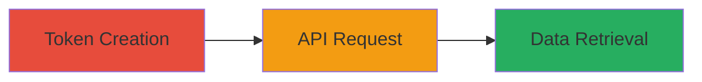

---
tags:
  - api-token
  - misconfiguration
  - information-disclosure
  - mapbox
type: attack_chain
tools: []
tactics:
  - '[[Initial Access]]'
verified: false
platforms:
  - Web
submitted: true
complexity: medium
created_at: '2024-10-04T00:00:00Z'
procedures:
  - '[[procedures/Create-Mapbox-No-Scope-API-Token]]'
  - '[[procedures/Retrieve-Public-Styles-with-Implicit-Token]]'
step_count: 3
techniques:
  - '[[Valid Accounts]]'
updated_at: '2025-12-14T17:32:10.151Z'
description: >-
  Multi-stage attack exploiting Mapbox API token misconfiguration where no
  explicit scopes grant implicit public read access, leading to unauthorized
  disclosure of public map styles.
skill_level: intermediate
impact_level: medium
id: 37d9c802-7fe4-42db-a9ae-bdbb6440e492
validated: true
mitre_tactics:
  - '[[Initial Access]]'
mitre_techniques:
  - '[[Valid Accounts]]'
---
# Mapbox API No-Scope Token Implicit Access to Public Styles Disclosure

Multi-stage attack chain demonstrating exploitation of Mapbox API token creation where selecting 'No scopes' implicitly grants access to public scopes like styles:read, allowing unauthorized retrieval of public map styles data. This violates least privilege and can lead to unintended information disclosure of user resources.

## Chain Metrics Dashboard

| Metric | Value |
|--------|-------|
| Chain Status | Unverified |
| Total Steps | 3 |
| Execution Time | ~5 minutes |
| Skill Level | Intermediate |
| Complexity | Medium |
| Impact Level | Medium |

## Attack Flow Visualization



## Prerequisites & Requirements

### Required Tools

- Web browser for Mapbox Studio access
- [[commands/get-mapbox-public-styles]] for API requests

### Target Environment

- Mapbox account with access to Studio UI
- Target Mapbox API endpoints
- No special ports required; uses HTTPS on port 443

### Initial Access Requirements

- Valid Mapbox user account credentials
- Network access to api.mapbox.com and studio.mapbox.com
- No prior elevated access needed

## Detailed Attack Procedures

### Step 1: Create No-Scope API Token
procedure: [[procedures/Create-Mapbox-No-Scope-API-Token]]

**Objective**: Generate an API access token via Mapbox Studio UI with no explicit scopes, which implicitly enables public read permissions.

**Instructions**: Log into your Mapbox account at https://studio.mapbox.com, navigate to Account > Access Tokens, click 'New token', select 'No scopes' in the permissions dropdown, name the token, and generate it. Copy the resulting public token (starts with 'pk.') for use in subsequent steps.

**Expected Output**: A token string like 'pk.eyJ1Ijoia2F0aWx0aGUiLCJhIjoiY2lsbWJwcWpjNjhmNnZubWNhYXdwZm5obyJ9.2cPnaIiXcFnDRFMfrD1TRw'.

**Success Indicators**:
- Token generated successfully in UI
- Token prefix confirms it's a public token

### Step 2: Send GET Request to Retrieve Styles
procedure: [[procedures/Retrieve-Public-Styles-with-Implicit-Token]]

**Objective**: Use the no-scope token to query the Mapbox API for public styles, exploiting implicit scopes to gain unauthorized read access.

**Instructions**: Target the /styles/v1/{username} endpoint with the token. Replace {username} with a target username (e.g., 'katilthe'). Execute using [[commands/get-mapbox-public-styles]]:

```bash
curl -X GET "https://api.mapbox.com/styles/v1/katilthe?access_token=pk.eyJ1Ijoia2F0aWx0aGUiLCJhIjoiY2lsbWJwcWpjNjhmNnZubWNhYXdwZm5obyJ9.2cPnaIiXcFnDRFMfrD1TRw" \
  -H "User-Agent: Mozilla/5.0 (Windows NT 6.3; WOW64; rv:44.0) Gecko/20100101 Firefox/44.0" \
  -H "Accept: text/html,application/xhtml+xml,application/xml;q=0.9,*/*;q=0.8" \
  -H "Referer: https://www.mapbox.com/studio/styles/fonts/"
```

**Expected Output**: HTTP 200 OK with JSON array of styles data.

**Success Indicators**:
- 200 OK response received
- JSON contains style objects with details like name, center, zoom

### Step 3: Validate Access and Analyze Disclosure

**Objective**: Confirm implicit access by reviewing the response for sensitive or unintended public data exposure.

**Instructions**: Parse the JSON response from Step 2 to inspect styles. Look for elements like style names, IDs, and metadata that reveal user resources. No additional command needed; use jq or manual review:

```bash
curl ... | jq '.[0] | {name, id, owner}'
```

**Expected Output**: Extracted style info, e.g., {'name':'test\'><svg/onload=alert(2)>-copy-copy','id':'cilmbusls00cvc6m23qpi69gg','owner':'katilthe'}.

**Success Indicators**:
- Response includes public styles without explicit scope grant
- Potential for information disclosure identified

## Attack Chain Summary

### Key Achievements

1. Created a token with no scopes that implicitly grants styles:read access
2. Successfully retrieved public map styles via API without authorization
3. Demonstrated violation of least privilege, leading to unintended data exposure

## Technique & Tactic Coverage

### MITRE ATT&CK Techniques

- [[Valid Accounts]]

### MITRE ATT&CK Tactics

- [[Initial Access]]

---
*Last updated: 2024-10-04T00:00:00Z*
