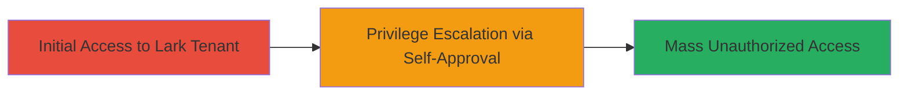

# Mass Privilege Escalation via Self-App Approval in Lark Tenant

Multi-stage attack chain demonstrating a complete attack workflow.

## Chain Metrics Dashboard

| Metric | Value |
|--------|-------|
| Chain Status | Unverified |
| Total Steps | 1 |
| Execution Time | ~5 minutes |
| Skill Level | Intermediate |
| Complexity | Medium |
| Impact Level | High |

## Attack Flow Visualization

## Prerequisites & Requirements

### Required Tools

- Web browser (e.g., Chrome with developer tools for inspection)

### Target Environment

- Lark Technologies tenant (cloud-based collaboration platform)
- Access to non-privileged user account
- No admin privileges required

### Initial Access Requirements

- Valid non-privileged user credentials in the Lark tenant
- Network access to Lark's web interface
- No prior elevated access needed

## Detailed Attack Procedures

### Step 1: Exploit Self-Approval for Privilege Escalation
procedure: [[procedures/Self-Approve-App-for-Privilege-Escalation-in-Lark]]

**Objective**: Bypass admin approval controls to self-approve a custom app, enabling unauthorized privilege escalation across the tenant.

**Instructions**: Log in to the Lark tenant as a non-privileged user. Navigate to the app management section and create or select an app requiring approval. Instead of waiting for admin review, directly submit and approve the app using the vulnerable interface, which lacks enforcement of admin-only approval.

**Expected Output**: The app is approved and installed without admin intervention, granting elevated permissions to access other apps and resources in the tenant.

**Success Indicators**:
- App status changes to "Approved" without admin notification
- Access to previously restricted tenant resources or apps is granted
- No error messages about missing admin privileges

## Attack Chain Summary

### Key Achievements

1. Bypassed admin approval workflow for app installation
2. Achieved mass privilege escalation within the Lark tenant
3. Enabled unauthorized access to multiple apps and tenant data

## Technique & Tactic Coverage

### MITRE ATT&CK Techniques

- [[Exploitation for Privilege Escalation]]

### MITRE ATT&CK Tactics

- [[Privilege Escalation]]

---
*Last updated: 2023-10-01T00:00:00Z*
