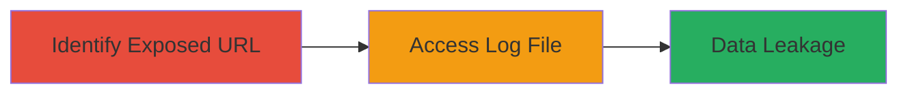

---
tags:
  - pii-leak
  - exposed-logs
  - insecure-storage
  - data-exposure
type: attack_chain
tools: []
tactics:
  - '[[Initial Access]]'
  - '[[Collection]]'
verified: false
platforms:
  - Web
submitted: true
complexity: low
procedures:
  - '[[procedures/Identify-Exposed-Access-Log-URL]]'
  - '[[procedures/Access-and-Retrieve-Sensitive-Log-Contents]]'
step_count: 2
techniques:
  - '[[Exploit Public-Facing Application]]'
description: >-
  An attack chain exploiting insecure storage of an access log file containing
  PII, accessible via a public URL without authentication on a visitor
  management system.
skill_level: beginner
impact_level: high
id: 53f19565-042e-4db3-9d57-02832acc8c5d
created_at: '2025-12-14T17:25:13.395Z'
updated_at: '2025-12-14T17:25:13.395Z'
validated: true
mitre_tactics:
  - '[[Initial Access]]'
  - '[[Collection]]'
mitre_techniques:
  - '[[Exploit Public-Facing Application]]'
---
# Massive PII Leakage via Exposed Access Log in Visitor Management System

Multi-stage attack chain demonstrating the discovery and exploitation of an exposed access log file containing personally identifiable information (PII) in the ███████ visitor management system hosted at mwcvisitor.royalcanin.com.cn. The vulnerability allowed unauthorized access to sensitive user data without any authentication, leading to massive data leakage. This was resolved by closing the site at the end of 2024.

## Chain Metrics Dashboard

| Metric | Value |
|--------|-------|
| Chain Status | Unverified |
| Total Steps | 2 |
| Execution Time | ~1 minutes |
| Skill Level | Beginner |
| Complexity | Low |
| Impact Level | High |

## Attack Flow Visualization

## Prerequisites & Requirements

### Required Tools

- None (direct web access sufficient)

### Target Environment

- Web-based visitor management system
- Publicly accessible URL
- No specific ports or services beyond standard HTTP/HTTPS

### Initial Access Requirements

- Internet access
- No credentials required due to lack of authentication
- Knowledge of the target domain (mwcvisitor.royalcanin.com.cn)

## Detailed Attack Procedures

### Step 1: Identify Exposed Access Log URL
procedure: [[procedures/Identify-Exposed-Access-Log-URL]]

**Objective**: Locate the public URL that exposes the access log file containing PII without authentication.

**Instructions**: Manually inspect the visitor management system's domain for common log file endpoints or use browser developer tools to identify static file paths. In this case, the log file was directly accessible at a predictable URL on mwcvisitor.royalcanin.com.cn.

**Expected Output**: A direct URL to the log file, such as a .log or .txt endpoint.

**Success Indicators**:
- URL returns a 200 OK response without prompting for login
- File contents visible in browser or via direct request

### Step 2: Access and Retrieve Sensitive Log Contents
procedure: [[procedures/Access-and-Retrieve-Sensitive-Log-Contents]]

**Objective**: Retrieve and view the contents of the exposed log file to access PII.

**Instructions**: Navigate to the identified URL in a web browser or use a simple HTTP client to download the file. No authentication is required, allowing immediate access to the log data.

**Expected Output**: Log file contents displaying PII such as user names, emails, or other identifiers.

**Success Indicators**:
- Log file downloads or displays successfully
- Sensitive data (PII) is visible and extractable

## Attack Chain Summary

### Key Achievements

1. Discovered an unauthenticated endpoint exposing sensitive access logs
2. Accessed and retrieved PII from the visitor management system
3. Demonstrated massive data leakage potential due to insecure storage

## Technique & Tactic Coverage

### MITRE ATT&CK Techniques

- [[Exploit Public-Facing Application]]

### MITRE ATT&CK Tactics

- [[Initial Access]]
- [[Collection]]

---
*Last updated: 2024-01-01*
