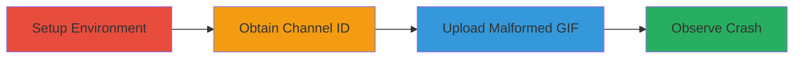

# Mattermost DoS: Out-of-Memory Crash via Malformed GIF Upload

Multi-stage attack chain demonstrating a complete denial-of-service workflow against Mattermost by exploiting a vulnerability in the upload API. A small, malformed GIF file causes the server to consume excessive RAM during decoding, resulting in an out-of-memory crash.

## Chain Metrics Dashboard

| Metric | Value |
|--------|-------|
| Chain Status | Unverified |
| Total Steps | 4 |
| Execution Time | ~5 minutes |
| Skill Level | Intermediate |
| Complexity | Medium |
| Impact Level | High |

## Attack Flow Visualization



## Prerequisites & Requirements

### Required Tools

- [[tools/Docker]]
- [[tools/Go]]

### Target Environment

- Mattermost server (preview image)
- Docker with 4GB memory limit
- Port 8065 exposed
- Linux host for Docker

### Initial Access Requirements

- Local access to run Docker
- No authentication needed for setup, but valid Mattermost user for channel ID
- API access to Mattermost instance

## Detailed Attack Procedures

### Step 1: Set Up Mattermost Docker Environment
procedure: [[procedures/Set-Up-Mattermost-Docker-Environment]]

**Objective**: Deploy a vulnerable Mattermost server in a memory-constrained Docker container to simulate a production-like environment for reproduction.

**Instructions**: Use [[commands/docker-run-mattermost]] to start the container:

```bash
docker run --name mattermost-preview -d --publish 8065:8065 mattermost/mattermost-preview -m=4G
```

Verify the container is running with `docker ps`.

**Expected Output**: Container ID and status; Mattermost accessible at http://localhost:8065.

**Success Indicators**:
- Container starts without errors
- Web interface loads on port 8065

### Step 2: Obtain Valid Channel ID
procedure: [[procedures/Obtain-Valid-Channel-ID]]

**Objective**: Retrieve a channel ID from the Mattermost instance to target the upload API.

**Instructions**: Access the Mattermost UI at http://localhost:8065, log in if needed, and navigate to a channel. Use browser developer tools or API calls to extract the channel ID (e.g., via /api/v4/channels endpoint).

**Expected Output**: A string like "channel_id_value".

**Success Indicators**:
- Valid channel ID obtained
- API endpoint responds successfully

### Step 3: Upload Malformed GIF via API
procedure: [[procedures/Upload-Malformed-GIF-via-API]]

**Objective**: Craft and upload a 31-byte malformed GIF that triggers high memory consumption in the gif.DecodeAll function without prior checks.

**Instructions**: Compile and run a Go POC script that creates an upload session and sends the bytes: []byte{0x47, 0x49, 0x46, 0x38, 0x39, 0x61, 0x2e, 0xf8, 0xff, 0xff, 0xf, 0x18, 0x18, 0x2c, 0x7f, 0x20, 0x0, 0x0, 0x0, 0xa0, 0xff, 0xff, 0xff, 0xd4, 0x9a, 0xf0, 0xb4, 0x8, 0x35, 0x4, 0x0}. Use Mattermost's model package for API interaction.

**Expected Output**: Upload session created; file upload completes, but server begins consuming RAM.

**Success Indicators**:
- Upload API call succeeds
- No immediate error from server

### Step 4: Observe Server Crash
procedure: [[procedures/Observe-Server-Crash]]

**Objective**: Monitor the Docker container for OOM kill due to excessive memory usage.

**Instructions**: Use `docker stats` or `docker logs mattermost-preview` to watch resource usage. The container should exceed 4GB and get killed.

**Expected Output**: Logs show OOM error; container stops running.

**Success Indicators**:
- RAM usage spikes over 4GB
- Container is terminated by Docker

## Attack Chain Summary

### Key Achievements

1. Deployed vulnerable Mattermost in controlled environment
2. Uploaded tiny malformed GIF triggering massive RAM leak
3. Demonstrated DoS crash via OOM in 4GB limit
4. Highlighted API flaw in image decoding order

## Technique & Tactic Coverage

### MITRE ATT&CK Techniques

- [[Exploit Public-Facing Application]]
- [[OS Exhaustion Flood]]

### MITRE ATT&CK Tactics

- [[Privilege Escalation]]

---
*Last updated: 2023-10-01T00:00:00Z*
