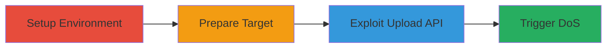

# Mattermost DoS via Malicious GIF Upload Causing OOM Crash

Multi-stage attack chain demonstrating a denial-of-service (DoS) vulnerability in Mattermost's upload API, where a crafted GIF file with extreme dimensions forces the server to allocate over 4GB of RAM during decoding, resulting in an out-of-memory (OOM) crash of the Docker container.

## Chain Metrics Dashboard

| Metric | Value |
|--------|-------|
| Chain Status | Unverified |
| Total Steps | 4 |
| Execution Time | ~5 minutes |
| Skill Level | Intermediate |
| Complexity | Medium |
| Impact Level | High |

## Attack Flow Visualization



## Prerequisites & Requirements

### Required Tools

- [[tools/Docker]]
- [[tools/Go]]
- [[tools/Mattermost-API-v4-Client]]

### Target Environment

- Mattermost Server (preview image)
- Docker with 4GB memory limit
- Port 8065 exposed

### Initial Access Requirements

- Local network access to run Docker
- Valid Mattermost credentials (default: toto/tototo)
- Go environment for POC execution

## Detailed Attack Procedures

### Step 1: Setup Mattermost Docker Environment
procedure: [[procedures/Setup-Mattermost-Docker-Environment]]

**Objective**: Deploy a vulnerable Mattermost instance in a Docker container with limited memory to simulate and reproduce the OOM condition.

**Instructions**: Use [[commands/docker-run-mattermost]] to start the container:

```bash
docker run --name mattermost-preview -d --publish 8065:8065 mattermost/mattermost-preview -m=4G
```

Verify the container is running and accessible at http://localhost:8065.

**Expected Output**: Container ID and running status; Mattermost UI loads without errors.

**Success Indicators**:
- Docker container starts successfully
- Server responds on port 8065

### Step 2: Obtain Mattermost Channel ID
procedure: [[procedures/Obtain-Mattermost-Channel-ID]]

**Objective**: Retrieve a valid channel ID from the Mattermost instance to target the upload.

**Instructions**: Access the Mattermost UI at http://localhost:8065, log in with default credentials (toto/tototo), and navigate to a channel. Use browser developer tools or API calls to extract the channel ID, such as '5dtj9hf89ifap8imigbzjc7wjo'.

**Expected Output**: A string representing the channel ID.

**Success Indicators**:
- Successful login to Mattermost
- Channel ID retrieved from UI or API

### Step 3: Upload Malicious GIF for OOM Attack
procedure: [[procedures/Upload-Malicious-GIF-for-OOM-Attack]]

**Objective**: Craft and upload a malicious GIF file via the API to trigger excessive memory allocation in the gif.DecodeAll function.

**Instructions**: Write and execute a Go POC using [[tools/Mattermost-API-v4-Client]]. Initialize the client with http://localhost:8065/, login with toto/tototo, create an upload session for channel ID (e.g., '5dtj9hf89ifap8imigbzjc7wjo'), filename 'oom.gif', size 31 bytes, and upload the crafted GIF data starting with GIF89a header followed by large dimension values like 0xf8ff and 0xff.

**Expected Output**: Upload request succeeds, but server-side decoding begins.

**Success Indicators**:
- API upload session created
- File upload initiated without immediate error

### Step 4: Observe Mattermost Server Crash
procedure: [[procedures/Observe-Mattermost-Server-Crash]]

**Objective**: Monitor the server for OOM conditions leading to Docker container termination.

**Instructions**: After upload, check Docker logs with `docker logs mattermost-preview` and monitor memory usage. The path App.UploadData -> doUploadData -> uploadData -> GetInfoForBytes -> gif.DecodeAll will allocate >4GB without dimension checks, triggering OOM kill.

**Expected Output**: Container stops with OOM error; logs show memory exhaustion.

**Success Indicators**:
- Server becomes unresponsive
- Docker container killed due to memory limit exceeded

## Attack Chain Summary

### Key Achievements

1. Successful deployment of vulnerable Mattermost in constrained Docker environment
2. Targeted upload of crafted GIF exploiting lack of image dimension validation
3. Achievement of DoS via server crash and container OOM kill

## Technique & Tactic Coverage

### MITRE ATT&CK Techniques

- [[Endpoint Denial of Service]] Endpoint Denial of Service
- [[Exploit Public-Facing Application]] Exploit Public-Facing Application

### MITRE ATT&CK Tactics

- [[Impact]] Impact

---

*Last updated: 2023-10-01T12:00:00Z*
