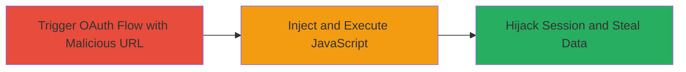

---
tags:
  - xss
  - mattermost
  - oauth
  - session-hijacking
type: attack_chain
tools: []
tactics:
  - '[[Execution]]'
  - '[[Collection]]'
verified: false
platforms:
  - Web
submitted: true
complexity: medium
created_at: '2024-01-01T00:00:00Z'
procedures:
  - '[[procedures/Exploit-Mattermost-OAuth-Reflected-XSS]]'
step_count: 2
techniques:
  - '[[JavaScript]]'
updated_at: '2025-12-14T17:24:38.949Z'
description: >-
  A multi-stage attack exploiting reflected XSS in Mattermost Server's OAuth
  flow to execute arbitrary JavaScript, enabling session hijacking and data
  theft.
skill_level: intermediate
impact_level: high
id: 05de2a30-2c08-49cb-8cfd-ce59f6172aa6
validated: true
mitre_tactics:
  - '[[Execution]]'
  - '[[Collection]]'
mitre_techniques:
  - '[[JavaScript]]'
---
# Mattermost-OAuth-Reflected-XSS-for-Session-Hijacking

Multi-stage attack chain demonstrating a complete attack workflow exploiting a reflected XSS vulnerability in the Mattermost Server's OAuth authentication flow. The attack targets the unsanitized 'redirect_to' parameter, allowing attackers to inject JavaScript during mobile error rendering, leading to session hijacking, theft of chat contents, or administrative privilege escalation.

## Chain Metrics Dashboard

| Metric | Value |
|--------|-------|
| Chain Status | Unverified |
| Total Steps | 2 |
| Execution Time | ~1 minutes |
| Skill Level | Intermediate |
| Complexity | Medium |
| Impact Level | High |

## Attack Flow Visualization

## Prerequisites & Requirements

### Required Tools

- None (browser-based exploitation)

### Target Environment

- Mattermost Server (vulnerable version with OAuth enabled)
- Web platform
- No specific ports required beyond standard HTTPS (443)

### Initial Access Requirements

- Social engineering to lure victim to click malicious link (e.g., phishing email)
- Network access to the Mattermost instance
- No prior credentials needed for the XSS trigger

## Detailed Attack Procedures

### Step 1: Trigger OAuth Flow with Malicious Payload

procedure: [[procedures/Exploit-Mattermost-OAuth-Reflected-XSS]]

**Objective**: Deliver the reflected XSS payload via the 'redirect_to' parameter to inject malicious JavaScript into the mobile error page.

**Instructions**: Construct and send the victim a link to the Mattermost OAuth endpoint with the payload encoded in the 'redirect_to' parameter. The payload closes the current HTML tag and injects an  element that executes JavaScript on error. Example URL:

https://<mattermost_url>/oauth/shielder/mobile_login?redirect_to=%22%3E%3Cimg%20src=%22%22%20onerror=%22alert(%27zi0Black%20@%20Shielder%27)%22%3E

Have the victim click the link in their browser, simulating a mobile login attempt.

**Expected Output**: The server responds with an error page where the injected script renders, triggering the JavaScript execution.

**Success Indicators**:
- Victim's browser loads the OAuth page
- Payload is reflected in the HTML response (inspect source to confirm)

### Step 2: Execute JavaScript and Hijack Session

procedure: [[procedures/Exploit-Mattermost-OAuth-Reflected-XSS]]

**Objective**: Confirm JavaScript execution and leverage it for session theft or further exploitation.

**Instructions**: Upon page load, the onerror handler in the injected  tag executes the JavaScript. For proof-of-concept, it displays an alert. In a real attack, replace the alert with code to steal cookies (e.g., document.cookie) and exfiltrate to an attacker-controlled server, or manipulate the DOM to add admin users if the victim is privileged.

**Expected Output**: Alert popup or network request to attacker server with stolen session data.

**Success Indicators**:
- JavaScript alert or console log appears
- Session cookies transmitted to attacker (verify via network tab)
- If victim is admin, unauthorized changes like adding new admins succeed

## Attack Chain Summary

### Key Achievements

1. Arbitrary JavaScript execution in the victim's browser via reflected XSS
2. Session hijacking to access chat contents or perform administrative actions
3. Potential for broader compromise depending on victim privileges

## Technique & Tactic Coverage

### MITRE ATT&CK Techniques

- [[JavaScript]]

### MITRE ATT&CK Tactics

- [[Execution]]
- [[Collection]]

---
*Last updated: 2024-01-01T00:00:00Z*
