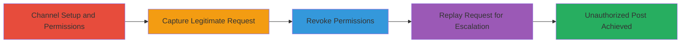

---
tags:
  - mattermost
  - privilege-escalation
  - request-replay
  - authorization-bypass
  - web-vulnerability
type: attack_chain
tools:
  - '[[tools/Burp-Suite]]'
tactics:
  - '[[Privilege Escalation]]'
verified: false
platforms:
  - Web
submitted: true
created_at: '2023-10-01T00:00:00Z'
procedures:
  - '[[procedures/Create-Public-Channel-with-Posting-Permissions]]'
  - '[[procedures/Join-Public-Channel]]'
  - '[[procedures/Capture-Legitimate-Post-Request-with-Burp-Suite]]'
  - '[[procedures/Create-Auxiliary-Channel-for-Request-Capture]]'
  - '[[procedures/Revoke-Channel-Posting-Permissions]]'
  - '[[procedures/Verify-Read-Only-Enforcement]]'
  - '[[procedures/Replay-Captured-Request-to-Bypass-Permissions]]'
step_count: 7
techniques:
  - '[[Exploitation for Privilege Escalation]]'
updated_at: '2025-12-14T17:30:07.525Z'
description: >-
  A multi-stage attack exploiting a privilege escalation vulnerability in
  Mattermost, allowing unauthorized posting in read-only public channels by
  capturing and replaying legitimate HTTP POST requests after permissions are
  revoked.
id: ba74e41e-808a-442a-a1a6-4cdacc76a9d9
validated: true
mitre_tactics:
  - '[[Privilege Escalation]]'
mitre_techniques:
  - '[[Exploitation for Privilege Escalation]]'
---
# Mattermost Privilege Escalation via HTTP Request Replay to Post in Read-Only Channels

Multi-stage attack chain demonstrating a complete privilege escalation workflow in Mattermost, where revoked posting permissions in public channels are bypassed by replaying captured HTTP POST requests.

## Chain Metrics Dashboard

| Metric | Value |
|--------|-------|
| Chain Status | Unverified |
| Total Steps | 7 |
| Execution Time | ~10 minutes |
| Skill Level | Intermediate |
| Complexity | Medium |
| Impact Level | High |

## Attack Flow Visualization

## Prerequisites & Requirements

### Required Tools

- [[tools/Burp-Suite]]

### Target Environment

- Mattermost web application (version vulnerable to this issue, e.g., pre-patch for CVE or similar)
- Access to System Console for admin-level permission changes
- Public channel creation capabilities

### Initial Access Requirements

- Valid user account with channel creation and joining permissions
- Admin access for permission revocation (or equivalent role)
- Network access to the Mattermost instance

## Detailed Attack Procedures

### Step 1: Create Public Channel with Posting Permissions
procedure: [[procedures/Create-Public-Channel-with-Posting-Permissions]]

**Objective**: Establish a public channel and initially grant posting permissions to members and guests to enable legitimate request capture.

**Instructions**: As an admin or channel owner, navigate to the Mattermost System Console, go to Channel > Permissions, create a new public channel named 'mikefourchannel', and set permissions to allow guests and members to post comments.

**Expected Output**: Channel created successfully with posting enabled for specified roles.

**Success Indicators**:
- Channel appears in public channels list
- Permission settings confirm posting allowed for members/guests

### Step 2: Join Public Channel
procedure: [[procedures/Join-Public-Channel]]

**Objective**: Gain access to the target channel as a regular user to prepare for posting and request capture.

**Instructions**: Log in as User2, search for the public channel 'mikefourchannel', and join it via the Mattermost UI.

**Expected Output**: User2 is now a member of the channel and can view its contents.

**Success Indicators**:
- User2 listed as channel member
- Channel feed visible without errors

### Step 3: Capture Legitimate Post Request with Burp Suite
procedure: [[procedures/Capture-Legitimate-Post-Request-with-Burp-Suite]]

**Objective**: Intercept and store a valid HTTP POST request for posting a message while permissions are still active.

**Instructions**: Configure Burp Suite as a proxy for the browser, post a message like 'has permission to comment in channel' in 'mikefourchannel', intercept the POST request to the channel endpoint (e.g., /api/v4/posts), and forward it to the Repeater tool for later use.

**Expected Output**: Message posts successfully, and the request is captured in Burp Repeater.

**Success Indicators**:
- Message appears in channel
- Request details (headers, payload with session token) saved in Repeater

### Step 4: Create Auxiliary Channel for Request Capture
procedure: [[procedures/Create-Auxiliary-Channel-for-Request-Capture]]

**Objective**: Set up a secondary channel under full control to generate a similar POST request structure for comparison or additional capture if needed.

**Instructions**: As User2, create a new public channel named 'privilegeescalation' via the Mattermost UI.

**Expected Output**: New channel created and accessible.

**Success Indicators**:
- 'privilegeescalation' channel exists and is joinable
- User2 has posting rights in the new channel

### Step 5: Revoke Channel Posting Permissions
procedure: [[procedures/Revoke-Channel-Posting-Permissions]]

**Objective**: Update permissions to make the target channel read-only, enforcing the restriction that should prevent unauthorized posts.

**Instructions**: As admin (User1), return to System Console > Channel > Permissions, and revoke posting rights for guests and members in 'mikefourchannel'.

**Expected Output**: Permissions updated; channel now read-only for non-admins.

**Success Indicators**:
- Settings reflect revoked permissions
- No immediate errors in console

### Step 6: Verify Read-Only Enforcement
procedure: [[procedures/Verify-Read-Only-Enforcement]]

**Objective**: Confirm that the permission revocation is active by attempting a direct post, which should fail.

**Instructions**: As User2, attempt to post a message in 'mikefourchannel' via the UI.

**Expected Output**: Error message: 'This channel is read only. Only members with permission can post here'.

**Success Indicators**:
- Post attempt blocked with read-only error
- No message posted to channel

### Step 7: Replay Captured Request to Bypass Permissions
procedure: [[procedures/Replay-Captured-Request-to-Bypass-Permissions]]

**Objective**: Exploit the lack of server-side permission re-validation by replaying the captured POST request to post unauthorized content.

**Instructions**: In Burp Suite Repeater, optionally post in the auxiliary channel 'privilegeescalation' to capture a fresh similar request if needed, then replay the original captured request from Step 3, modifying the payload to 'commenting in mike4 channel even no privilege' and sending it to the /api/v4/posts endpoint for 'mikefourchannel'.

**Expected Output**: Message posts successfully despite revoked permissions.

**Success Indicators**:
- Unauthorized message appears in 'mikefourchannel'
- No error response from server (200 OK)

## Attack Chain Summary

### Key Achievements

1. Successfully created and configured a public channel with initial permissions.
2. Captured a valid POST request during permitted access.
3. Revoked permissions and verified read-only state.
4. Bypassed restrictions via request replay, achieving privilege escalation.

## Technique & Tactic Coverage

### MITRE ATT&CK Techniques

- [[Exploitation for Privilege Escalation]] Exploitation for Privilege Escalation

### MITRE ATT&CK Tactics

- [[Privilege Escalation]] Privilege Escalation

---

*Last updated: 2023-10-01T00:00:00Z*
