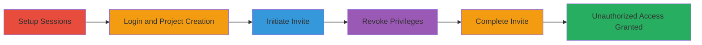

---
tags:
  - privilege-escalation
  - mavenlink
  - web
  - invite-bypass
  - session-persistence
type: attack_chain
tools: []
tactics:
  - '[[Privilege Escalation]]'
verified: false
platforms:
  - Web
submitted: true
complexity: medium
created_at: '2023-10-01T00:00:00Z'
procedures:
  - '[[procedures/Prepare-Multi-Session-Environment-for-Mavenlink]]'
  - '[[procedures/Login-to-Mavenlink-with-Multiple-Users]]'
  - '[[procedures/Create-Project-and-Assign-Privileges]]'
  - '[[procedures/Initiate-Project-Invite-Session]]'
  - '[[procedures/Revoke-User-Privileges-in-Project]]'
  - '[[procedures/Complete-Invite-After-Privilege-Revocation]]'
step_count: 6
techniques:
  - '[[Exploitation for Privilege Escalation]]'
updated_at: '2025-12-14T17:28:44.705Z'
description: >-
  Demonstrates privilege escalation in Mavenlink by exploiting a lack of
  privilege re-validation during project invite submission after revocation.
skill_level: intermediate
impact_level: high
id: cea09f68-d510-49d0-9739-b6966238015e
validated: true
mitre_tactics:
  - '[[Privilege Escalation]]'
mitre_techniques:
  - '[[Exploitation for Privilege Escalation]]'
---
# Mavenlink Privilege Escalation via Persistent Invite Session

Multi-stage attack chain demonstrating a privilege escalation vulnerability in Mavenlink's project management feature, where revoked privileges do not invalidate an ongoing invite session, allowing unauthorized user invitations.

## Chain Metrics Dashboard

| Metric | Value |
|--------|-------|
| Chain Status | Unverified |
| Total Steps | 6 |
| Execution Time | ~10 minutes |
| Skill Level | Intermediate |
| Complexity | Medium |
| Impact Level | High |

## Attack Flow Visualization

## Prerequisites & Requirements

### Required Tools

- Two web browsers (e.g., Chrome, Firefox) for separate sessions
- Valid Mavenlink user accounts with administrative access

### Target Environment

- Mavenlink web application at https://app.mavenlink.com
- Project management features enabled

### Initial Access Requirements

- Credentials for at least two user accounts (one admin, one to escalate)
- Direct access to the web interface
- No prior network compromise needed

## Detailed Attack Procedures

### Step 1: Prepare Multi-Session Environment
procedure: [[procedures/Prepare-Multi-Session-Environment-for-Mavenlink]]

**Objective**: Set up isolated browser sessions to simulate concurrent user actions without interference.

**Instructions**: Launch two separate browsers or use incognito modes to ensure session isolation. Create or use existing accounts: User A (admin) and User B (to escalate).

**Expected Output**: Two ready browser instances for independent logins.

**Success Indicators**:
- Browsers opened without shared cookies or sessions
- User accounts prepared

### Step 2: Login to Mavenlink with Multiple Users
procedure: [[procedures/Login-to-Mavenlink-with-Multiple-Users]]

**Objective**: Authenticate both users to gain access to the project management interface.

**Instructions**: In Browser X, navigate to https://app.mavenlink.com and login as User A. In Browser Y, do the same for User B.

**Expected Output**: Successful dashboard access for both users.

**Success Indicators**:
- User A sees admin options
- User B is logged in but without initial project access

### Step 3: Create Project and Assign Privileges
procedure: [[procedures/Create-Project-and-Assign-Privileges]]

**Objective**: Establish a test project and grant temporary high privileges to User B.

**Instructions**: Using User A in Browser X, create a new project and add User B as a consultant with Team Lead privileges, which include invite capabilities.

**Expected Output**: Project created with User B assigned Team Lead role.

**Success Indicators**:
- Project visible to User B
- User B can access invite features

### Step 4: Initiate Project Invite Session
procedure: [[procedures/Initiate-Project-Invite-Session]]

**Objective**: Start the invite process with User B to create a pending session that bypasses later checks.

**Instructions**: Switch to Browser Y as User B, navigate to the project, and open the invite dialog, entering no email yet but keeping the console open.

**Expected Output**: Invite dialog open and ready for input.

**Success Indicators**:
- Invite interface active without submission

### Step 5: Revoke User Privileges in Project
procedure: [[procedures/Revoke-User-Privileges-in-Project]]

**Objective**: Revoke User B's high privileges to simulate a security control, expecting it to block future actions.

**Instructions**: Switch to Browser X as User A, edit project settings to change User B's role to Collaboration (removing invite privileges), and save.

**Expected Output**: User B's permissions updated in the system.

**Success Indicators**:
- Privilege changes reflected in project settings

### Step 6: Complete Invite After Privilege Revocation
procedure: [[procedures/Complete-Invite-After-Privilege-Revocation]]

**Objective**: Demonstrate the escalation by submitting the invite despite revoked privileges.

**Instructions**: Switch back to Browser Y as User B, enter a test email in the open invite console, and submit.

**Expected Output**: Invite sent successfully, granting access to the new user.

**Success Indicators**:
- Invite completes without error
- Unauthorized access granted, confirming bypass

## Attack Chain Summary

### Key Achievements

1. Simulated concurrent user sessions to exploit timing
2. Bypassed privilege revocation through session persistence
3. Enabled unauthorized project invitations, compromising access controls

## Technique & Tactic Coverage

### MITRE ATT&CK Techniques

- [[Exploitation for Privilege Escalation]]

### MITRE ATT&CK Tactics

- [[Privilege Escalation]]

---
*Last updated: 2023-10-01T00:00:00Z*
