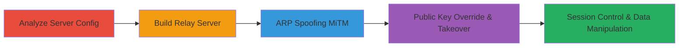

---
tags:
  - mitm
  - websocket
  - shopify-pos
  - android
  - arp-spoofing
  - curve25519
  - crypto-failure
type: attack_chain
tools:
  - '[[tools/netstat]]'
tactics:
  - '[[Initial Access]]'
  - '[[Defense Evasion]]'
verified: false
platforms:
  - Android
  - Mobile
  - Network
submitted: true
complexity: medium
created_at: '2023-10-01T00:00:00Z'
procedures:
  - '[[procedures/Analyze-PoS-App-WebSocket-Server-Configuration]]'
  - '[[procedures/Build-WebSocket-Relay-Server-for-Message-Interception]]'
  - '[[procedures/Perform-ARP-Spoofing-for-MiTM-on-WebSocket-Connection]]'
  - '[[procedures/Override-Receiver-Public-Key-to-Takeover-Session]]'
step_count: 4
techniques:
  - '[[Adversary-in-the-Middle]]'
  - '[[Encrypted Channel]]'
updated_at: '2025-12-14T17:30:58.492Z'
description: >-
  Man-in-the-Middle attack exploiting lack of public key validation in Shopify
  PoS WebSocket communication, enabling session takeover and data
  interception/modification.
skill_level: intermediate
impact_level: high
id: 060624b7-5e3d-44c5-9410-adcc1939134b
validated: true
mitre_tactics:
  - '[[Initial Access]]'
  - '[[Defense Evasion]]'
mitre_techniques:
  - '[[Adversary-in-the-Middle]]'
  - '[[Encrypted Channel]]'
---
# MiTM Shopify PoS WebSocket Session Takeover via Public Key Override

Multi-stage attack chain demonstrating a complete Man-in-the-Middle (MiTM) workflow against Shopify's Point of Sale (PoS) application. The attack exploits a cryptographic vulnerability in the WebSocket handshake between the PoS server and the customer view app, allowing an attacker on the same WiFi network to override the receiver public key, takeover the session, and intercept/modify sensitive customer data such as cart contents, tips, email opt-ins, and contact information.

## Chain Metrics Dashboard

| Metric | Value |
|--------|-------|
| Chain Status | Unverified |
| Total Steps | 4 |
| Execution Time | ~15 minutes |
| Skill Level | Intermediate |
| Complexity | Medium |
| Impact Level | High |

## Attack Flow Visualization



## Prerequisites & Requirements

### Required Tools

- [[tools/netstat]]
- ARP spoofing tool (e.g., arpspoof or Bettercap)
- Custom WebSocket relay implementation (e.g., in Python with websockets library)

### Target Environment

- Shopify PoS Android app running on the same WiFi network
- PoS server listening on port 5000 (WebSocket)
- Attacker device with network access to the local WiFi (e.g., laptop or another mobile device)

### Initial Access Requirements

- Physical proximity to the target WiFi network
- No credentials required; relies on local network positioning
- Rooted Android device or ADB access for analysis (optional for initial recon)

## Detailed Attack Procedures

### Step 1: Analyze PoS App WebSocket Server Configuration
procedure: [[procedures/Analyze-PoS-App-WebSocket-Server-Configuration]]

**Objective**: Identify the WebSocket server binding and configuration to confirm exposure on all interfaces.

**Instructions**: Use [[commands/netstat-listen-sockets]] to verify the server listens on 0.0.0.0:5000. Reverse-engineer the Android app code (e.g., via APK decompilation) to examine com.shopify.pos.customerview.server.CustomerViewWebSocketServer::getConnectionString(), which uses the WiFi IP and binds to all interfaces.

```bash
netstat -an | egrep 'LISTEN[^I]'
```

**Expected Output**: Lines showing tcp 0 0 0.0.0.0:5000 0.0.0.0:* LISTEN, confirming binding to all interfaces.

**Success Indicators**:
- Server confirmed listening on 0.0.0.0:5000
- WebSocket URL constructed with local WiFi IP

### Step 2: Build WebSocket Relay Server for Message Interception
procedure: [[procedures/Build-WebSocket-Relay-Server-for-Message-Interception]]

**Objective**: Create a proxy to snoop on unencrypted WebSocket messages and understand the handshake process.

**Instructions**: Implement a custom relay server in Python (using websockets library) to intercept ws:// connections. Monitor raw messages before Curve25519 encryption, capturing the initial public key and nonce from the QR code or startup messages.

**Expected Output**: Logs of handshake messages, including public key exchange and nonces.

**Success Indicators**:
- Relay successfully proxies traffic without breaking the connection
- Initial crypto setup (public key, nonce) observed in plaintext

### Step 3: Perform ARP Spoofing for MiTM on WebSocket Connection
procedure: [[procedures/Perform-ARP-Spoofing-for-MiTM-on-WebSocket-Connection]]

**Objective**: Position the attacker to intercept traffic between PoS server and customer view app.

**Instructions**: Use an ARP spoofing tool like arpspoof to poison ARP caches on the local network, redirecting WebSocket traffic (port 5000) through the attacker's relay. Alter intercepted messages to inject a new receiverPublicKey, exploiting the lack of validation in com.shopify.pos.customerview.common.crypto.ClientCryptoProtocol::receiveMessageFromServer() when cryptoType != 1.

**Expected Output**: Traffic rerouted; modified messages accepted by client/server.

**Success Indicators**:
- ARP tables show spoofed MAC addresses
- WebSocket connection hijacked without disconnection

### Step 4: Override Receiver Public Key to Takeover Session
procedure: [[procedures/Override-Receiver-Public-Key-to-Takeover-Session]]

**Objective**: Inject and set a new public key to decrypt/encrypt subsequent messages, achieving full session control.

**Instructions**: From the relay, extract the initial public key and nonce from QR code or messages. Modify the message type to trigger setReceiverPublicKey() unconditionally by ensuring cryptoType condition (if(WhenMappings.$EnumSwitchMapping$0[cryptoType.ordinal()]!=1)) is met, overriding the Curve25519 key. Use the new key to intercept/modify carts, tips, emails, and customer details.

**Expected Output**: Session messages decryptable with attacker's key; modifications (e.g., changed tip) reflected in app.

**Success Indicators**:
- New public key accepted without ACK validation
- Attacker can read and alter encrypted payloads
- Full control over customer view interactions

## Attack Chain Summary

### Key Achievements

1. Confirmed WebSocket exposure on local network via server binding analysis
2. Intercepted handshake to understand crypto flow without encryption
3. Established MiTM position using ARP spoofing
4. Overrode public key for session takeover, enabling data manipulation

## Technique & Tactic Coverage

### MITRE ATT&CK Techniques

- [[Adversary-in-the-Middle]] Adversary-in-the-Middle
- [[Encrypted Channel]] Encrypted Channel

### MITRE ATT&CK Tactics

- [[Initial Access]] Initial Access
- [[Defense Evasion]] Defense Evasion

---

*Last updated: 2023-10-01T00:00:00Z*
