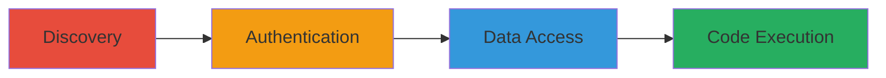

---
tags:
  - jenkins
  - authentication-bypass
  - rce
  - information-disclosure
  - oauth-misconfig
type: attack_chain
tools: []
tactics:
  - '[[Initial Access]]'
  - '[[Execution]]'
  - '[[Discovery]]'
  - '[[Collection]]'
commands: []
platforms:
  - Web
  - Jenkins
complexity: medium
procedures:
  - '[[procedures/Discover-Open-Jenkins-Instance]]'
  - '[[procedures/Authenticate-via-Google-OAuth]]'
  - '[[procedures/Access-Sensitive-API-Tokens-and-Source-Code]]'
  - '[[procedures/Execute-Arbitrary-Code-via-Script-Console]]'
step_count: 4
techniques:
  - '[[Valid Accounts]]'
  - '[[Command-Line Interface]]'
  - '[[Account Discovery]]'
  - '[[Data from Local System]]'
description: >-
  Exploitation of a misconfigured Jenkins instance allowing unauthorized access
  via any Google account, leading to sensitive data exposure and remote code
  execution.
skill_level: intermediate
impact_level: high
id: a20d1477-06eb-4475-bbfb-2d5143028cf9
created_at: '2025-12-11T06:10:15.846Z'
updated_at: '2025-12-11T06:10:15.846Z'
verified: false
validated: true
submitted: true
mitre_tactics:
  - '[[TA0001]]'
  - '[[TA0002]]'
  - '[[TA0007]]'
  - '[[TA0009]]'
mitre_techniques:
  - '[[T1078]]'
  - '[[T1059]]'
  - '[[T1087]]'
  - '[[T1005]]'
---
# Misconfigured Jenkins Authentication Bypass via Google OAuth Leading to RCE and Data Exposure

## Overview

This attack chain demonstrates the exploitation of a misconfigured production Jenkins instance that allowed authentication with any valid Google account, bypassing intended access controls. The attacker gains initial access, explores the dashboard to disclose sensitive API tokens and source code, and ultimately achieves remote code execution via the Script Console. This could lead to further compromise of the target's infrastructure, such as Snapchat's systems, enabling data exfiltration or additional attacks.

## Attack Flow Visualization

## Prerequisites & Requirements

### Required Tools

- None specific; a web browser and valid Google account are sufficient.

### Target Environment

- Jenkins server with Google OAuth integration.
- Exposed to the internet or accessible network.
- No whitelisting on authentication.

### Initial Access Requirements

- Valid Google account credentials.
- Network access to the Jenkins instance URL.
- No prior access needed beyond discovery.

## Detailed Attack Procedures

### Step 1: Discovery - [[procedures/Discover-Open-Jenkins-Instance]]

**Objective**: Identify the exposed Jenkins instance configured for open Google OAuth login.

**Instructions**: Scan for public-facing Jenkins servers using search engines or tools like Shodan. Look for indicators of Google OAuth integration without restrictions. Once identified, navigate to the login page to confirm it prompts for Google authentication without domain restrictions.

**Expected Output**: Access to the Jenkins login page confirming Google OAuth is enabled.

**Success Indicators**:
- Successful navigation to the Jenkins URL.
- Google login prompt appears without errors or restrictions.

### Step 2: Authentication - [[procedures/Authenticate-via-Google-OAuth]]

**Objective**: Gain authenticated access to the Jenkins dashboard using any valid Google account.

**Instructions**: On the Jenkins login page, select the Google authentication option and log in with valid Google credentials. The misconfiguration allows any Google account to authenticate successfully.

**Expected Output**: Redirect to the Jenkins dashboard with user privileges.

**Success Indicators**:
- Successful login and access to Jenkins interface.
- No authentication errors or access denied messages.

### Step 3: Data Access - [[procedures/Access-Sensitive-API-Tokens-and-Source-Code]]

**Objective**: Navigate the Jenkins dashboard to disclose API tokens and source code repositories.

**Instructions**: Within the authenticated Jenkins session, browse to user configuration pages to view API tokens. Access job configurations and repositories to view source code for public apps. Note any sensitive information exposed.

**Expected Output**: Retrieval of API tokens and source code files.

**Success Indicators**:
- Visibility of API tokens in user profile.
- Access to source code without additional permissions required.

### Step 4: Code Execution - [[procedures/Execute-Arbitrary-Code-via-Script-Console]]

**Objective**: Achieve remote code execution on the Jenkins server using the Script Console.

**Instructions**: Navigate to the Script Console feature in Jenkins (typically at /script). Input and execute arbitrary Groovy scripts to run commands on the server, such as system information retrieval or file operations.

**Expected Output**: Successful execution of scripts with output confirming RCE.

**Success Indicators**:
- Script execution without errors.
- Output from scripts indicating server-side execution.

## Attack Chain Summary

### Key Achievements

1. Unauthorized access to production Jenkins instance.
2. Disclosure of sensitive API tokens and source code.
3. Remote code execution capabilities on the server.

## Technique & Tactic Coverage

### MITRE ATT&CK Techniques

- [[Valid Accounts]]
- [[Command-Line Interface]]
- [[Account Discovery]]
- [[Data from Local System]]

### MITRE ATT&CK Tactics

- [[Initial Access]]
- [[Execution]]
- [[Discovery]]
- [[Collection]]

*Last updated: 2023-10-01*
