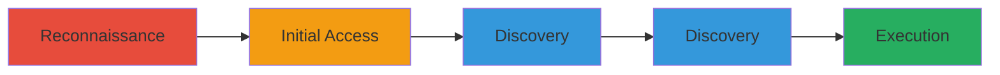

---
tags:
  - jenkins
  - oauth-misconfig
  - rce
  - api-token-exposure
  - source-code-disclosure
type: attack_chain
tools:
  - '[[tools/Browser]]'
tactics:
  - '[[Initial Access]]'
  - '[[Execution]]'
  - '[[Discovery]]'
commands: []
platforms:
  - Jenkins
  - Web
complexity: medium
procedures:
  - '[[procedures/Discover-Open-Jenkins-Instance]]'
  - '[[procedures/Login-via-Misconfigured-Google-OAuth]]'
  - '[[procedures/Access-Sensitive-API-Tokens]]'
  - '[[procedures/Disclose-Source-Code-from-Jenkins-Jobs]]'
  - '[[procedures/Execute-Arbitrary-Code-via-Jenkins-Script-Console]]'
step_count: 5
techniques:
  - '[[Valid Accounts]]'
  - '[[Command-Line Interface]]'
  - '[[File and Directory Discovery]]'
description: >-
  Exploitation of a misconfigured Jenkins instance via Google OAuth for
  unauthorized access, sensitive data exposure, and remote code execution.
skill_level: intermediate
impact_level: high
id: 9d7a454c-1810-4da8-913b-eb71ca57503f
created_at: '2025-12-11T03:47:56.639Z'
updated_at: '2025-12-11T03:47:56.639Z'
verified: false
validated: true
submitted: true
mitre_tactics:
  - '[[TA0001]]'
  - '[[TA0002]]'
  - '[[TA0007]]'
mitre_techniques:
  - '[[T1078]]'
  - '[[T1059]]'
  - '[[T1083]]'
---
# Misconfigured Jenkins OAuth Allowing Unauthorized Access and RCE

Multi-stage attack chain demonstrating unauthorized access to a production Jenkins instance via misconfigured Google OAuth, leading to exposure of sensitive API tokens, source code disclosure, and arbitrary code execution through the Script Console.

## Chain Metrics Dashboard

| Metric | Value |
|--------|-------|
| Chain Status | Unverified |
| Total Steps | 5 |
| Execution Time | ~15 minutes |
| Skill Level | Intermediate |
| Complexity | Medium |
| Impact Level | High |

## Attack Flow Visualization



## Prerequisites & Requirements

### Required Tools

- #curl
- [[tools/Browser]]

### Target Environment

- Jenkins CI/CD platform with Google OAuth integration
- Publicly accessible Jenkins service
- No specific ports required beyond HTTP/HTTPS (default 8080)

### Initial Access Requirements

- Valid Google account for OAuth login
- Network access to the Jenkins instance
- No prior credentials needed due to misconfiguration

## Detailed Attack Procedures

### Step 1: Reconnaissance - [[procedures/Discover-Open-Jenkins-Instance]]

**Procedure**: [[procedures/Discover-Open-Jenkins-Instance]]

**Objective**: Identify a publicly accessible Jenkins server through reconnaissance.

**Expected Output**: Confirmation of an open Jenkins instance URL.

**Success Indicators**:
- Detection of Jenkins login page
- No authentication barriers during probing

Use [[commands/curl-jenkins-probe]] to check for Jenkins headers:

```bash
curl -I https://jenkins.target.com
```

Look for headers like 'X-Jenkins' in the response.

### Step 2: Initial Access - [[procedures/Login-via-Misconfigured-Google-OAuth]]

**Procedure**: [[procedures/Login-via-Misconfigured-Google-OAuth]]

**Objective**: Authenticate to the Jenkins instance using any valid Google account due to misconfiguration.

**Expected Output**: Successful login and access to the Jenkins dashboard.

**Success Indicators**:
- Redirect to Jenkins dashboard after OAuth flow
- Ability to view Jenkins projects and configurations

Navigate to the Jenkins login page in a [[tools/Browser]] and select Google OAuth, then log in with any valid Google credentials.

### Step 3: Discovery - [[procedures/Access-Sensitive-API-Tokens]]

**Procedure**: [[procedures/Access-Sensitive-API-Tokens]]

**Objective**: Navigate to user configurations to retrieve exposed API tokens.

**Expected Output**: List of API tokens that can be used for further API access.

**Success Indicators**:
- Tokens visible in user profile or configuration pages
- Tokens valid for authenticated API calls

After login, go to 'Manage Users' or your profile and view API tokens.

### Step 4: Discovery - [[procedures/Disclose-Source-Code-from-Jenkins-Jobs]]

**Procedure**: [[procedures/Disclose-Source-Code-from-Jenkins-Jobs]]

**Objective**: Access Jenkins job configurations to disclose source code of public apps.

**Expected Output**: Exposed source code files or repositories.

**Success Indicators**:
- Ability to view or download source code from job workspaces
- Confirmation of sensitive code exposure

Browse to Jenkins jobs, select a job, and view the workspace or configuration to access source code.

### Step 5: Execution - [[procedures/Execute-Arbitrary-Code-via-Jenkins-Script-Console]]

**Procedure**: [[procedures/Execute-Arbitrary-Code-via-Jenkins-Script-Console]]

**Objective**: Use the Script Console to run arbitrary Groovy scripts for remote code execution.

**Expected Output**: Successful execution of test scripts, such as system property retrieval.

**Success Indicators**:
- Script output returned in the console
- Evidence of code execution on the server

Navigate to '/script' endpoint, enter a Groovy script using [[commands/groovy-rce-test]]:

```groovy
println System.getProperty("os.name")
```

Submit and observe the output.

## Attack Chain Summary

### Key Achievements

1. Unauthorized access via misconfigured OAuth
2. Exposure of API tokens and source code
3. Achievement of remote code execution

## Technique & Tactic Coverage

### MITRE ATT&CK Techniques

- [[Valid Accounts]]
- [[Command-Line Interface]]
- [[File and Directory Discovery]]

### MITRE ATT&CK Tactics

- [[Initial Access]]
- [[Execution]]
- [[Discovery]]

*Last updated: 2023-10-01*
