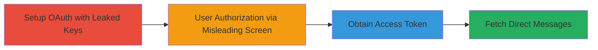

---
tags:
  - oauth
  - twitter-api
  - privacy-violation
  - leaked-credentials
  - direct-messages
type: attack_chain
tools:
  - '[[tools/tweepy]]'
tactics:
  - '[[Initial Access]]'
  - '[[Credential Access]]'
  - '[[Collection]]'
verified: false
platforms:
  - Web
submitted: true
complexity: medium
created_at: '2023-10-01T00:00:00Z'
procedures:
  - '[[procedures/Setup-OAuth-Authentication-with-Leaked-Twitter-Keys]]'
  - '[[procedures/Generate-and-Trigger-User-Authorization-URL]]'
  - '[[procedures/Exchange-Verifier-PIN-for-Access-Token]]'
  - '[[procedures/Fetch-Direct-Messages-via-Authenticated-API]]'
step_count: 4
techniques:
  - '[[Valid Accounts]]'
  - '[[Use Alternate Authentication Material]]'
  - '[[Data from Information Repositories]]'
updated_at: '2025-12-14T17:30:35.534Z'
description: >-
  Attack chain exploiting a misleading OAuth permissions screen in official
  Twitter API consumer keys to gain unauthorized access to users' Direct
  Messages by tricking users into granting full permissions under false
  pretenses of no DM access.
skill_level: intermediate
impact_level: high
id: 4b55ecbb-d2fb-42fe-9a4a-df92e18908c2
validated: true
mitre_tactics:
  - '[[Initial Access]]'
  - '[[Credential Access]]'
  - '[[Collection]]'
mitre_techniques:
  - '[[Valid Accounts]]'
  - '[[Use Alternate Authentication Material]]'
  - '[[Data from Information Repositories]]'
---
# Misleading OAuth Permissions Screen Enabling Unauthorized DM Access via Leaked Official Twitter API Keys

Multi-stage attack chain demonstrating exploitation of Twitter's misleading OAuth permissions screen for official API consumer keys, allowing attackers to access private Direct Messages without explicit user consent.

## Chain Metrics Dashboard

| Metric | Value |
|--------|-------|
| Chain Status | Unverified |
| Total Steps | 4 |
| Execution Time | ~5 minutes |
| Skill Level | Intermediate |
| Complexity | Medium |
| Impact Level | High |

## Attack Flow Visualization



## Prerequisites & Requirements

### Required Tools

- [[tools/tweepy]]

### Target Environment

- Twitter API (api.twitter.com)
- Web-based OAuth flow
- No specific ports required; uses HTTPS

### Initial Access Requirements

- Leaked official Twitter consumer keys (e.g., iPhone app: consumer_key='IQKbtAYlXLripLGPWd0HUA', consumer_secret='GgDYlkSvaPxGxC4X8liwpUoqKwwr3lCADbz8A7ADU')
- Python environment with Tweepy installed
- User interaction to authorize via generated URL

## Detailed Attack Procedures

### Step 1: Setup OAuth Authentication
procedure: [[procedures/Setup-OAuth-Authentication-with-Leaked-Twitter-Keys]]

**Objective**: Initialize OAuth handler using leaked official Twitter consumer keys to begin the authentication flow.

**Instructions**: Import Tweepy and set up the OAuth handler with the leaked keys, enabling secure mode.

Execute [[commands/setup-oauth-handler]]:

```python
auth = tweepy.OAuthHandler(consumer_key, consumer_secret)
auth.secure = True
auth_url = auth.get_authorization_url()
print 'Visit this URL and authorise the app to use your Twitter account: ' + auth_url
```

**Expected Output**: Printed authorization URL that leads to the misleading permissions screen.

**Success Indicators**:
- OAuth handler initialized successfully
- Authorization URL generated

### Step 2: Generate and Trigger User Authorization
procedure: [[procedures/Generate-and-Trigger-User-Authorization-URL]]

**Objective**: Generate the authorization URL and have the user visit it, where they encounter the misleading screen claiming no DM access.

**Instructions**: The URL from Step 1 is visited by the target user, who sees the permissions screen for the official app (e.g., Twitter for iPhone) stating 'Will not be able to: Access your direct messages,' but authorizes anyway, providing a PIN.

No direct command execution here; relies on user interaction via the printed URL from [[commands/setup-oauth-handler]].

**Expected Output**: User receives a verifier PIN after authorization.

**Success Indicators**:
- User visits URL and authorizes
- Verifier PIN obtained from user

### Step 3: Exchange Verifier for Access Token
procedure: [[procedures/Exchange-Verifier-PIN-for-Access-Token]]

**Objective**: Use the user's provided PIN to complete OAuth and obtain access tokens, granting full API access including DMs.

**Instructions**: Prompt the user for the PIN and exchange it for access tokens using Tweepy.

Execute [[commands/exchange-verifier-for-token]]:

```python
verifier = raw_input('Type in the generated PIN: ').strip()
auth.get_access_token(verifier)
```

**Expected Output**: Access token and access token secret retrieved.

**Success Indicators**:
- Access tokens obtained
- Authentication completed

### Step 4: Fetch Direct Messages
procedure: [[procedures/Fetch-Direct-Messages-via-Authenticated-API]]

**Objective**: Create an authenticated API instance and retrieve Direct Messages, demonstrating unauthorized access.

**Instructions**: Set up a new OAuth handler with the access tokens and call the DM endpoint.

First, execute [[commands/create-authenticated-api]]:

```python
full_auth = tweepy.OAuthHandler(consumer_key, consumer_secret)
full_auth.set_access_token(auth.access_token, auth.access_token_secret)
api = tweepy.API(full_auth)
```

Then, execute [[commands/fetch-direct-messages]]:

```python
print api.direct_messages()
```

**Expected Output**: List of user's Direct Messages printed, confirming access despite the misleading screen.

**Success Indicators**:
- API instance created successfully
- DMs retrieved and displayed

## Attack Chain Summary

### Key Achievements

1. Bypassed user privacy expectations using official leaked keys
2. Obtained full API access via misleading OAuth screen
3. Accessed private Direct Messages without explicit consent
4. Highlighted potential GDPR compliance issues

## Technique & Tactic Coverage

### MITRE ATT&CK Techniques

- [[Valid Accounts]] Valid Accounts
- [[Use Alternate Authentication Material]] Use Alternate Authentication Material
- [[Data from Information Repositories]] Data from Information Repositories

### MITRE ATT&CK Tactics

- [[Initial Access]] Initial Access
- [[Credential Access]] Credential Access
- [[Collection]] Collection

---

*Last updated: 2023-10-01T00:00:00Z*
