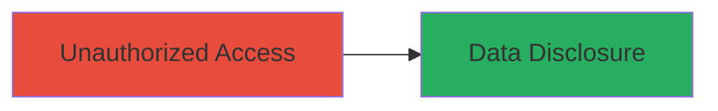

---
tags:
  - information-disclosure
  - authorization-bypass
  - credential-exposure
type: attack_chain
tools: []
tactics:
  - '[[Initial Access]]'
  - '[[Collection]]'
commands:
  - '[[commands/curl-unauthorized-admin-access]]'
platforms:
  - Web
complexity: low
procedures:
  - '[[procedures/Exploit-Missing-Authorization-for-Admin-Data-Disclosure]]'
step_count: 1
techniques:
  - '[[Exploit Public-Facing Application]]'
  - '[[Unsecured Credentials]]'
description: >-
  A vulnerability in the ubernihao.com platform due to missing authorization
  checks allows unauthorized users to access and disclose administrator
  credentials and tokens.
skill_level: beginner
impact_level: high
id: 7bae96c0-ef7b-4829-9af3-277ed6ed7d94
created_at: '2025-12-14T17:29:20.314Z'
updated_at: '2025-12-14T17:29:20.314Z'
verified: false
validated: true
submitted: true
mitre_tactics:
  - '[[Initial Access]]'
  - '[[Collection]]'
mitre_techniques:
  - '[[Exploit Public-Facing Application]]'
  - '[[Unsecured Credentials]]'
---
# Missing Authorization Checks Exposing Admin Credentials on Ubernihao.com

## Overview

This attack chain exploits missing authorization checks on the ubernihao.com web platform, enabling unauthorized access to sensitive administrator data. Without proper authentication enforcement, an attacker can directly retrieve credentials and tokens for admin accounts, leading to potential account takeover and further compromise. The vulnerability was identified through simple testing of unprotected endpoints, highlighting a critical broken access control issue in the application's security model.

## Chain Metrics Dashboard

| Metric | Value |
|--------|-------|
| Chain Status | Unverified |
| Total Steps | 1 |
| Execution Time | ~1 minutes |
| Skill Level | Beginner |
| Complexity | Low |
| Impact Level | High |

## Attack Flow Visualization



## Prerequisites & Requirements

### Required Tools

- None specific (uses standard HTTP client like curl)

### Target Environment

- Web platform (ubernihao.com)
- No specific services/ports required beyond standard HTTPS (443)
- Public internet access to the target domain

### Initial Access Requirements

- No credentials needed due to missing checks
- Direct network access to the web application
- No prior access required

## Detailed Attack Procedures

### Step 1: Unauthorized Access to Admin Data
procedure: [[procedures/Exploit-Missing-Authorization-for-Admin-Data-Disclosure]]

**Objective**: Bypass authorization to retrieve exposed administrator credentials and tokens from unprotected endpoints.

**Instructions**: Identify and access admin-related endpoints without authentication. Use [[commands/curl-unauthorized-admin-access]] to send a GET request to a suspected admin path, such as /admin or an API endpoint handling user data:

```bash
curl -X GET https://ubernihao.com/admin/users -H "User-Agent: Mozilla/5.0"
```

If the endpoint lacks authorization, it will return sensitive data. Inspect the response for JSON or HTML containing admin usernames, passwords, or API tokens.

**Expected Output**: Raw response data including admin credentials, e.g., {"admin_user": "admin@ubernihao.com", "token": "eyJ..."}.

**Success Indicators**:
- Response contains admin account details without prompting for login
- Credentials or tokens visible in the output
- No 401/403 errors returned

## Attack Chain Summary

### Key Achievements

1. Successful unauthorized access to admin endpoints
2. Disclosure of sensitive credentials and tokens
3. Potential for further exploitation like account takeover

## Technique & Tactic Coverage

### MITRE ATT&CK Techniques

- [[Exploit Public-Facing Application]]
- [[Unsecured Credentials]]

### MITRE ATT&CK Tactics

- [[Initial Access]]
- [[Collection]]

---
*Last updated: 2023-10-01*
