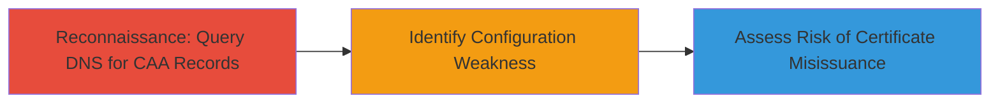

---
tags:
  - dns
  - caa
  - certificate
  - configuration
  - reconnaissance
type: attack_chain
tools:
  - '[[tools/Google-DNS-Lookup]]'
tactics:
  - '[[Reconnaissance]]'
verified: false
platforms:
  - DNS
submitted: true
complexity: low
created_at: '2023-10-01T00:00:00Z'
procedures:
  - '[[procedures/Query-DNS-for-CAA-Records]]'
step_count: 1
techniques:
  - '[[Hardware]]'
updated_at: '2025-12-14T17:29:28.170Z'
description: >-
  Reconnaissance attack identifying absence of Certificate Authority
  Authorization (CAA) DNS records on target domains, increasing risk of
  fraudulent certificate issuance.
skill_level: beginner
impact_level: medium
id: ab52fb6b-7110-45cc-ac83-fcc33514dd1f
validated: true
mitre_tactics:
  - '[[Reconnaissance]]'
mitre_techniques:
  - '[[Hardware]]'
---
# Missing CAA DNS Records Enabling Certificate Misissuance Risk

Multi-stage attack chain demonstrating a complete attack workflow.

## Chain Metrics Dashboard

| Metric | Value |
|--------|-------|
| Chain Status | Unverified |
| Total Steps | 1 |
| Execution Time | ~5 minutes |
| Skill Level | Beginner |
| Complexity | Low |
| Impact Level | Medium |

## Attack Flow Visualization

## Prerequisites & Requirements

### Required Tools

- [[tools/Google-DNS-Lookup]]

### Target Environment

- DNS infrastructure
- Access to public DNS query services
- No authentication required

### Initial Access Requirements

- Internet connectivity
- No credentials or prior access needed

## Detailed Attack Procedures

### Step 1: DNS Reconnaissance for CAA Records
procedure: [[procedures/Query-DNS-for-CAA-Records]]

**Objective**: Query the DNS for Certificate Authority Authorization (CAA) records on target domains to identify if authorized certificate authorities are restricted, revealing configuration weaknesses that could allow unauthorized CAs to issue certificates.

**Instructions**: Use [[tools/Google-DNS-Lookup]] to query for resource record type 257 (CAA) on the target domains. Navigate to the tool's web interface and input the domain name with type=257 and dnssec=true.

For hacker101.com:

Access https://dns.google.com/query and set parameters: name=hacker101.com, type=257, dnssec=true.

For ctf.hacker101.com:

Repeat with name=ctf.hacker101.com, type=257, dnssec=true.

**Expected Output**: DNS response showing no CAA records present, confirming the absence of rules restricting certificate authorities.

**Success Indicators**:
- No CAA records returned in the query results
- Confirmation that domains lack authorization restrictions for CAs

## Attack Chain Summary

### Key Achievements

1. Identified missing CAA DNS records on hacker101.com and ctf.hacker101.com
2. Demonstrated increased risk of phony certificate issuance by unauthorized CAs
3. Highlighted potential for phishing and man-in-the-middle attacks via fraudulent certificates

## Technique & Tactic Coverage

### MITRE ATT&CK Techniques

- [[Hardware]]

### MITRE ATT&CK Tactics

- [[Reconnaissance]]

---
*Last updated: 2023-10-01T00:00:00Z*
