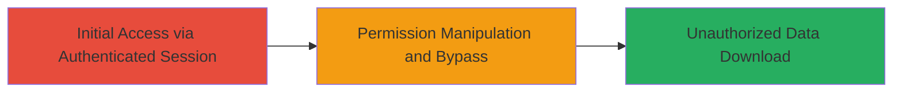

# Moneybird Invoice Download Access Control Bypass via Permission Manipulation

Multi-stage attack chain demonstrating a complete attack workflow exploiting improper access control in a web application.

## Chain Metrics Dashboard

| Metric | Value |
|--------|-------|
| Chain Status | Unverified |
| Total Steps | 1 |
| Execution Time | ~5 minutes |
| Skill Level | Intermediate |
| Complexity | Medium |
| Impact Level | High |

## Attack Flow Visualization

## Prerequisites & Requirements

### Required Tools

- Web browser (e.g., Chrome with Developer Tools)

### Target Environment

- Web platform (Moneybird application)
- Required services/ports: HTTPS on standard web ports (443)
- Network access requirements: Valid network connectivity to the Moneybird instance

### Initial Access Requirements

- Credential requirements: Valid user account with initial download permissions; secondary account or admin access to modify permissions
- Network position: Direct access to the web application
- Prior access needed: Authenticated session as a user

## Detailed Attack Procedures

### Step 1: Permission Bypass and Unauthorized Download
procedure: [[procedures/Bypass-Invoice-Download-Permissions-via-Open-Page-Manipulation]]

**Objective**: Exploit the lack of permission re-verification during the download action to access invoice documents without authorization.

**Instructions**: Authenticate to the Moneybird application as a user with initial access to the invoice page. Navigate to the invoice documents downloading feature page to load it in the browser. While the page remains open (without refreshing), use an administrative interface or secondary session to downgrade or revoke the user's permissions for downloading exports. Immediately initiate the download action from the still-open page. The backend fails to perform extra permission checks, allowing the export to proceed.

**Expected Output**: Successful download of the invoice export file containing sensitive documents.

**Success Indicators**:
- Download completes without error despite revoked permissions
- Exported file contains unauthorized invoice data
- No permission denial message appears during the action

## Attack Chain Summary

### Key Achievements

1. Bypassed authorization checks in the download endpoint
2. Gained unauthorized access to invoice documents
3. Demonstrated impact of missing runtime permission validation

## Technique & Tactic Coverage

### MITRE ATT&CK Techniques

- [[Exploit Public-Facing Application]]

### MITRE ATT&CK Tactics

- [[Initial Access]]

---
*Last updated: 2024-01-01T00:00:00Z*
