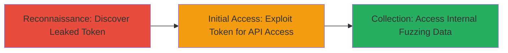

# Mozilla FuzzManager API Token Leak Leading to Unauthorized Internal Data Access

Multi-stage attack chain demonstrating the discovery and exploitation of an exposed API token in a public GitHub repository, resulting in unauthorized read-write access to Mozilla's FuzzManager fuzzing platform.

## Chain Metrics Dashboard

| Metric | Value |
|--------|-------|
| Chain Status | Unverified |
| Total Steps | 2 |
| Execution Time | ~5 minutes |
| Skill Level | Basic |
| Complexity | Low |
| Impact Level | High |

## Attack Flow Visualization



## Prerequisites & Requirements

### Required Tools

- [[tools/truffleHog]]

### Target Environment

- Public GitHub repositories
- Web-based API services (e.g., FuzzManager at https://fuzzmanager.fuzzing.mozilla.org/)
- No specific ports required; uses HTTPS (443)

### Initial Access Requirements

- Internet access to scan public GitHub repos
- No prior credentials needed for discovery phase
- Valid leaked token for exploitation phase

## Detailed Attack Procedures

### Step 1: Discover Leaked Token
procedure: [[procedures/Discover-Leaked-API-Tokens-in-Public-GitHub-Repositories]]

**Objective**: Scan public GitHub repositories to identify accidentally committed sensitive API tokens.

**Instructions**: Use [[tools/truffleHog]] to scan a cloned repository or multiple repos for exposed secrets like API tokens.

First, clone the target repository:

```bash
git clone https://github.com/target/repo.git
```

Then scan for secrets using [[commands/trufflehog-scan]]:

```bash
trufflehog filesystem ./repo
```

**Expected Output**: Detection of high-entropy strings or known patterns matching API tokens, e.g., "Detected API token: abc123... with read-write permissions to FuzzManager."

**Success Indicators**:
- Token pattern matched (e.g., Mozilla API format)
- Token validity confirmed via manual test (e.g., curl to API endpoint)

### Step 2: Exploit Token for Unauthorized Access
procedure: [[procedures/Access-FuzzManager-API-with-Stolen-Token]]

**Objective**: Use the discovered API token to gain read-write access to the FuzzManager API, allowing retrieval and modification of internal fuzzing data.

**Instructions**: Authenticate to the FuzzManager API using the leaked token via HTTP requests.

Test token validity and read access with [[commands/curl-api-read]]:

```bash
curl -H "Authorization: Token abc123def456" https://fuzzmanager.fuzzing.mozilla.org/api/v1/crashes/
```

For write access, attempt to create a new entry with [[commands/curl-api-write]]:

```bash
curl -X POST -H "Authorization: Token abc123def456" -d '{"test":"data"}' https://fuzzmanager.fuzzing.mozilla.org/api/v1/crashes/
```

**Expected Output**: JSON response with fuzzing data (read) or success confirmation (write), e.g., {"id": 123, "crash_data": "..."}.

**Success Indicators**:
- API returns internal data without authentication errors
- Write operations succeed, confirming full access

## Attack Chain Summary

### Key Achievements

1. Identified exposed API token in public GitHub commit
2. Gained unauthorized read-write access to Mozilla's FuzzManager
3. Potential exfiltration or tampering with internal fuzzing results

## Technique & Tactic Coverage

### MITRE ATT&CK Techniques

- [[Hardware]]
- [[Valid Accounts]]

### MITRE ATT&CK Tactics

- [[Reconnaissance]]
- [[Initial Access]]

---
*Last updated: 2023-10-01T00:00:00Z*
