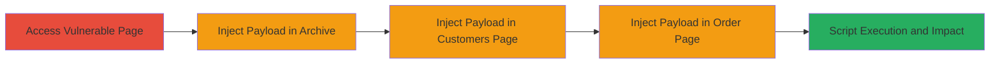

---
tags:
  - xss
  - reflected-xss
  - javascript-injection
  - web-vulnerability
type: attack_chain
tools: []
tactics:
  - '[[Execution]]'
verified: false
platforms:
  - Web
submitted: true
complexity: medium
created_at: '2023-10-01T00:00:00Z'
procedures:
  - '[[procedures/XSS-Injection-in-Updates-Archive-Directory-Parameter]]'
  - '[[procedures/XSS-Injection-in-Store-Customers-Login-Task]]'
  - '[[procedures/XSS-Injection-in-Store-Order-Product-Parameters]]'
step_count: 4
techniques:
  - '[[JavaScript]]'
updated_at: '2025-12-14T03:16:14.402Z'
description: >-
  A chain of reflected Cross-site Scripting (XSS) attacks exploiting unsanitized
  URL parameters in the MapsMarker.com website's archive, customer, and order
  pages to execute arbitrary JavaScript in victims' browsers.
skill_level: intermediate
impact_level: high
id: 5016c831-eb48-42a7-8519-6b2abd2d18a8
validated: true
mitre_tactics:
  - '[[Execution]]'
mitre_techniques:
  - '[[JavaScript]]'
---
# Multiple Reflected XSS via URL Parameter Manipulation in MapsMarker.com

This attack chain exploits multiple reflected XSS vulnerabilities in the MapsMarker.com website by injecting malicious JavaScript payloads into URL parameters. The vulnerabilities allow arbitrary script execution in the victim's browser when they visit crafted links, potentially enabling session hijacking, data theft, or phishing. The chain covers navigation to vulnerable endpoints and payload injection across archive, customer login, and order pages, all built on PHP without proper input sanitization.

## Chain Metrics Dashboard

| Metric | Value |
|--------|-------|
| Chain Status | Unverified |
| Total Steps | 4 |
| Execution Time | ~5 minutes |
| Skill Level | Intermediate |
| Complexity | Medium |
| Impact Level | High |

## Attack Flow Visualization

## Prerequisites & Requirements

### Required Tools

- Web browser (e.g., Chrome, Firefox) for manual testing
- URL encoding tool (built-in browser dev tools or online encoder)

### Target Environment

- Web platform
- PHP-based website (MapsMarker.com)
- No specific ports required; standard HTTPS (443)
- Publicly accessible website

### Initial Access Requirements

- No credentials needed
- Direct network access to the internet
- Ability to craft and share malicious URLs (e.g., via phishing emails)

## Detailed Attack Procedures

### Step 1: Navigate to Archive Page

**Objective**: Access the vulnerable updates archive endpoint to prepare for payload injection.

**Instructions**: Open a web browser and navigate to the base archive URL. This establishes the context for the directory parameter manipulation.

**Expected Output**: The archive page loads, displaying version information like v3.0.1.

**Success Indicators**:
- Page loads without errors
- URL parameter 'dir' is visible in the address bar

### Step 2: Inject XSS Payload in Archive Directory Parameter

procedure: [[procedures/XSS-Injection-in-Updates-Archive-Directory-Parameter]]

**Objective**: Exploit the lack of sanitization in the 'dir' parameter to execute JavaScript on page load.

**Instructions**: Append a URL-encoded JavaScript payload to the 'dir' parameter. For example, use '<svg onLoad=prompt(9)>' encoded as '%3Csvg%20onLoad%3Dprompt%289%29%3E'. The full URL becomes https://www.mapsmarker.com/updates-pro/archive/?dir=v3.0.1%3Csvg%20onLoad%3Dprompt%289%29%3E. Visit this URL in a browser.

**Expected Output**: A JavaScript prompt dialog appears with the number 9, confirming execution.

**Success Indicators**:
- Alert or prompt triggers immediately on page load
- No server-side errors; payload reflects in the page source

### Step 3: Inject XSS Payload in Store Customers Page

procedure: [[procedures/XSS-Injection-in-Store-Customers-Login-Task]]

**Objective**: Test and exploit reflected XSS in the customer login endpoint by manipulating query parameters.

**Instructions**: Navigate to the customers index page and inject payloads into the 'task' parameter, such as 'x'/onmouseover=prompt(9)//' or x'><svg onLoad=prompt(9)>. URL example: https://www.mapsmarker.com/store/customers/index.php/?task=login%22/onmouseover%3Dprompt%289%29//. Hover or load the page to trigger.

**Expected Output**: Script executes on mouseover or load, displaying a prompt.

**Success Indicators**:
- Payload reflects without sanitization in HTML attributes
- Interactive trigger (e.g., onmouseover) fires the script

### Step 4: Inject XSS Payload in Store Order Page

procedure: [[procedures/XSS-Injection-in-Store-Order-Product-Parameters]]

**Objective**: Demonstrate XSS in the order product endpoint by injecting into product_id or category_id parameters.

**Instructions**: Access the order page and append payloads to parameters like product_id=1%22%3E%3Csvg%20onLoad%3Dprompt%289%29%3E. Full URL: https://www.mapsmarker.com/store/order/index.php/?task=product&product_id=1%22%3E%3Csvg%20onLoad%3Dprompt%289%29%3E&category_id=1. Load the page to execute.

**Expected Output**: JavaScript prompt appears, indicating successful injection.

**Success Indicators**:
- Arbitrary HTML/JS injection in page elements
- Potential for session compromise if victim is authenticated

## Attack Chain Summary

### Key Achievements

1. Successful execution of JavaScript across three endpoints without authentication
2. Demonstration of reflected XSS leading to browser-based code execution
3. Highlighted risks of session hijacking and data exfiltration in a production e-commerce site

## Technique & Tactic Coverage

### MITRE ATT&CK Techniques

- [[JavaScript]]

### MITRE ATT&CK Tactics

- [[Execution]]

---
*Last updated: 2023-10-01T00:00:00Z*
