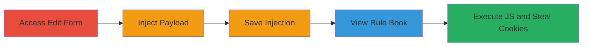

---
tags:
  - xss
  - stored-xss
  - veris
  - javascript
  - cookie-theft
type: attack_chain
tools:
  - '[[tools/Mozilla-Firefox]]'
  - '[[tools/Google-Chrome]]'
tactics:
  - '[[Collection]]'
verified: false
platforms:
  - Web
submitted: true
complexity: medium
created_at: '2023-10-01T00:00:00Z'
procedures:
  - '[[procedures/Inject-Stored-XSS-Payload-in-Veris-Edit-Group-Details]]'
  - '[[procedures/Trigger-Stored-XSS-in-Veris-Rule-Book]]'
step_count: 5
techniques:
  - '[[JavaScript]]'
updated_at: '2025-12-14T03:15:26.748Z'
description: >-
  A multi-stage attack exploiting stored XSS vulnerabilities in the Veris
  application's Edit Group Details form, allowing arbitrary JavaScript execution
  when viewing the Rule Book to steal user cookies and perform client-side
  attacks.
skill_level: intermediate
impact_level: high
id: 5499e9a1-f5cb-4ab7-b090-ee36a0e91773
validated: true
mitre_tactics:
  - '[[Collection]]'
mitre_techniques:
  - '[[JavaScript]]'
---
# Multiple Stored XSS in Veris Edit Group Details Leading to Cookie Theft

Multi-stage attack chain demonstrating the exploitation of multiple stored XSS vulnerabilities in the Veris application, enabling attackers to inject malicious JavaScript via the Edit Group Details form and execute it in victims' browsers when viewing the Rule Book, resulting in potential session hijacking through cookie theft.

## Chain Metrics Dashboard

| Metric | Value |
|--------|-------|
| Chain Status | Unverified |
| Total Steps | 5 |
| Execution Time | ~5 minutes |
| Skill Level | Intermediate |
| Complexity | Medium |
| Impact Level | High |

## Attack Flow Visualization

## Prerequisites & Requirements

### Required Tools

- [[tools/Mozilla-Firefox]]
- [[tools/Google-Chrome]]

### Target Environment

- Web application: Veris platform
- Required services/ports: HTTP/HTTPS on standard web ports (80/443)
- Network access requirements: Direct access to the Veris application URL

### Initial Access Requirements

- No credentials required if the Edit Group Details form is publicly accessible or under authenticated session with edit privileges
- Network position: External or internal depending on application exposure
- Prior access needed: Valid user session for editing groups

## Detailed Attack Procedures

### Step 1: Navigate to Edit Group Details Form
procedure: [[procedures/Inject-Stored-XSS-Payload-in-Veris-Edit-Group-Details]]

**Objective**: Access the vulnerable form to prepare for payload injection.

**Instructions**: Open the Veris application in a web browser and navigate to the 'Edit Group Details' section, typically under group management features.

**Expected Output**: The form loads with input fields for group information.

**Success Indicators**:
- Form is accessible and input fields are visible
- No immediate sanitization errors

### Step 2: Inject Malicious Payloads into Input Fields
procedure: [[procedures/Inject-Stored-XSS-Payload-in-Veris-Edit-Group-Details]]

**Objective**: Insert JavaScript payloads into unsanitized input fields to store malicious code.

**Instructions**: In the input fields (e.g., group name or description), enter payloads such as `` or ``. These exploit the lack of input sanitization.

**Expected Output**: Payloads are entered without rejection.

**Success Indicators**:
- Payloads are accepted in the form
- No client-side validation blocks the input

### Step 3: Submit and Save the Form
procedure: [[procedures/Inject-Stored-XSS-Payload-in-Veris-Edit-Group-Details]]

**Objective**: Persist the malicious payloads in the application's backend storage.

**Instructions**: Click the submit button to save the group details, allowing the unsanitized input to be stored in the database.

**Expected Output**: Form submission succeeds, and a confirmation message appears.

**Success Indicators**:
- Data is saved without errors
- Payload is stored for later reflection

### Step 4: Navigate to the Rule Book and View It
procedure: [[procedures/Trigger-Stored-XSS-in-Veris-Rule-Book]]

**Objective**: Access the section where stored data is reflected without sanitization.

**Instructions**: Log in as or trick a victim into navigating to the 'View Rule Book' feature, which displays the injected group details.

**Expected Output**: The Rule Book loads, rendering the stored content.

**Success Indicators**:
- Rule Book is viewable
- Injected content appears in the output

### Step 5: Observe XSS Execution
procedure: [[procedures/Trigger-Stored-XSS-in-Veris-Rule-Book]]

**Objective**: Trigger JavaScript execution to demonstrate impact, such as alerting domain or cookies.

**Instructions**: Upon viewing, the payload executes automatically in the browser context, popping alerts or performing actions like cookie exfiltration.

**Expected Output**: JavaScript alert boxes show `document.domain` or `document.cookie` values.

**Success Indicators**:
- Alert dialogs appear with sensitive data
- Browser console logs execution

## Attack Chain Summary

### Key Achievements

1. Successful injection and storage of XSS payloads without sanitization
2. Reflection and execution of payloads in the Rule Book viewer
3. Demonstration of client-side attacks including cookie theft and domain disclosure

## Technique & Tactic Coverage

### MITRE ATT&CK Techniques

- [[JavaScript]]

### MITRE ATT&CK Tactics

- [[Collection]]

---
*Last updated: 2023-10-01T00:00:00Z*
