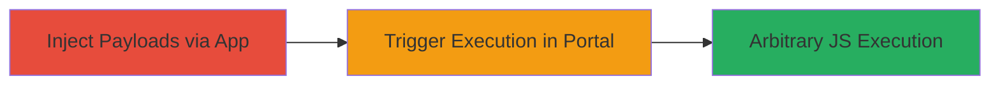

---
tags:
  - xss
  - stored-xss
  - android
  - web
  - javascript-injection
type: attack_chain
tools: []
tactics:
  - '[[Execution]]'
commands: []
platforms:
  - Android
  - Web
complexity: medium
procedures:
  - '[[procedures/Inject-Stored-XSS-Payloads-via-Veris-Frontdesk-App]]'
  - '[[procedures/Trigger-XSS-in-Web-Portal-Visitor-Log]]'
step_count: 2
techniques:
  - '[[JavaScript]]'
description: >-
  A multi-stage attack exploiting stored XSS vulnerabilities in the Veris
  Frontdesk Android App, where malicious JavaScript is injected during visitor
  check-in and executed when viewing the web portal's visitor log, enabling
  arbitrary code execution in victims' browsers.
skill_level: intermediate
impact_level: high
id: 6ad0dc86-b76b-4ae9-99d7-7211816a4174
created_at: '2025-12-14T17:24:39.236Z'
updated_at: '2025-12-14T17:24:39.236Z'
verified: false
validated: true
submitted: true
mitre_tactics:
  - '[[Execution]]'
mitre_techniques:
  - '[[JavaScript]]'
---
# Multiple Stored XSS via Veris Frontdesk Android App to Web Portal Visitor Log

## Overview

This attack chain demonstrates a stored cross-site scripting (XSS) vulnerability in the Veris Frontdesk Android App. An attacker injects malicious JavaScript payloads into input fields during the visitor check-in process, such as 'Who do you wish to meet?' and 'Additional Information'. These payloads are stored in the backend without sanitization and later reflected unsanitized in the web portal's visitor log at https://sandbox.veris.in/portal/visitor-log/. When an authenticated user views the log, the payloads execute in their browser context, potentially leading to session hijacking, data theft, or phishing attacks. The chain requires access to the Android app and valid credentials for the web portal.

## Chain Metrics Dashboard

| Metric | Value |
|--------|-------|
| Chain Status | Unverified |
| Total Steps | 2 |
| Execution Time | ~5 minutes |
| Skill Level | Intermediate |
| Complexity | Medium |
| Impact Level | High |

## Attack Flow Visualization

## Prerequisites & Requirements

### Required Tools

- Android device or emulator with Veris Frontdesk App installed
- Web browser for portal access

### Target Environment

- Veris Frontdesk Android App (version vulnerable to unsanitized inputs)
- Web portal at https://sandbox.veris.in/
- No specific ports or services required beyond app connectivity and HTTPS (443)

### Initial Access Requirements

- Ability to perform visitor check-in (no authentication needed for app injection)
- Valid credentials for web portal login to view logs
- Network access to the app's backend and portal

## Detailed Attack Procedures

### Step 1: Inject Stored XSS Payloads
procedure: [[procedures/Inject-Stored-XSS-Payloads-via-Veris-Frontdesk-App]]

**Objective**: Inject malicious JavaScript into app input fields to store unsanitized payloads in the backend.

**Instructions**: Launch the Veris Frontdesk App, navigate to Check In, enter legitimate details (e.g., name and phone), then inject payloads like `` in 'Who do you wish to meet?' and `` in 'Additional Information'. Submit the form to persist the data.

**Expected Output**: Successful check-in confirmation in the app, with payloads stored server-side.

**Success Indicators**:
- Check-in completes without errors
- Payloads are accepted in input fields

### Step 2: Trigger XSS in Web Portal
procedure: [[procedures/Trigger-XSS-in-Web-Portal-Visitor-Log]]

**Objective**: Access the visitor log to render and execute the stored payloads in the browser.

**Instructions**: Log in to https://sandbox.veris.in/ with valid credentials, navigate to /portal/visitor-log/, and load the page containing the injected entries. The payloads will execute automatically upon rendering.

**Expected Output**: JavaScript alerts (e.g., alert(3) and alert(4)) pop up in the browser.

**Success Indicators**:
- Alerts trigger confirming XSS execution
- Browser console shows no sanitization errors

## Attack Chain Summary

### Key Achievements

1. Successful injection of multiple stored XSS payloads via the Android app
2. Persistence of unsanitized inputs in the web portal backend
3. Arbitrary JavaScript execution against portal users viewing the log

## Technique & Tactic Coverage

### MITRE ATT&CK Techniques

- [[JavaScript]]

### MITRE ATT&CK Tactics

- [[Execution]]

---
*Last updated: 2023-10-01*
