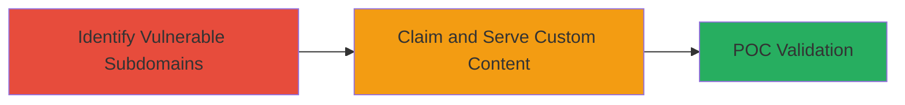

---
tags:
  - subdomain-takeover
  - dns-misconfig
  - cloud-instances
type: attack_chain
tools:
  - '[[tools/Subjack]]'
tactics:
  - '[[Initial Access]]'
verified: false
platforms:
  - Web
submitted: true
complexity: medium
created_at: '2023-10-01T00:00:00Z'
procedures:
  - '[[procedures/Identify-Vulnerable-Subdomains-for-Takeover]]'
  - '[[procedures/Perform-Non-Destructive-Subdomain-Takeover-POC]]'
step_count: 2
techniques:
  - '[[Exploit Public-Facing Application]]'
  - '[[Email Accounts]]'
updated_at: '2025-12-14T04:38:49.513Z'
description: >-
  A multi-stage attack exploiting unclaimed cloud instances to takeover
  Starbucks subdomains, enabling custom content serving from legitimate domains
  without disrupting operations.
skill_level: intermediate
impact_level: high
id: d060f5de-01a5-4fb0-a93f-1eac18863be8
validated: true
mitre_tactics:
  - '[[Initial Access]]'
mitre_techniques:
  - '[[Exploit Public-Facing Application]]'
  - '[[Email Accounts]]'
---
# Multiple Subdomain Takeovers via Unclaimed Instances on Starbucks OpenAPI Subdomains

Multi-stage attack chain demonstrating subdomain takeovers on unclaimed cloud instances for Starbucks subdomains, allowing attackers to claim unused DNS space and serve custom content.

## Chain Metrics Dashboard

| Metric | Value |
|--------|-------|
| Chain Status | Unverified |
| Total Steps | 2 |
| Execution Time | ~30 minutes |
| Skill Level | Intermediate |
| Complexity | Medium |
| Impact Level | High |

## Attack Flow Visualization



## Prerequisites & Requirements

### Required Tools

- [[tools/Subjack]]
- Standard DNS enumeration tools like dig or nslookup

### Target Environment

- Web platform with DNS resolution
- Access to public DNS queries
- No authentication required for enumeration

### Initial Access Requirements

- Public internet access for DNS queries
- No prior credentials needed
- Knowledge of target domain (e.g., starbucks.com)

## Detailed Attack Procedures

### Step 1: Identify Vulnerable Subdomains
procedure: [[procedures/Identify-Vulnerable-Subdomains-for-Takeover]]

**Objective**: Enumerate and identify subdomains with dangling or unclaimed DNS records pointing to exploitable cloud services.

**Instructions**: Start by enumerating subdomains using passive and active techniques. Use [[commands/subfinder-enumerate]] to discover potential subdomains:

```bash
subfinder -d starbucks.com -o subdomains.txt
```

Then, probe for live subdomains and check for takeover fingerprints using [[commands/subjack-check]]:

```bash
subjack -w subdomains.txt -t 100 -o takeovers.txt -v
```

Focus on subdomains like germany.openapi.starbucks.com that resolve to unclaimed services.

**Expected Output**: List of subdomains with potential takeover vulnerabilities, such as unclaimed AWS or Heroku instances.

**Success Indicators**:
- Subdomains identified with dangling CNAME records
- Fingerprints matching known takeover services

### Step 2: Perform Non-Destructive Takeover POC
procedure: [[procedures/Perform-Non-Destructive-Subdomain-Takeover-POC]]

**Objective**: Claim the unclaimed instance and demonstrate serving custom content without affecting existing operations.

**Instructions**: Once a vulnerable subdomain is identified, exploit the weak process flow to claim the instance. For example, if it's an unclaimed AWS S3 bucket or similar, register the domain on the provider's platform. Verify the takeover by serving a simple HTML page:

Use [[commands/dig-lookup]] to confirm DNS resolution:

```bash
dig +short germany.openapi.starbucks.com
```

Then, upload a test file to the claimed instance and access it via the subdomain URL to serve custom content.

**Expected Output**: Custom content (e.g., a test HTML page) accessible at the subdomain URL, confirming control without disruption.

**Success Indicators**:
- DNS points to attacker-controlled instance
- Custom content loads successfully
- No impact on primary Starbucks applications

## Attack Chain Summary

### Key Achievements

1. Discovery of multiple unclaimed subdomains on critical paths like openapi.starbucks.com
2. Successful claiming of instances via process flow exploitation
3. Non-destructive POC proving potential for phishing or content injection

## Technique & Tactic Coverage

### MITRE ATT&CK Techniques

- [[Exploit Public-Facing Application]] Exploit Public-Facing Application
- [[Email Accounts]] External Service Provider

### MITRE ATT&CK Tactics

- [[Initial Access]] Initial Access

---
*Last updated: 2023-10-01T00:00:00Z*
