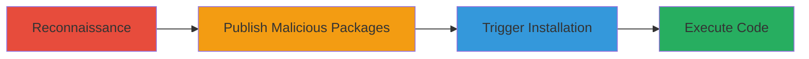

# NPM Dependency Confusion via Registry Misconfiguration Leading to Arbitrary Code Execution

Multi-stage attack chain demonstrating a complete attack workflow.

## Chain Metrics Dashboard

| Metric | Value |
|--------|-------|
| Chain Status | Unverified |
| Total Steps | 4 |
| Execution Time | ~X minutes |
| Skill Level | Intermediate |
| Complexity | Medium |
| Impact Level | High |

## Attack Flow Visualization



## Prerequisites & Requirements

### Required Tools

- #npm

### Target Environment

- Node.js
- Private NPM registry, Global NPM registry

### Initial Access Requirements

- Knowledge of private module names
- Access to public NPM registry for publishing

## Detailed Attack Procedures

### Step 1: Reconnaissance - [[procedures/Reconnaissance-of-Private-NPM-Module-Names]]

**Procedure**: [[procedures/Reconnaissance-of-Private-NPM-Module-Names]]

**Objective**: Identify names of internal private NPM modules used by the target.

**Expected Output**: List of private module names.

**Success Indicators**:
- Obtained module names through reconnaissance.
- Verified names are used in target's projects.

First, perform reconnaissance to discover private module names, possibly through leaked information or public sources.

### Step 2: Publishing - [[procedures/Publishing-Malicious-Packages-to-Public-NPM-Registry]]

**Procedure**: [[procedures/Publishing-Malicious-Packages-to-Public-NPM-Registry]]

**Objective**: Register malicious packages with the same names but higher versions in the public NPM registry.

**Expected Output**: Malicious packages published to npmjs.com.

**Success Indicators**:
- Packages successfully uploaded with higher versions.
- No conflicts or rejections from the registry.

Create malicious modules and publish them using [[commands/npm-publish-malicious]]:

```bash
npm publish
```

Ensure the version is higher than the private ones and include malicious scripts.

### Step 3: Installation - [[procedures/Triggering-Malicious-Package-Installation-in-Node.js-Builds]]

**Procedure**: [[procedures/Triggering-Malicious-Package-Installation-in-Node.js-Builds]]

**Objective**: Victim's Node.js project builds and installs the malicious package from the public registry.

**Expected Output**: Malicious package installed during build.

**Success Indicators**:
- Build process pulls from public registry.
- Higher version prioritized over private.

The misconfiguration causes the build to install via [[commands/npm-install]]:

```bash
npm install
```

### Step 4: Execution - [[procedures/Executing-Arbitrary-Code-via-Malicious-NPM-Package]]

**Procedure**: [[procedures/Executing-Arbitrary-Code-via-Malicious-NPM-Package]]

**Objective**: Malicious script in the package executes on the host machine.

**Expected Output**: Arbitrary code execution on affected hosts.

**Success Indicators**:
- Code executes during installation.
- Attacker achieves objectives like data exfiltration or persistence.

The embedded script runs automatically upon installation.

## Attack Chain Summary

### Key Achievements

1. Identified private modules.
2. Published malicious versions.
3. Triggered installation via misconfiguration.

## Technique & Tactic Coverage

### MITRE ATT&CK Techniques

- [[Supply Chain Compromise]]
- [[Command-Line Interface]]

### MITRE ATT&CK Tactics

- [[Initial Access]]
- [[Execution]]

---

*Last updated: [TIMESTAMP]*
