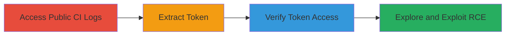

---
tags:
  - token-leak
  - ci-cd
  - netlify
  - rce
  - aws-lambda
type: attack_chain
tools:
  - '[[tools/curl]]'
  - '[[tools/jq]]'
tactics:
  - '[[Initial Access]]'
  - '[[Execution]]'
verified: false
platforms:
  - Web
  - Cloud (AWS)
submitted: true
complexity: medium
created_at: '2023-10-01T00:00:00Z'
procedures:
  - '[[procedures/Access-Public-Mozilla-CI-Log]]'
  - '[[procedures/Extract-Exposed-Netlify-Token]]'
  - '[[procedures/Verify-Token-Validity-via-Netlify-API]]'
  - '[[procedures/Explore-Account-Access-and-RCE-Potential]]'
step_count: 4
techniques:
  - '[[Unsecured Credentials]]'
  - '[[Valid Accounts]]'
  - '[[JavaScript]]'
updated_at: '2025-12-14T17:31:52.745Z'
description: >-
  Multi-stage attack exploiting an exposed Netlify authentication token in
  public Mozilla CI logs, enabling unauthorized access to the 'Mozilla IT Web
  SRE' account and potential remote code execution via AWS Lambda deployments.
skill_level: intermediate
impact_level: high
id: 71fd7ba5-0d69-4a79-8c10-d20331b5b4b0
validated: true
mitre_tactics:
  - '[[Initial Access]]'
  - '[[Execution]]'
mitre_techniques:
  - '[[Unsecured Credentials]]'
  - '[[Valid Accounts]]'
  - '[[JavaScript]]'
---
# Netlify Token Exposure in Mozilla CI Logs Leading to Account Takeover and RCE

Multi-stage attack chain demonstrating exploitation of an unmasked authentication token in public Mozilla CI logs, leading to full compromise of a Netlify account and potential remote code execution on AWS Lambda.

## Chain Metrics Dashboard

| Metric | Value |
|--------|-------|
| Chain Status | Unverified |
| Total Steps | 4 |
| Execution Time | ~5 minutes |
| Skill Level | Intermediate |
| Complexity | Medium |
| Impact Level | High |

## Attack Flow Visualization



## Prerequisites & Requirements

### Required Tools

- [[tools/curl]]
- [[tools/jq]]

### Target Environment

- Mozilla TaskCluster CI/CD platform
- Netlify cloud hosting service
- AWS Lambda for function deployments
- Required services: Netlify API, TaskCluster logs
- No specific ports; web access only

### Initial Access Requirements

- Public internet access to Mozilla CI logs
- No credentials needed for initial log access
- Basic knowledge of API testing

## Detailed Attack Procedures

### Step 1: Access Public CI Log
procedure: [[procedures/Access-Public-Mozilla-CI-Log]]

**Objective**: Gain access to the publicly available Mozilla CI log file containing sensitive output.

**Instructions**: Open the provided URL in a web browser to view the live log.

**Expected Output**: Raw log content from the CI pipeline, including unmasked commands.

**Success Indicators**:
- Log file loads successfully
- Visible CI pipeline output

### Step 2: Extract Exposed Token
procedure: [[procedures/Extract-Exposed-Netlify-Token]]

**Objective**: Identify and copy the leaked Netlify authentication token from the log.

**Instructions**: Use browser search functionality to locate the token.

**Expected Output**: The token string following 'auth:' (redacted for security).

**Success Indicators**:
- Token extracted without errors
- Token format matches Netlify Bearer token

### Step 3: Verify Token Validity
procedure: [[procedures/Verify-Token-Validity-via-Netlify-API]]

**Objective**: Confirm the token grants access to the Netlify account.

**Instructions**: Execute [[commands/curl-verify-netlify-token]] to query account details:

```bash
curl -X GET https://api.netlify.com/api/v1/accounts -H "Authorization: Bearer ████" -s | jq
```

Then parse the response with [[tools/jq]].

**Expected Output**: JSON with account 'Mozilla IT Web SRE', roles including Owner and Developer.

**Success Indicators**:
- API returns 200 OK
- Account details visible

### Step 4: Explore Access and RCE
procedure: [[procedures/Explore-Account-Access-and-RCE-Potential]]

**Objective**: Assess full capabilities, including site access and RCE via function deployment.

**Instructions**: Use [[commands/curl-list-netlify-site-functions]] to list functions:

```bash
curl -X GET https://api.netlify.com/api/v1/sites/5a05c659-aa54-4184-bdbe-7faa4dd497b5/functions -H "Authorization: Bearer ████" -s | jq
```

Explore further endpoints for deployments leading to RCE.

**Expected Output**: JSON listing functions like 'ping-details' on AWS Lambda.

**Success Indicators**:
- Site functions retrieved
- Potential for arbitrary code deployment identified

## Attack Chain Summary

### Key Achievements

1. Exposed token extraction from public logs
2. Verified full account access with admin roles
3. Identified RCE vector via Lambda functions
4. Potential for site compromise and data exfiltration

## Technique & Tactic Coverage

### MITRE ATT&CK Techniques

- [[Unsecured Credentials]] Unprotected Credentials
- [[Valid Accounts]] Valid Accounts
- [[JavaScript]] JavaScript

### MITRE ATT&CK Tactics

- [[Initial Access]] Initial Access
- [[Execution]] Execution

---
*Last updated: 2023-10-01T00:00:00Z*
