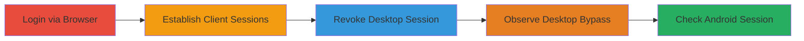

---
tags:
  - session-bypass
  - nextcloud
  - authentication
  - revocation
type: attack_chain
tools: []
tactics:
  - '[[Persistence]]'
verified: false
platforms:
  - Web
submitted: true
created_at: '2023-10-01T00:00:00Z'
procedures:
  - '[[procedures/Login-to-Nextcloud-via-Browser]]'
  - '[[procedures/Establish-Sessions-in-Desktop-and-Android-Clients]]'
  - '[[procedures/Revoke-Desktop-Client-Session-via-Web-Interface]]'
  - '[[procedures/Verify-Continued-Access-in-Desktop-Client]]'
  - '[[procedures/Check-Android-Client-Session-Visibility]]'
step_count: 5
techniques:
  - '[[Valid Accounts]]'
updated_at: '2025-12-14T17:24:39.372Z'
description: >-
  Demonstrates improper session revocation in Nextcloud 10.0, allowing desktop
  and Android clients to maintain access after web-based revocation attempts.
id: 106a9bf7-4bff-41a4-9e77-87a91466f876
validated: true
mitre_tactics:
  - '[[Persistence]]'
mitre_techniques:
  - '[[Valid Accounts]]'
---
# Nextcloud 10.0 Session Revocation Bypass via Desktop and Android Clients

Multi-stage attack chain demonstrating improper session management in Nextcloud 10.0, where revoking sessions through the web interface fails to invalidate active desktop and Android client sessions, enabling continued unauthorized file syncing and access.

## Chain Metrics Dashboard

| Metric | Value |
|--------|-------|
| Chain Status | Unverified |
| Total Steps | 5 |
| Execution Time | ~5 minutes |
| Skill Level | Basic |
| Complexity | Low |
| Impact Level | Medium |

## Attack Flow Visualization

## Prerequisites & Requirements

### Required Tools

- Nextcloud 10.0 installed locally
- Desktop client for Nextcloud
- Android client for Nextcloud

### Target Environment

- Nextcloud 10.0 server (PHP-based web application)
- Required services: Web server hosting Nextcloud
- Network access: Local network or direct access to the instance

### Initial Access Requirements

- Admin username and password
- No application-specific passwords (use standard credentials)
- Installed and configured clients

## Detailed Attack Procedures

### Step 1: Browser Login
procedure: [[procedures/Login-to-Nextcloud-via-Browser]]

**Objective**: Authenticate to the Nextcloud web interface as an admin user to establish a baseline session.

**Instructions**: Open the Nextcloud web interface in a browser and enter admin credentials to log in.

**Expected Output**: Successful login to the dashboard.

**Success Indicators**:
- User profile and personal settings accessible
- Active session established in browser

### Step 2: Establish Client Sessions
procedure: [[procedures/Establish-Sessions-in-Desktop-and-Android-Clients]]

**Objective**: Create active sessions in desktop and Android clients using the same credentials.

**Instructions**: Launch the desktop client and Android app, then authenticate with the admin username and password (not app-specific).

**Expected Output**: Clients connected and ready to sync files.

**Success Indicators**:
- Three active sessions: browser, desktop, Android
- Clients show synced files from the server

### Step 3: Revoke Desktop Session
procedure: [[procedures/Revoke-Desktop-Client-Session-via-Web-Interface]]

**Objective**: Attempt to terminate the desktop client session through the web UI.

**Instructions**: In the browser, navigate to User > Personal > Sessions, locate the desktop client entry, and select to kill/revoke it.

**Expected Output**: Confirmation of session revocation in the web interface.

**Success Indicators**:
- Desktop session listed as revoked in the sessions tab
- No immediate error in the UI

### Step 4: Verify Continued Access
procedure: [[procedures/Verify-Continued-Access-in-Desktop-Client]]

**Objective**: Demonstrate that the desktop client remains active despite revocation.

**Instructions**: Upload a new file via the web interface and monitor the desktop client for automatic syncing without re-authentication prompts.

**Expected Output**: File appears in the desktop client's synced folder without password request.

**Success Indicators**:
- Desktop client syncs the new file seamlessly
- No re-authentication required, indicating session persistence

### Step 5: Check Android Session
procedure: [[procedures/Check-Android-Client-Session-Visibility]]

**Objective**: Confirm that the Android client session is active but not visible in the web sessions list.

**Instructions**: Interact with the Android client (e.g., sync files) and refresh the web sessions tab to check for listing.

**Expected Output**: Android client functions normally, but no corresponding session entry in the web UI.

**Success Indicators**:
- Android client remains operational
- Sessions tab does not display Android session

## Attack Chain Summary

### Key Achievements

1. Established multiple session types across browser, desktop, and mobile clients
2. Revoked a session via web UI without affecting client-side access
3. Demonstrated bypass allowing continued file syncing and potential unauthorized access
4. Highlighted untracked Android sessions as an additional visibility gap

## Technique & Tactic Coverage

### MITRE ATT&CK Techniques

- [[Valid Accounts]]

### MITRE ATT&CK Tactics

- [[Persistence]]

---

*Last updated: 2023-10-01T00:00:00Z*
