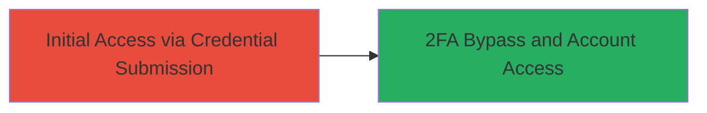

---
tags:
  - 2fa-bypass
  - nextcloud
  - authentication-bypass
  - improper-authentication
type: attack_chain
tools: []
tactics:
  - '[[Initial Access]]'
commands: []
platforms:
  - Web
complexity: low
procedures:
  - '[[procedures/Bypass-Nextcloud-2FA-Login]]'
step_count: 1
techniques:
  - '[[Valid Accounts]]'
description: >-
  Attack chain demonstrating the bypass of two-factor authentication in
  Nextcloud by exploiting improper protection in the login mechanism, allowing
  unauthorized access with known user credentials.
skill_level: intermediate
impact_level: high
id: e24fecda-61dc-474a-a926-1163ce063ec2
created_at: '2025-12-14T17:24:47.765Z'
updated_at: '2025-12-14T17:24:47.765Z'
verified: false
validated: true
submitted: true
mitre_tactics:
  - '[[Initial Access]]'
mitre_techniques:
  - '[[Valid Accounts]]'
---
# Nextcloud 2FA Bypass Using Known Credentials

Multi-stage attack chain demonstrating a complete attack workflow.

## Chain Metrics Dashboard

| Metric | Value |
|--------|-------|
| Chain Status | Unverified |
| Total Steps | 1 |
| Execution Time | ~5 minutes |
| Skill Level | Intermediate |
| Complexity | Low |
| Impact Level | High |

## Attack Flow Visualization

## Prerequisites & Requirements

### Required Tools

- None (manual web interaction or browser-based testing)

### Target Environment

- Nextcloud web application
- Enabled 2FA mechanism
- Web browser or HTTP client for form submission

### Initial Access Requirements

- Known username and password for a target account
- Network access to the Nextcloud login endpoint
- No prior access needed beyond reaching the login page

## Detailed Attack Procedures

### Step 1: Bypass 2FA Login
procedure: [[procedures/Bypass-Nextcloud-2FA-Login]]

**Objective**: Circumvent the two-factor authentication step using known credentials to gain unauthorized access to the account.

**Instructions**: Access the Nextcloud login page and submit the username and password without providing the 2FA code, exploiting the improper protection in the authentication flow.

**Expected Output**: Successful login to the Nextcloud dashboard without 2FA verification.

**Success Indicators**:
- User is redirected to the main Nextcloud interface
- No 2FA prompt appears after credential submission
- Account session is established

## Attack Chain Summary

### Key Achievements

1. Bypassed 2FA protection in Nextcloud login mechanism
2. Gained unauthorized access to protected accounts
3. Demonstrated ineffectiveness of 2FA as a security layer

## Technique & Tactic Coverage

### MITRE ATT&CK Techniques

- [[Valid Accounts]]

### MITRE ATT&CK Tactics

- [[Initial Access]]

---
*Last updated: 2023-10-01*
