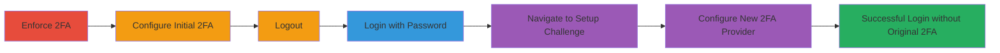

---
tags:
  - 2fa-bypass
  - auth-bypass
  - nextcloud
  - web-vulnerability
type: attack_chain
tools: []
tactics:
  - '[[Initial Access]]'
verified: false
platforms:
  - Web
submitted: true
complexity: medium
created_at: '2023-10-01T00:00:00Z'
procedures:
  - '[[procedures/Nextcloud-2FA-Bypass-via-Setup-Challenge]]'
step_count: 7
techniques:
  - '[[Exploit Public-Facing Application]]'
updated_at: '2025-12-14T17:24:45.436Z'
description: >-
  Exploit a missing check in Nextcloud 17 login flow to bypass enforced 2FA by
  navigating to the setup challenge endpoint and configuring a different
  provider.
skill_level: intermediate
impact_level: high
id: 150ff361-9d6b-4931-b19d-497f2cb419bc
validated: true
mitre_tactics:
  - '[[Initial Access]]'
mitre_techniques:
  - '[[Exploit Public-Facing Application]]'
---
# Nextcloud 2FA Bypass via Alternative Provider Setup

Multi-stage attack chain demonstrating a complete attack workflow to bypass enforced two-factor authentication (2FA) in Nextcloud 17 by exploiting a flaw in the login process.

## Chain Metrics Dashboard

| Metric | Value |
|--------|-------|
| Chain Status | Unverified |
| Total Steps | 7 |
| Execution Time | ~5 minutes |
| Skill Level | Intermediate |
| Complexity | Medium |
| Impact Level | High |

## Attack Flow Visualization

## Prerequisites & Requirements

### Required Tools

- Web browser (e.g., Chrome, Firefox)

### Target Environment

- Nextcloud 17 instance
- Web platform with admin and user access
- Enforced 2FA configuration

### Initial Access Requirements

- Valid admin credentials to enforce 2FA
- Valid user credentials with configured 2FA
- Direct access to the Nextcloud login page

## Detailed Attack Procedures

### Step 1: Enforce 2FA for All Users
procedure: [[procedures/Nextcloud-2FA-Bypass-via-Setup-Challenge]]

**Objective**: Ensure 2FA is required for all users to set up the vulnerable environment.

**Instructions**: As an admin, log in to the Nextcloud admin settings and enable 2FA enforcement for all users. This can be done via the security settings panel under "Two-factor authentication".

**Expected Output**: Confirmation that 2FA is now mandatory for logins.

**Success Indicators**:
- 2FA option appears in user settings
- Login prompts for 2FA after password entry

### Step 2: Configure Initial 2FA Provider
procedure: [[procedures/Nextcloud-2FA-Bypass-via-Setup-Challenge]]

**Objective**: Set up an initial 2FA provider for the target user account.

**Instructions**: Log in as the user, navigate to personal settings > Security, and enable a 2FA provider (e.g., TOTP app like Google Authenticator). Scan the QR code and enter the verification code to complete setup.

**Expected Output**: 2FA provider listed as active in user settings.

**Success Indicators**:
- 2FA challenge appears on next login
- Provider status shows as enabled

### Step 3: Log Out
procedure: [[procedures/Nextcloud-2FA-Bypass-via-Setup-Challenge]]

**Objective**: End the current session to test the login flow.

**Instructions**: Click the user avatar in the top-right corner and select "Log out".

**Expected Output**: Redirect to the login page.

**Success Indicators**:
- Session terminated
- Login page displayed

### Step 4: Log In with Password Only
procedure: [[procedures/Nextcloud-2FA-Bypass-via-Setup-Challenge]]

**Objective**: Initiate the login process to trigger the 2FA prompt.

**Instructions**: On the login page, enter the username and password, then submit. This should redirect to the 2FA challenge for the configured provider.

**Expected Output**: 2FA verification prompt appears.

**Success Indicators**:
- Password accepted
- 2FA input field shown for the initial provider

### Step 5: Navigate to Setup Challenge
procedure: [[procedures/Nextcloud-2FA-Bypass-via-Setup-Challenge]]

**Objective**: Bypass the 2FA prompt by accessing the setup endpoint.

**Instructions**: Instead of entering the 2FA code, manually navigate to the URL `/login/setupchallenge` in the browser while the 2FA prompt is active.

**Expected Output**: Setup challenge page loads, allowing new 2FA configuration.

**Success Indicators**:
- Page loads without error
- Option to add new 2FA providers available

### Step 6: Set Up Alternative 2FA Provider
procedure: [[procedures/Nextcloud-2FA-Bypass-via-Setup-Challenge]]

**Objective**: Configure a different 2FA provider to complete the bypass.

**Instructions**: On the setup challenge page, select and configure a new 2FA provider that hasn't been set up before (e.g., switch from TOTP to another app or method). Complete the setup by scanning QR and verifying.

**Expected Output**: New provider activated, and login proceeds.

**Success Indicators**:
- New provider listed
- No further 2FA prompt for original provider

### Step 7: Successful Login
procedure: [[procedures/Nextcloud-2FA-Bypass-via-Setup-Challenge]]

**Objective**: Gain access without completing the original 2FA.

**Instructions**: After setup, the system should automatically authenticate and redirect to the dashboard.

**Expected Output**: Full access to Nextcloud interface.

**Success Indicators**:
- Dashboard loads
- No additional authentication required

## Attack Chain Summary

### Key Achievements

1. Bypassed enforced 2FA using valid password only
2. Exploited missing validation in login flow
3. Gained unauthorized access to protected account

## Technique & Tactic Coverage

### MITRE ATT&CK Techniques

- [[Exploit Public-Facing Application]]

### MITRE ATT&CK Tactics

- [[Initial Access]]

---
*Last updated: 2023-10-01T00:00:00Z*
