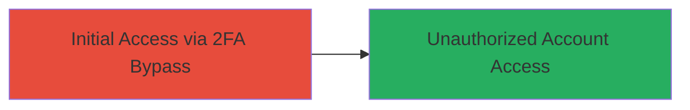

---
tags:
  - 2fa-bypass
  - authentication-bypass
  - nextcloud
  - improper-authentication
type: attack_chain
tools: []
tactics:
  - '[[Initial Access]]'
commands:
  - '[[commands/curl-nextcloud-login-bypass]]'
platforms:
  - Web
complexity: low
procedures:
  - '[[procedures/Bypass-Nextcloud-2FA-Authentication]]'
step_count: 1
techniques:
  - '[[Valid Accounts]]'
description: >-
  Attack chain exploiting a vulnerability in Nextcloud's 2FA mechanism to gain
  unauthorized access without second factor verification.
skill_level: intermediate
impact_level: high
id: bdd5a076-e7c3-4f24-8bb8-4afd946c1158
created_at: '2025-12-14T17:29:44.532Z'
updated_at: '2025-12-14T17:29:44.532Z'
verified: false
validated: true
submitted: true
mitre_tactics:
  - '[[Initial Access]]'
mitre_techniques:
  - '[[Valid Accounts]]'
---
# Nextcloud 2FA Bypass via Improper Authentication

Multi-stage attack chain demonstrating a complete attack workflow.

## Chain Metrics Dashboard

| Metric | Value |
|--------|-------|
| Chain Status | Unverified |
| Total Steps | 1 |
| Execution Time | ~1 minutes |
| Skill Level | Intermediate |
| Complexity | Low |
| Impact Level | High |

## Attack Flow Visualization



## Prerequisites & Requirements

### Required Tools

- [[commands/curl-nextcloud-login-bypass]]

### Target Environment

- Target OS/Platform: Web application
- Required services/ports: HTTP/HTTPS on port 80/443
- Network access requirements: Direct access to Nextcloud login endpoint

### Initial Access Requirements

- Credential requirements: Valid username and password for the target account
- Network position: External or internal network access to the Nextcloud instance
- Prior access needed: None, but knowledge of the vulnerable version

## Detailed Attack Procedures

### Step 1: Bypass 2FA and Gain Access
procedure: [[procedures/Bypass-Nextcloud-2FA-Authentication]]

**Objective**: Authenticate to the Nextcloud account using only username and password, bypassing the 2FA verification to achieve unauthorized access.

**Instructions**: Identify the Nextcloud login endpoint, typically at `/login`. Use the provided credentials to submit a login request that exploits the improper authentication flaw in the 2FA mechanism. This vulnerability (CVE-2024-37313) allows the server to accept the login without requiring the second factor, due to a weakness in the authentication flow validation.

Execute the bypass using [[commands/curl-nextcloud-login-bypass]]:

```bash
curl -X POST 'https://target-nextcloud.com/login' \
  -H 'Content-Type: application/x-www-form-urlencoded' \
  -d 'user=username&password=pass123'
```

**Expected Output**: Successful login response, such as a session cookie or redirect to the dashboard, without prompting for 2FA.

**Success Indicators**:
- HTTP 200 or 302 response indicating login success
- Receipt of authentication token or session ID
- Access to protected resources without 2FA challenge

## Attack Chain Summary

### Key Achievements

1. Bypassed 2FA verification using valid primary credentials
2. Gained full unauthorized access to the Nextcloud account
3. Compromised account security, enabling further actions like data exfiltration or privilege escalation

## Technique & Tactic Coverage

### MITRE ATT&CK Techniques

- [[Valid Accounts]]

### MITRE ATT&CK Tactics

- [[Initial Access]]

---
*Last updated: 2024-10-01*
