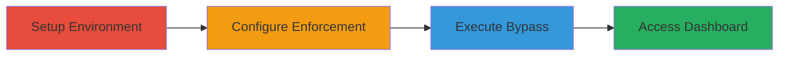

---
tags:
  - nextcloud
  - 2fa-bypass
  - session-manipulation
  - auth-bypass
type: attack_chain
tools:
  - '[[tools/requests-Python-Library]]'
  - '[[tools/BeautifulSoup-Python-Library]]'
tactics:
  - '[[Initial Access]]'
verified: false
platforms:
  - Web
submitted: true
complexity: medium
created_at: '2023-10-01T00:00:00Z'
procedures:
  - '[[procedures/Setup-Nextcloud-Enforcement-Group-and-User]]'
  - '[[procedures/Configure-2FA-Enforcement-for-Group]]'
  - '[[procedures/Bypass-2FA-via-Session-Cookie-Manipulation]]'
step_count: 3
techniques:
  - '[[Valid Accounts]]'
  - '[[Reversible Encryption]]'
updated_at: '2025-12-14T17:31:52.304Z'
description: >-
  Multi-stage attack chain exploiting a vulnerability in Nextcloud's session
  handling to bypass two-factor authentication enforcement by swapping session
  cookies between parallel login attempts.
skill_level: intermediate
impact_level: high
id: ba574e65-8522-4c9e-84be-2462e12ed453
validated: true
mitre_tactics:
  - '[[Initial Access]]'
mitre_techniques:
  - '[[Valid Accounts]]'
  - '[[Reversible Encryption]]'
---
# Nextcloud 2FA Enforcement Bypass via Session Cookie Manipulation

Multi-stage attack chain demonstrating a complete attack workflow to bypass 2FA enforcement in Nextcloud by manipulating the 'oc_sessionPassphrase' cookie during parallel login sessions. This vulnerability allows unauthorized access to user dashboards in enforced 2FA groups, potentially leading to data compromise or privilege escalation.

## Chain Metrics Dashboard

| Metric | Value |
|--------|-------|
| Chain Status | Unverified |
| Total Steps | 3 |
| Execution Time | ~10 minutes |
| Skill Level | Intermediate |
| Complexity | Medium |
| Impact Level | High |

## Attack Flow Visualization

## Prerequisites & Requirements

### Required Tools

- [[tools/requests-Python-Library]]
- [[tools/BeautifulSoup-Python-Library]]

### Target Environment

- Nextcloud web application (PHP-based)
- Administrative access for setup
- Browser for manual sessions or Python for automation

### Initial Access Requirements

- Valid admin credentials
- Network access to Nextcloud instance
- No prior 2FA setup on target user

## Detailed Attack Procedures

### Step 1: Setup Enforcement Group and User
procedure: [[procedures/Setup-Nextcloud-Enforcement-Group-and-User]]

**Objective**: Create a group with 2FA enforcement and a test user assigned to it to simulate a protected account.

**Instructions**: Log in as admin, navigate to users management, create a group named 'Enforcement', and add a new user 'Bypass' with password 'NextCloudEnforcement' to that group.

**Expected Output**: New group and user created, user assigned to group.

**Success Indicators**:
- Group 'Enforcement' visible in users section
- User 'Bypass' listed in the group

### Step 2: Configure 2FA Enforcement
procedure: [[procedures/Configure-2FA-Enforcement-for-Group]]

**Objective**: Enable 2FA enforcement specifically for the 'Enforcement' group to trigger the bypass condition.

**Instructions**: From admin settings, go to Security > Two-Factor Authentication, select group enforcement, add 'Enforcement' group, and save changes. Log out afterward.

**Expected Output**: 2FA enforcement applied to the group; login with 'Bypass' user prompts for 2FA setup.

**Success Indicators**:
- Enforcement group added in settings
- Login attempt with 'Bypass' shows 2FA required message

### Step 3: Bypass 2FA via Cookie Manipulation
procedure: [[procedures/Bypass-2FA-via-Session-Cookie-Manipulation]]

**Objective**: Exploit session handling flaw by initiating two login sessions and swapping the 'oc_sessionPassphrase' cookie to gain access without 2FA.

**Instructions**: Log in with 'Bypass' credentials in two separate sessions (e.g., browsers). In the second session, replace the 'oc_sessionPassphrase' cookie with the value from the first session using browser dev tools or the provided Python script. For automation, install dependencies with [[commands/Install-Python-Dependencies-for-Bypass-Script]] and execute [[commands/Execute-Nextcloud-2FA-Bypass-Script]] to generate modified cookies.

Import the modified cookies into the browser and refresh to access the dashboard.

**Expected Output**: Access to user dashboard without 2FA configuration.

**Success Indicators**:
- Dashboard loads successfully
- No 2FA prompt appears
- Session persists with swapped cookie

## Attack Chain Summary

### Key Achievements

1. Established a controlled environment with 2FA-enforced group and user
2. Configured enforcement to simulate real-world protection
3. Bypassed 2FA via session cookie swap, gaining unauthorized dashboard access

## Technique & Tactic Coverage

### MITRE ATT&CK Techniques

- [[Valid Accounts]] Valid Accounts
- [[Reversible Encryption]] Multi-Factor Authentication Instrument

### MITRE ATT&CK Tactics

- [[Initial Access]] Initial Access

---

*Last updated: 2023-10-01T00:00:00Z*
