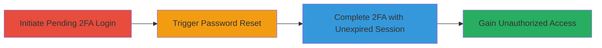

# Nextcloud 2FA Session Fixation Bypass After Password Reset

Multi-stage attack chain demonstrating a complete attack workflow exploiting CVE-2019-15612 in Nextcloud Server 15.0.2.

## Chain Metrics Dashboard

| Metric | Value |
|--------|-------|
| Chain Status | Unverified |
| Total Steps | 1 |
| Execution Time | ~5 minutes |
| Skill Level | Intermediate |
| Complexity | Medium |
| Impact Level | High |

## Attack Flow Visualization

## Prerequisites & Requirements

### Required Tools

- Web browser or proxy tool like Burp Suite for session manipulation

### Target Environment

- Nextcloud Server 15.0.2 or vulnerable versions
- Web platform with 2FA enabled
- Access to authentication endpoints

### Initial Access Requirements

- Knowledge of target user's email for password reset
- Ability to intercept or control a pending 2FA session (e.g., via phishing or prior access)
- Network access to the Nextcloud instance

## Detailed Attack Procedures

### Step 1: Exploit 2FA Session Fixation
procedure: [[procedures/Exploit-Unexpired-2FA-Session-After-Password-Reset]]

**Objective**: Obtain a pending 2FA session, trigger a password reset, and use the unexpired session to bypass the new password requirement and gain account access.

**Instructions**: Begin by initiating a 2FA login flow to establish a pending session. Use a web browser or interception tool to capture the session cookie. Then, trigger a password reset for the target account. Finally, replay the pending 2FA session to complete authentication without entering the new password.

**Expected Output**: Successful login to the Nextcloud account using the old 2FA session, granting full access to files and settings.

**Success Indicators**:
- Pending 2FA session cookie remains valid post-reset
- Authentication completes without password prompt
- Access to user dashboard confirmed

## Attack Chain Summary

### Key Achievements

1. Bypassed password reset security controls
2. Exploited session fixation in 2FA flow
3. Achieved unauthorized account takeover

## Technique & Tactic Coverage

### MITRE ATT&CK Techniques

- [[Valid Accounts]]

### MITRE ATT&CK Tactics

- [[Initial Access]]

---
*Last updated: 2023-10-01T00:00:00Z*
