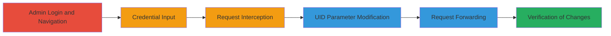

# Nextcloud Admin Abuse to Modify User External Storage Credentials via UID Manipulation

Multi-stage attack chain demonstrating how a malicious administrator can exploit improper access control in Nextcloud to alter external storage credentials for other users, leading to potential disruption of storage access or unauthorized credential takeover.

## Chain Metrics Dashboard

| Metric | Value |
|--------|-------|
| Chain Status | Unverified |
| Total Steps | 6 |
| Execution Time | ~5 minutes |
| Skill Level | Intermediate |
| Complexity | Medium |
| Impact Level | High |

## Attack Flow Visualization



## Prerequisites & Requirements

### Required Tools

- [[tools/Burp-Suite]]

### Target Environment

- Nextcloud server (version vulnerable to CVE or similar, e.g., pre-patch for this issue)
- Web browser for GUI access
- Proxy tool like Burp Suite for request interception
- Admin credentials for the Nextcloud instance

### Initial Access Requirements

- Valid admin account in Nextcloud
- Network access to the Nextcloud web interface (typically HTTPS on port 443)
- No prior user compromise needed; leverages existing admin privileges

## Detailed Attack Procedures

### Step 1: Admin Login and Navigation
procedure: [[procedures/Exploit-Nextcloud-External-Storage-UID-Manipulation]]

**Objective**: Gain access to the external storage configuration interface as a malicious admin.

**Instructions**: Log in to the Nextcloud instance using admin credentials and navigate to the admin settings for external storage.

**Expected Output**: Access to the External storage configuration page in the Nextcloud GUI.

**Success Indicators**:
- Admin dashboard loaded successfully
- External storage settings visible and editable

### Step 2: Input Test Credentials
procedure: [[procedures/Exploit-Nextcloud-External-Storage-UID-Manipulation]]

**Objective**: Enter sample credentials into the global credentials field to prepare for request interception.

**Instructions**: In the external storage settings, locate the global credentials input and enter test values, such as username 'POC' and password 'anything'.

**Expected Output**: Form fields populated with test credentials, ready for submission.

**Success Indicators**:
- Credentials entered without validation errors
- Submit button available

### Step 3: Intercept the POST Request
procedure: [[procedures/Exploit-Nextcloud-External-Storage-UID-Manipulation]]

**Objective**: Capture the outgoing POST request using a proxy tool to inspect and modify it.

**Instructions**: Configure your browser to proxy traffic through Burp Suite, then submit the form. Intercept the request to `/nextcloud/index.php/apps/files_external/globalcredentials`.

**Expected Output**: Intercepted request showing JSON body like `{"uid":"nvz","user":"nvz","password":"123"}`.

**Success Indicators**:
- Request captured in proxy tool
- Body parameters visible for editing

### Step 4: Modify the UID Parameter
procedure: [[procedures/Exploit-Nextcloud-External-Storage-UID-Manipulation]]

**Objective**: Alter the 'uid' parameter in the request body to target a victim's username.

**Instructions**: In the intercepted request, edit the JSON body to change the 'uid' value from the current user (e.g., 'nvz') to the target victim's username (e.g., 'victim_user'). Keep other parameters as test values.

**Expected Output**: Modified request body with new 'uid' value.

**Success Indicators**:
- UID parameter updated correctly
- No syntax errors in JSON

### Step 5: Forward the Modified Request
procedure: [[procedures/Exploit-Nextcloud-External-Storage-UID-Manipulation]]

**Objective**: Send the tampered request to the server and confirm acceptance.

**Instructions**: Forward the modified POST request through the proxy. Use a tool like curl if simulating outside GUI: execute [[commands/curl-modify-nextcloud-credentials]] with the target's UID.

```bash
curl -X POST 'https://nextcloud.example.com/index.php/apps/files_external/globalcredentials' -H 'Content-Type: application/json' -d '{"uid":"victim_user","user":"POC","password":"anything"}' --cookie 'nextcloud_session=admin_session_cookie'
```

**Expected Output**: Server response of 'true' indicating successful update.

**Success Indicators**:
- HTTP 200 response with 'true'
- No error messages from server

### Step 6: Verify the Credential Change
procedure: [[procedures/Exploit-Nextcloud-External-Storage-UID-Manipulation]]

**Objective**: Confirm the malicious modification by checking the affected user's settings or access.

**Instructions**: Log in as the target user or impersonate via admin tools, then navigate to their external storage settings. Alternatively, attempt access to the mounted storage with the new credentials to verify disruption.

**Expected Output**: Global credentials updated to the injected values (e.g., 'POC:anything').

**Success Indicators**:
- Victim's external storage shows altered credentials
- Access to storage fails or succeeds with new creds, confirming takeover

## Attack Chain Summary

### Key Achievements

1. Bypassed access controls to modify any user's external storage credentials using admin privileges.
2. Demonstrated potential for disrupting user access to SMB/WebDAV mounts or injecting malicious credentials.
3. Highlighted lack of UID validation in Nextcloud's AjaxController.php for globalcredentials endpoint.

## Technique & Tactic Coverage

### MITRE ATT&CK Techniques

- [[Account Manipulation]] Account Manipulation
- [[Exploit Public-Facing Application]] Exploit Public-Facing Application

### MITRE ATT&CK Tactics

- [[Persistence]] Persistence
- [[Initial Access]] Initial Access

---
*Last updated: 2023-10-01T00:00:00Z*
